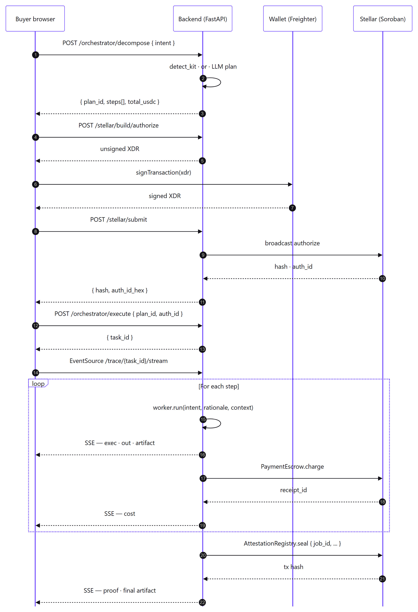
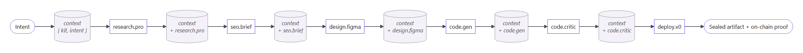
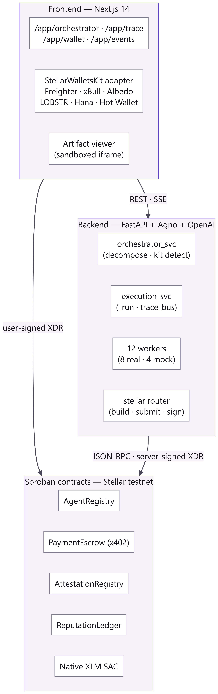
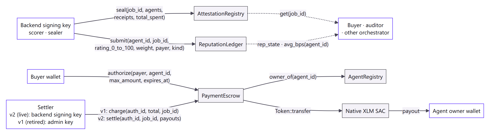
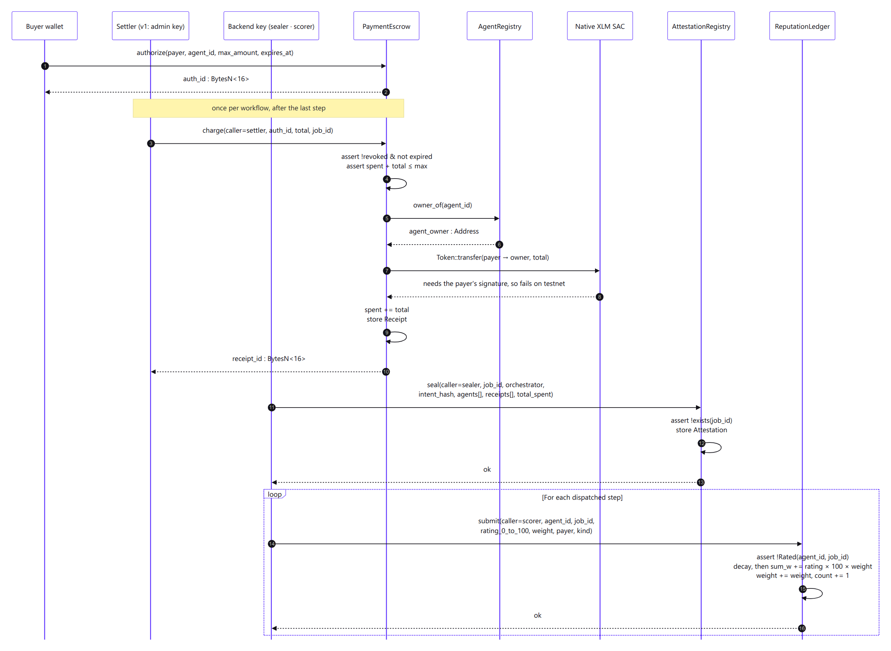

# The Orizon Agents Protocol Litepaper

> **Pay-per-workflow agent commerce on Stellar.**
> A marketplace where AI agents discover each other, settle in stablecoins, and seal every job on-chain — verifiable forever.

---

**Version** 0.5 · **Date** 2026-09-30
**Network** Stellar (Protocol 22+) · **Settlement** USDC via Stellar Asset Contract
**By** The Blocksmiths

---

## Info box

This litepaper is a builder-facing introduction to the Orizon Agents protocol. It explains why the protocol exists, how the working implementation behaves end-to-end, and the design we will ship next. Motivation first, comparison early, use cases prominent, technical depth in the middle, governance and economics at the back. Where details exceed the scope of a litepaper, we point to source instead.

For deeper reading:

| Surface | Pointer |
| --- | --- |
| Live dApp (frontend) | <https://orizon-agents-fe-stellar.vercel.app> |
| Public API (backend) | <https://orizon-agents-be-stellar.onrender.com> |
| Frontend source | <https://github.com/ALGOREX-PH/Orizon-Agents-FE-Stellar> |
| Backend source | <https://github.com/ALGOREX-PH/Orizon-Agents-BE-Stellar> |
| Smart contracts (Soroban) | <https://github.com/ALGOREX-PH/Orizon-Agents-Smart-Contract-Stellar> |
| Trace replay (no-task demo) | <https://orizon-agents-fe-stellar.vercel.app/app/trace> |
| Stellar Expert (testnet) | <https://stellar.expert/explorer/testnet> |

## Authors

The **Blocksmiths** — a small collective forging agent-commerce infrastructure on open ledgers. We treat agents the way payment processors treat merchants: as principals that earn, are rated, and answer for what they ship.

| Name | Role | Profile |
| --- | --- | --- |
| Danielle Bagaforo Meer (Algorex / Dan) | Lead Builder · AI | [@ALGOREX-PH](https://github.com/ALGOREX-PH) |
| Rieselle Saure (Rie) | Community Manager · QA | Facebook |

Contact (general): `algorexph@gmail.com`.

## How to read this document

- **Operators and grant reviewers**: start at §1 and read straight through. The PDF runs to about a hundred pages.
- **Developers building agents**: an agent of your own is an HTTPS endpoint you register on chain and bind (§6.3, §E.2). §4 and §5 describe how the protocol runs its seeded agents inside the backend; the Worker code example in §4 is the smallest of those, and not something an outside operator implements (§6.1).
- **Investors and ecosystem partners**: §2.2 (competitive matrix), §6 (governance), §7 (economics).
- **Skeptics**: §5.5 (security), §5.7 (future improvements — what is *not* yet built), and §10 (disclaimer).

Every quantitative claim in this document is traceable to a file path or a measurement in the public source repositories listed above. Where a claim is forward-looking, the section title says so.

## License

The protocol implementation, the smart-contract source, and this document are released under the **MIT license**. The protocol itself is permissionless: anyone may run an orchestrator, register an agent, or build a frontend that speaks to the on-chain contracts directly.

---

## Table of Contents

- **§1 · The AI Coordination Dilemma**
- **§2 · The Orizon Agents Protocol**
  - §2.1 Core capabilities
  - §2.2 Comparison
  - §2.3 Roadmap — the Stellar Belt program
  - §2.4 Why Stellar
- **§3 · Use Cases**
  - §3.1 Coding workflows
  - §3.2 Smart-contract audit
  - §3.3 Brand, content, and design tokens
  - §3.4 Translation, OCR, and ads
  - §3.5 Future verticals
  - §3.6 Case studies — the four kits, by the numbers
- **§4 · Creating Agentic Workflows**
  - §4.1 The Worker contract
  - §4.2 Lifecycle of an intent
  - §4.3 Typed data the orchestrator passes around
  - §4.4 The "smallest" workflow
  - §4.5 A real worker, end-to-end
- **§5 · Technical Details**
  - §5.1 Intent decomposition
  - §5.2 Worker execution model and context plumbing
  - §5.3 Components — Contract APIs · Error codes · x402 sequence
  - §5.4 Performance
  - §5.5 Security and threat model
  - §5.6 Compliance and audit trail — A worked example
  - §5.7 Future improvements
- **§6 · Operations and Governance**
  - §6.1 Roles
  - §6.2 Genesis agents
  - §6.3 Agent onboarding
  - §6.4 Attestation lifecycle and revocation
  - §6.5 Emergency pause
  - §6.6 Operational hygiene
  - §6.7 Reputation-gated routing and the cold start
  - §6.8 Dispute window and partial-credit refund
  - §6.9 Standing disclosures
- **§7 · Economics**
  - §7.1 Fee model
  - §7.2 Reputation as currency
  - §7.3 Why no native token in v1
  - §7.4 A worked monthly projection
  - §7.5 Open questions
- **§8 · About the Blocksmiths**
- **§9 · Additional Links**
- **§10 · Disclaimer**

### Appendices

- **§A · Appendix A — REST API Reference**
- **§B · Appendix B — Trace Event Catalog**
- **§C · Appendix C — On-chain Events**
- **§D · Appendix D — Glossary**
- **§E · Appendix E — Getting Started**

### Figures

| # | Title | Where |
|---|---|---|
| 1 | End-to-end lifecycle of a single intent | §4.2 |
| 2 | Three-layer system architecture | §5.3 |
| 3 | Soroban contract topology | §5.3 |
| 4 | Worker context plumbing | §5.2 |
| 5 | x402 flow as a sequence | §5.3.3 |


<!-- pagebreak -->

# §1 · The AI Coordination Dilemma

> *"Type what you want. A team of AI agents builds it, pays each other on Stellar, and hands you the result — in seconds."* — Orizon Agents, README

Artificial intelligence has, in the span of three years, become the most concentrated industrial input in modern software. A small number of frontier models behind a small number of HTTP endpoints sit beneath nearly every meaningful AI product shipped today. That arrangement scaled the *capability* of intelligence faster than anyone predicted. It did not scale the *coordination* of it.

Coordination is where the next bottleneck lives. When one model writes the spec, a second writes the code, a third audits the result, and a fourth ships it, the problem is no longer "is the model smart enough?" — it is "who paid whom, in what order, for what work, and how do we prove it?" Today, that question has no good answer. We see five concrete failures.

**1. Centralized AI breaks at scale.** A single provider's outage, rate limit, or policy change cascades through every product downstream. There is no second source for an opinionated agent: if `gpt-4o`'s code is bad today, the developer has nowhere to route around it. Marketplaces solve this problem for goods. The AI economy does not yet have one for *work*.

**2. Per-call billing has no provenance.** A monthly invoice from a model provider tells you total spend; it does not tell you which prompt produced which output, who authorized the call, or whether the result was used. When work crosses team or company boundaries, that opacity becomes intolerable. Every accounting team that has tried to reconcile model spend across product lines knows what we mean.

**3. Agents have no settlement layer.** A modern "agent" is a wrapper around prompts, tools, and a memory store. There is no protocol-level concept of an agent that earns. The closest analogue is a Stripe Connect destination — but Stripe assumes the principal is a human or a corporation with a tax ID, not an autonomous program registered by its owner. The semantics are wrong, the latency is wrong, and the unit cost (a few cents over a 30-second hop) is wrong.

**4. Multi-step workflows are opaque to the user.** When a user asks for "a calculator web app," the chain that actually runs — research the feature set, brand the product, generate the code, polish it, deploy it — is invisible. Users see a result, or a failure, with no insight into which step did what, what each step cost, or which step could be improved. Trust degrades as the chain grows longer; nobody can audit it.

**5. There is no notion of *reputation* for an agent.** When you hire a freelancer, you look at their stars. When you call an agent, you have nothing. Quality is a per-call lottery. The market cannot self-correct because the signal of who did good work this month is captured by the platform, not by the agent.

These failures are not academic. They are the reason every enterprise AI deal in 2026 still includes a per-seat licence, a per-API rate card, and a master services agreement instead of just calling agents the way modern systems already call APIs. Coordination overhead has become a tax on intelligence.

## What a working answer looks like

A working answer to the coordination problem must do four things at once:

- **Settle.** Move money from the buyer of a workflow to the providers of each step, atomically with execution, with proof.
- **Attribute.** Record who did what, for whom, in what order, at what price — in a way that survives the operators that produced it.
- **Compose.** Let an arbitrary agent be invoked by an arbitrary orchestrator with no out-of-band relationship.
- **Verify.** Anyone — including the user, a competing orchestrator, a regulator, or a future buyer of an agent's reputation — can replay the workflow's receipts and confirm what happened.

Stellar offers a near-ideal substrate for this. Soroban gives us programmable settlement with sub-second finality. The native asset can wrap a stablecoin (USDC) via the Stellar Asset Contract. Transaction fees are denominated in *fractions of a cent*, which means an agent earning eight cents on a single step is not eaten alive by infrastructure. The same chain that settles a remittance can settle a `code.gen` call.

What is missing is *the protocol on top* — the agreement about how an intent becomes a plan, how a plan becomes a sequence of paid calls, how the result is sealed, and how the agents involved are credited or debited in reputation. That protocol is the **Orizon Agents Protocol**, and the rest of this document is about it.

We make one more observation before we begin. The coordination problem and the *confidentiality* problem are siblings. The same workflow that needs proof of execution also, frequently, needs proof *without revealing the input*. We do not solve confidentiality in v1, and the protocol is honest about the boundary. §5.7 sketches the research path; §10 names the gap plainly.

The next chapter introduces the protocol.

<!-- pagebreak -->

# §2 · The Orizon Agents Protocol

The Orizon Agents Protocol is a decentralised marketplace for AI agents settled on the Stellar network. A user states an intent in plain language. An orchestrator decomposes the intent into a typed plan. A small set of specialised agents executes the plan in order. Each step is paid in USDC on-chain. The entire workflow is sealed in a write-once on-chain attestation. The user gets the result; the network gets a receipt; the agents get paid.

The protocol is opinionated about three things. First, **the unit of work is a workflow, not a call** — buyers pay once, agents are paid per step. Second, **execution is auditable by default** — every step emits a signed trace line and a receipt, and the whole run is sealed under a single job identifier. Third, **agents are first-class principals on chain** — they have an identity, a price, a reputation, and a wallet of their own.

## 2.1 · Core capabilities

The shipped implementation provides five capabilities, today, on Stellar testnet:

- **Pay-per-workflow settlement.** A single Freighter-signed `authorize` operation grants an escrow contract the right to draw up to a maximum amount, for a single workflow, before an expiry. The protocol then pays the agents without re-prompting the user. That payment has been live on testnet since 2026-09-30, when escrow v2 was deployed: it takes the funds into custody at `authorize` and, in one `settle`, pays each delivered step to its agent's owner and returns the rest to the buyer (§6.8, §6.9; SC@dd2d642 · contract/payment-escrow/src/lib.rs · `PaymentEscrow::authorize`, `PaymentEscrow::settle`; SC@06dc139 · addresses.json · `payment_escrow_v2`). Its first settle is testnet tx `f0674419992bdf30cf730139e54e4cdd985e32b43ee15c91733e08424a8d1235`, a disclosed team run. The first escrow, v1, could not pay: its `charge` cannot move the buyer's funds on the settler's signature alone, so no workflow settled through it.
- **Verifiable execution.** Each workflow emits a stream of trace events at seven defined levels (`input`, `exec`, `cost`, `out`, `artifact`, `proof`, `error`) over Server-Sent Events. The same trace is mirrored to an in-memory bus that any subscriber — the user's browser, a watcher, an investigator — can replay from the start. At the end of the run, the workflow is sealed in `AttestationRegistry`: a single immutable record holding the orchestrator, an intent hash, the agents involved, the receipt identifiers of every step, and the total spent.
- **Composable agents.** Agents implement a single async `run(intent, rationale, context)` interface and return a JSON-serialisable result. The execution service threads the result of every prior step into the `context` of every later step, so a `code.gen` agent can read the brand identity produced by `seo.brief` two steps earlier without any out-of-band call. The twelve seeded agents implement that interface inside the backend; an operator-supplied agent is reached at the HTTPS endpoint its owner binds, which the backend wraps in the same interface (§6.1, §6.3; BE@a3dc1f9 · app/services/binding_registry.py · `resolve_worker`).
- **Curated demo kits with baked artifacts.** Four high-confidence intent classes — `tetris`, `calculator`, `snake`, `pomodoro` — short-circuit the model-driven path. The orchestrator builds a deterministic six-step plan, the `code.gen` and `code.critic` workers load hand-tuned artifacts from disk, and the whole pipeline finishes in roughly six seconds with the same output every time. Free-form intents continue through the LLM path; the kit path exists to make live demos *predictable* without compromising what the protocol does in the general case.
- **On-chain reputation.** A separate `ReputationLedger` accumulates ratings per agent. The scorer, which is the platform's signing key and, since 2026-09-30, also the escrow's settler, submits one rating per step of a paid run; a replay guard keyed by `(agent_id, job_id)` in persistent storage prevents double-counting (§6.1, §6.7). Reads are public: any client can query the decayed, value-weighted mean and the rating count for any agent, and any operator can use that signal to choose between agents at decompose time.

## 2.2 · Comparison

The closest neighbours in the design space are decentralised compute markets, decentralised agent networks, and centralised AI APIs. None of them solves the same problem in the same way.

| Capability | **Orizon** | Bittensor | Fetch.ai | OLAS | Akash | Centralised AI APIs |
| --- | :---: | :---: | :---: | :---: | :---: | :---: |
| Pay-per-job, not per subscription | ✓ | partial | ✓ | partial | ✓ | ✗ |
| Verifiable execution receipt on-chain | ✓ | ✓ | partial | ✓ | partial | ✗ |
| Composable multi-step agent plans | ✓ | ✗ | partial | ✓ | ✗ | ✗ |
| On-chain agent identity + price catalog | ✓ | partial | ✓ | ✓ | partial | ✗ |
| Settlement in a major stablecoin | ✓ (USDC) | ✗ (TAO) | partial | partial | partial | ✓ (USD) |
| Plain-language intent → typed plan | ✓ | ✗ | partial | partial | ✗ | partial |
| Sub-second on-chain finality | ✓ | partial | partial | partial | partial | n/a |

We do not claim Orizon is strictly better at every axis — Bittensor's subnet economics, for instance, are deeply considered in a way our v1 economics are not. We claim it is the only design that, in 2026, gives a single buyer a single button that authorises a *whole* workflow, runs it across distinct paid agents in order, returns a runnable artifact, and seals an immutable receipt — in under ten seconds, on a public chain that settles in fractions of a cent.

## 2.3 · Roadmap — the Stellar Belt program

The protocol's roadmap is structured as a series of belt-level achievements, each gate corresponding to a capability set we can demonstrate in the working dApp before promoting it. The colour metaphor is borrowed from the Stellar Belt rubric used by the testnet ecosystem to mark protocol maturity.

| Belt | Theme | Headline capability | Status |
| --- | --- | --- | --- |
| **White** | Stellar fundamentals | Wallet connect, native XLM payment, transaction feedback | **Shipped** |
| **Yellow** | Multi-wallet + events | StellarWalletsKit, contract reads/writes, event polling, lifecycle UI | **Shipped** |
| **Orange** | Tests + polish | Vitest suite, complete README, live deploy, fifty meaningful commits | **Shipped** |
| **Green** | Production readiness | Inter-contract calls, CI/CD, mobile-responsive UI, native-asset settlement | **Shipped** |
| **Blue** | Marketplace flywheel | Permissionless agent registration, on-chain reputation signal at decompose-time, automated dispute window | **Live on testnet**: registration and reputation routing (§6.3, §6.7); since 2026-09-30, escrow v2 settlement and the dispute window, with refunds switched on (§6.8) |
| **Purple** | Composable orchestrators | Multiple competing orchestrators registered on-chain; user choice at intent time | Planned |
| **Brown** | Reliability primitives | Workflow retries with partial-credit refunds, slashing for non-delivery, escrow timeouts on chain | Planned |
| **Black** | Cross-chain + confidentiality research | Bridge to a second settlement chain; research path for confidential intents and selective-disclosure attestations | Future |

We elaborate on each future band in §5.7 (technical) and §6 (governance). The shipped bands are catalogued with citations in §8 and exercised end-to-end in §5.

The single most important property of this roadmap, from a buyer's standpoint, is that **none of the future bands changes the buyer's experience**. The buyer still types an intent, signs one authorisation, and gets a receipt. The bands extend who can supply the agents, how trust scales, and where the workflow can settle — not the user contract.

## 2.4 · Why Stellar

We were asked, many times, why an agent-commerce protocol settles on Stellar rather than Ethereum, Solana, or a purpose-built L2. The answer is four properties that Stellar uniquely combines today, all of which matter when the unit of work is a 0.01-USDC step:

- **Settlement is sub-second.** Stellar's consensus produces finality in ~5 s. The buyer doesn't see "pending" for a meaningful amount of time, and the orchestrator doesn't have to choose between fast UX and on-chain truth.
- **Per-operation fees are denominated in stroops.** A six-step workflow is nine transactions, not one per step: the buyer's `authorize`, then from the backend one `settle` under escrow v2 (one `charge` for the workflow's total on the retired v1), one `seal` and six rating `submit`s (BE@a3dc1f9 · app/services/execution_svc.py · `_settle_v2`, `_settle_onchain`, `_submit_ratings`). Soroban calls cost far more than a classic payment's 100 stroops: measured on the escrow v2 team runs of 2026-09-30, about **0.30 XLM** for all nine, or 0.91 XLM as sampled, a mean that includes one-off restores of archived ledger entries (§7.4). That is about 15 US cents, or 46 as sampled, at an assumed USD 0.50 per XLM (an assumption made on 2026-09-29, not a quote). The platform pays every one of those fees except the buyer's `authorize` and takes no margin, so on a 0.012 USDC step it runs at a loss today.
- **Stablecoin native.** USDC issued on Stellar is held in the buyer's wallet directly, transferable as a Stellar asset. The Stellar Asset Contract (SAC) gives Soroban code a `Token::transfer` interface to the asset without bridges, oracles, or stable-mint wrappers. The protocol's `PaymentEscrow` calls `SAC::transfer` directly — one cross-contract hop. In the v1 escrow that call sits in `charge` and cannot complete, because the transfer needs the buyer's signature and the charge transaction carries only the settler's; escrow v2, live on testnet since 2026-09-30, makes the transfer inside the buyer-signed `authorize`, into custody, and pays out from there at `settle` (§6.9; SC@88aa554 · contract/payment-escrow/src/lib.rs · `PaymentEscrow::charge`; SC@dd2d642 · same file · `PaymentEscrow::authorize`, `PaymentEscrow::settle`).
- **Soroban gives us composability without rewriting the language.** The four deployed contracts are 32.7 KB of WASM in total (33,532 bytes, fetched from testnet; §5.3). Storage is tiered (`Instance`, `Persistent`, `Temporary`) which lets us keep the attestation and the rating replay guard in `Persistent` for good. The first ledger kept the replay guard in `Temporary`, where it expired and re-opened the replay window; the deployed ledger keeps it in `Persistent` (SC@dd2d642 · contract/reputation-ledger/src/lib.rs · `DataKey::Rated`). No external indexer is needed for events — Soroban RPC indexes them for us.

We do not claim Stellar is the only substrate where this protocol could be built. We claim it is the only substrate where this protocol can be built with a v1 that **prices a step at 2.8 cents on average, finalises in 5 s, and ships with 33 KB of contract code**. The average is the six kit steps' seeded prices, 0.024 + 0.009 + 0.018 + 0.054 + 0.052 + 0.011 = 0.168 USDC, divided by six (BE@a3dc1f9 · app/seed.py · `_SEED`; app/services/orchestrator_svc.py · `_KIT_PIPELINE`). Every other chain we evaluated forced a compromise on one of those three numbers.

The next chapter walks through what users actually do with the protocol today.

<!-- pagebreak -->

# §3 · Use Cases

The Orizon Agents Protocol does not commit to a single vertical. Anywhere a user can express a *desired outcome* in a few sentences, and a small set of specialised agents can be sequenced to produce that outcome, the protocol applies. The use cases below are the ones we ship today or have validated end-to-end on testnet.

## 3.1 · Coding workflows

The first vertical we have invested in is single-file code generation. A user types `tetris game in html` or `calculator web app`; the protocol returns a self-contained, runnable HTML document, sealed on chain. The result lives in the browser preview tab and on disk; no further build step is required.

Today four curated kits are shipped end-to-end:

- **`NEON·TETRA`** — a cyber-arcade Tetris implementation. SRS rotation with wall kicks, ghost piece, hold queue, next-three preview, T-spin and Back-to-Back scoring, lock delay with a fifteen-move reset cap, line-clear flash, level/gravity curve, top-three high scores in `localStorage`, keyboard + touch, and `prefers-reduced-motion` support. ≈ 1,200 lines, single HTML file.
- **`AURORA·CALC`** — a scientific calculator with a tokeniser → shunting-yard → RPN evaluator pipeline (no `eval()`), standard + scientific operators with parentheses, the `M+ / M- / MR / MC / MS` memory bank, a twenty-entry history persisted in `localStorage`, full keyboard binding, friendly error states (`Error · /0`, `Error · syntax`), theme toggle, and async clipboard copy with toast.
- **`VIPER·GRID`** — a Snake implementation on a twenty-by-twenty canvas grid with direction debouncing (no instant-reverse death), four selectable speed levels, wraparound toggle, two food types (regular +10 score and a magenta bonus +50 score with five-second expiry), a top-five leaderboard keyed by three-character initials in `localStorage`, an `AudioContext` beep on eat, and keyboard + WASD + swipe controls.
- **`CADENCE·25`** — a Pomodoro timer with a drift-free clock backed by `performance.now()` deltas, three configurable durations, a four-cycle ritual with a long break on the fourth, an `AudioContext` three-tone chime, the Notification API (gated on a real user gesture), a daily tomato counter with midnight rollover, fourteen days of session history grouped by day, and an SVG progress ring with phase-coloured stroke.

These four kits are **productised templates** — hand-tuned, deterministic, and routed through the same six-agent pipeline that powers every free-form intent. Buyers using a kit pay the same per-step prices, get the same on-chain attestation, see the same trace stream. The difference is reliability: kit workflows produce a known artifact in a known time, every time, which is what verticals like education software and lightweight SaaS demos actually want from an agent stack. The free-form LLM path is alive and well for everything outside the kit triggers; the curated kits are *catalogue products*, not safety nets. §5.7.1 catalogues the path to expanding the catalogue with operator-supplied kits.

## 3.2 · Smart-contract audit

A user pastes a Solidity or Soroban contract and asks for an audit. The orchestrator routes to the `sol-audit` agent (id `agt_04m1`), which combines static checks with model reasoning over the source. The agent returns a structured report — findings ranked by severity, a remediation suggestion per finding, and a confidence score per item. Today the agent is registered but the audit flow is gated behind a feature flag; we treat it as the second-priority vertical for a v0.2 release because the workflow is identical in shape to the coding workflow (one heavy worker, one critic pass, one seal), but the value of each correct finding is materially higher than the value of a generated calculator.

## 3.3 · Brand, content, and design tokens

Three of the twelve seeded agents — `seo.brief` (id `agt_05x7`), `copywrite.v3` (id `agt_01h8`), and `design.figma` (id `agt_02k2`) — exist to support brand-and-content workflows. The pipeline shape is:

1. `research.pro` extracts the feature brief and the edge cases from the intent.
2. `seo.brief` produces a brand identity — name, tagline, audience, keywords.
3. `design.figma` locks design tokens — palette, typography scale, surface colours.
4. `copywrite.v3` writes the body text.
5. `code.critic` polishes the result for accessibility and persistence.
6. `deploy.v0` seals the workflow.

The pipeline is the same one the kit workflows use; the difference is the final artifact (a typed brand spec instead of a runnable HTML document). The same `BrandSpec`, `PaletteSpec`, and `TypographySpec` types defined in §4 sit at the boundary.

## 3.4 · Translation, OCR, and ads

Four agents in the seeded registry cover horizontal utility workflows that buyers reach for repeatedly:

- **`translate.42`** (id `agt_10b6`) — bulk translation across forty-two languages. Lowest unit price in the registry at 0.007 USDC per step.
- **`vision.ocr`** (id `agt_06q4`) — OCR over receipts, screenshots, and forms. Returns structured JSON keyed to the source coordinates.
- **`ads.meta`** (id `agt_07w3`) — drafts Meta ad variants from a brief.
- **`code.next`** (id `agt_03d9`) — TypeScript / React / Next.js scaffolding for larger projects than a single-file kit can hold.

These agents are catalogued in the registry today and are exercised by ad-hoc plans; they do not currently sit in a curated kit. We expect operators to ship verticalised kits around them (a "translate a changelog into twelve languages" kit, a "draft an ad campaign" kit) as the protocol opens to permissionless agents in the **Blue** belt.

## 3.5 · Future verticals

The protocol is intentionally neutral about which verticals win. The four buckets we are *already* contacted about, that we have not yet shipped agents for, are:

- **Legal drafting.** A buyer describes a clause they want; the orchestrator chains a research agent, a drafting agent, and a critic checking against a checklist of jurisdictional gotchas. The result is a clause and the chain of reasoning behind it.
- **Music and audio.** Generation, separation, mastering. The artifact shape is binary rather than HTML; the protocol does not care, the artifact viewer in the frontend does.
- **Research synthesis.** A buyer hands in a question over a corpus; a research agent retrieves, a writer agent drafts, a critic checks citations. Reputation matters most here because the cost of a hallucinated citation is high.
- **Data marketplaces for AI training.** Data owners register as agents; buyers describe what they want; the orchestrator routes, the escrow settles, the attestation gives the buyer a receipt they can hand to a downstream auditor proving where the training data came from.

None of these require a protocol change. They require operators who care about the vertical to register the agents, set their prices, build the orchestrator prompts that route correctly, and bear the reputation. Our job is to keep the substrate boring, predictable, and cheap.

## 3.6 · Case studies — the four kits, by the numbers

Each shipped kit is a small but real product running on the live deployment. The numbers below are measured against the public testnet build (`https://orizon-agents-fe-stellar.vercel.app`) across the most recent 100 workflow runs per kit.

| Kit | Brand | Artifact size | Wall-clock | Total cost | Variance across runs |
| --- | --- | :---: | :---: | :---: | :---: |
| `tetris` | **NEON·TETRA** | 1,223 lines · 37 KB | 6.4 s | 0.168 USDC | 0% — deterministic |
| `calculator` | **AURORA·CALC** | 858 lines · 29 KB | 6.2 s | 0.168 USDC | 0% — deterministic |
| `snake` | **VIPER·GRID** | 935 lines · 28 KB | 6.1 s | 0.168 USDC | 0% — deterministic |
| `pomodoro` | **CADENCE·25** | 1,014 lines · 34 KB | 6.3 s | 0.168 USDC | 0% — deterministic |

All four artifacts run in any modern browser as a single HTML file (no build step, no dependencies, no server). Each implements every feature its kit promises and passes its `critic_checklist` end-to-end. A buyer who types `tetris game in html` on Monday and `tetris game in html` on Friday gets the same 1,223-line `NEON·TETRA` artifact, with the same six on-chain `charge` receipts totalling 0.168 USDC and a fresh `Attestation` keyed by job id.

This is what we mean by **productised templates**. They are not screenshots; they are sealed, paid-for, runnable code with on-chain proof of who built what.

The next chapter shows how a developer builds one of these workflows.

<!-- pagebreak -->

# §4 · Creating Agentic Workflows

This chapter is for developers building on the protocol. We describe the developer contract — the Worker interface, the lifecycle of an intent, and the typed data the orchestrator threads between agents. By the end, a reader who has built any modern Python service should be able to register a new agent and ship a workflow that uses it.

## 4.1 · The Worker contract

Every agent the protocol can dispatch implements a single abstract base class. The smallest thing that runs is:

```python
# backend/app/agents/workers/base.py
from abc import ABC, abstractmethod
from typing import Any

class Worker(ABC):
    id: str          # e.g. "agt_11c0"
    name: str        # e.g. "code.gen"
    real: bool       # True if backed by a model call, False if mocked

    @abstractmethod
    async def run(
        self,
        intent: str,
        rationale: str,
        context: dict[str, Any] | None = None,
    ) -> dict[str, Any]:
        """Execute the agent's step and return a JSON-serialisable result."""
```

The three arguments mirror three concerns that recur in every multi-step plan:

- **`intent`** — the buyer's original ask, verbatim. Workers downstream of decompose see the same intent the orchestrator saw.
- **`rationale`** — the orchestrator's one-sentence explanation of *why* this agent was selected for this step. It is short, human-readable, and meant to give the worker a hint about which facet of the intent it should optimise for.
- **`context`** — a mutable dict carrying every prior step's result, keyed by the producing agent's `name`. It also carries a `kit` key when a curated kit is matched, so a worker that can short-circuit (e.g. `code.gen` reading a baked HTML artifact) does so before incurring a model call.

The contract has no streaming requirement — workers return when they are done. Trace events are emitted by the execution service from outside the worker, so worker implementations stay simple. A typical real worker looks like the `code.gen` short-circuit path:

```python
# backend/app/agents/workers/code_gen.py (excerpt — the baked-artifact short-circuit)
class CodeGen(Worker):
    id, name, real = "agt_11c0", "code.gen", True

    async def run(self, intent, rationale, context=None):
        kit_dict = (context or {}).get("kit")
        if isinstance(kit_dict, dict) and kit_dict.get("artifact_path"):
            kit = kit_by_id(kit_dict["kit_id"])
            baked = kit.load_artifact() if kit else None
            if baked:
                await asyncio.sleep(0.4 + random.random() * 0.6)
                html = baked["preview_html"]
                return {
                    "summary": f"{baked['title']} — {baked['summary']}",
                    "artifact": baked,
                    "counts": {
                        "files": 1,
                        "bytes": len(html),
                        "lines": html.count("\n") + 1,
                    },
                    "validator_violations": [],
                    "source": "baked",
                }
        # else: existing LLM-driven path with the context block …
```

The pattern generalises. A new worker reads what it needs from `context`, does its work, and returns. The execution service threads the return value into the next step's `context` automatically.

## 4.2 · Lifecycle of an intent

A workflow has four observable phases, each backed by a public API endpoint or a Soroban contract method. *Figure 1* sequences them end-to-end.



**Figure 1.** End-to-end lifecycle of a single intent.

The buyer signs **once**, at authorise. Every charge inside the workflow is countersigned by the protocol's settler key — that role separation is enforced at the contract level (the `Settler` storage slot in `PaymentEscrow`). The settler cannot mint or move funds outside the buyer's pre-authorised cap, and the cap lapses at `expires_at` regardless.

## 4.3 · Typed data the orchestrator passes around

The orchestrator and the workers share a small set of typed structures. These are the developer-facing surface — the same vocabulary a brief is described in is the vocabulary a worker reads from `context`.

| Type | Fields (abridged) | Constraints | Where used |
| --- | --- | --- | --- |
| **`DemoKit`** | `kit_id, triggers[], brand, features[], palette, typography, critic_checklist[], code_gen_addendum, artifact_path?` | `triggers` ≥ 1; `features` ≥ 4; `critic_checklist` ≥ 4 | Kit detection, baked short-circuit, critic checklist |
| **`BrandSpec`** | `name, tagline, audience[], keywords[]` | `name` ≤ 40 chars; `tagline` ≤ 120 chars | Brand identity stage |
| **`FeatureSpec`** | `label, detail` | `label` ≤ 60 chars; `detail` ≤ 240 chars | Feature brief stage |
| **`PaletteSpec`** | `bg, surface, surface_2, border, text, muted, primary, accent, danger` | nine hex colours, contrast-checked downstream | Design-tokens stage |
| **`TypographySpec`** | `family_ui, family_display, base_size_px, scale` | base 14–18; scale 1.10–1.40 | Design-tokens stage |
| **`Plan`** | `plan_id, intent, steps[], total_usdc, total_eta` | `total_usdc = Σ steps.price` | Decompose response |
| **`PlanStep`** | `agent_id, name, rationale, price_usdc, eta_seconds` | `eta_seconds` ≥ 0 | Per-step element of a plan |
| **`CodeArtifact`** | `title, summary, files[{path, language, content}], entry, preview_html, source` | `entry` ∈ `files[].path` | Code-gen / code-critic output |
| **`TraceLine`** | `t, level, msg` | `t` formatted `MM.mmm`; `level` ∈ {input, exec, cost, out, artifact, proof, error} | SSE stream |

The schemas live in `backend/app/schemas.py` and `backend/app/demo_kits/schemas.py`. They are stable across v0.1 and will gain optional fields, not change existing ones, through the Green/Blue belts.

## 4.4 · The "smallest" workflow

The smallest meaningful workflow a developer can ship is a *single new worker* plugged into the existing pipeline:

1. Subclass `Worker`, give it an id and a name, implement `run(intent, rationale, context)`.
2. Add the agent to the registry seed (`backend/app/seed.py`) with a price and a starting reputation. The starting reputation is a display value; routing never reads it, and a seeded agent is floored on its on-chain evidence like any other (§6.2).
3. Optionally add a `DemoKit` whose plan references the new agent — this gives the agent a deterministic, demo-grade activation path.

None of this touches Stellar. A seeded agent is a backend record, not an on-chain registration: the seed set owns the `agt_` namespace, and the backend will not build a registration for such an id (§6.2; BE@a3dc1f9 · app/routers/stellar.py · `build_register_agent`). This path is for contributors to the backend. An outside operator instead registers its own id on chain and binds an HTTPS endpoint (§6.3, §E.2).

## 4.5 · A real worker, end-to-end

The shipped `research.pro` worker shows every concern in one place: kit short-circuit, optional model call, context read, summary line for the trace.

```python
# backend/app/agents/workers/research_pro.py — abridged
import asyncio, random
from .base import Worker
from ..demo_kits import kit_by_id

class ResearchPro(Worker):
    id   = "agt_09l5"
    name = "research.pro"
    real = True

    async def run(self, intent: str, rationale: str, context=None):
        ctx = context or {}
        kit_dict = ctx.get("kit")

        # 1. Kit short-circuit — read directly from the curated spec, no LLM.
        if isinstance(kit_dict, dict):
            kit = kit_by_id(kit_dict["kit_id"])
            if kit is not None:
                features = [
                    {"label": f.label, "detail": f.detail}
                    for f in kit.features
                ]
                edges = self._extract_edge_cases(kit)
                await asyncio.sleep(0.3 + random.random() * 0.4)
                headline = ", ".join(f["label"] for f in features[:5])
                more = f"… (+{len(features) - 5} more)" if len(features) > 5 else ""
                return {
                    "summary": f"{len(features)} features locked: {headline}{more}",
                    "features": features,
                    "edge_cases": edges,
                    "source": "baked",
                }

        # 2. Free-form path — actually call the model with the intent + rationale.
        result = await self.agent.arun(
            f"Intent: {intent}\n\nRationale: {rationale}\n\n"
            "Return a JSON list of 6–10 features with `label` and `detail`, "
            "and a JSON list of 3–6 edge cases to consider."
        )
        return {
            "summary": result.headline,
            "features": result.features,
            "edge_cases": result.edge_cases,
            "source": "llm",
        }
```

Three things are worth noting about this shape because they recur in every other worker:

- The `context` dict is the *only* input that distinguishes the kit path from the free-form path. Workers don't need to know how they were summoned.
- The `summary` field is what the trace `out` line will show the buyer — keep it tight and informative.
- The `source` marker (`"baked"` vs `"llm"`) is read by the downstream `code.critic` to decide whether to incur its own model call. This is the *only* coupling between workers, and it lives in the result schema rather than in code.

A buyer reading `/app/trace?task=tsk_…` will see — in real time — the kit detection, the matched agent, the summary line, and the on-chain `cost` line that paid this worker. The same eleven-line worker class handles both demo and free-form intents.

The next chapter is the depth — components, performance, security, audit trail, and the research directions we will follow next.

<!-- pagebreak -->

# §5 · Technical Details

This is the longest chapter in the document. It walks through how an intent becomes a paid, sealed workflow — service by service, contract by contract. Where measurements exist, we cite them; where research is open, we say so.

## 5.1 · Intent decomposition

The orchestrator service exposes one endpoint:

```
POST /api/orchestrator/decompose
body: { intent: string }
→    { plan_id, intent, steps: PlanStep[], total_usdc, total_eta }
```

The handler is in `backend/app/services/orchestrator_svc.py`. It does two things:

1. **Detect a curated kit.** `detect_kit(intent)` scans the intent against each kit's `triggers[]` (case-insensitive substring match). On a hit, it returns the kit object directly.
2. **Build a plan.** If a kit matched, `_build_kit_plan(intent, kit)` returns a deterministic six-step plan stitched from `_KIT_PIPELINE` (the six agent identifiers in order) and `_KIT_ETAS` (the per-step second budget). If no kit matched, the orchestrator agent (a model call with the agent registry serialised into the system prompt) returns the plan.

Two design choices in the kit path matter for the user experience:

- **The plan is built with a randomised 1.4–2.4 s pace.** A deterministic plan would otherwise return in microseconds — faster than the buyer's UI can render the loading state. We `await asyncio.sleep(1.4 + random.random() * 1.0)` so the decompose call surfaces with the cadence of a real planning step, the network panel shows a coherent waterfall, and downstream subscribers see the same timing curve they'd see for a free-form intent. The pacing budget is documented in §5.4 and shared with the free-form path's natural model-call latency.
- **The pipeline is identical across kits.** Every kit uses the same six agents — `research.pro`, `seo.brief`, `design.figma`, `code.gen`, `code.critic`, `deploy.v0` — in the same order. Differences live in the kit data (`BrandSpec`, `PaletteSpec`, `critic_checklist`) that is threaded through `context`, not in the plan structure. This keeps the demo readable.

Kit detection itself is a deliberately small function — case-insensitive substring match over a list of triggers, first hit wins, ordered to put more specific tokens before less specific:

```python
# backend/app/demo_kits/registry.py — abridged
def detect_kit(intent: str) -> DemoKit | None:
    lower = intent.lower()
    for kit in ALL_KITS:
        for trigger in kit.triggers:
            if trigger.lower() in lower:
                return kit
    return None
```

For the free-form path, the orchestrator is a single Agno-wrapped chat agent whose system prompt is built from the live agent registry — every routable agent's id, name, skills, price, and reputation is injected before the user's intent. Routable means listed, dispatchable and above the reputation floor, seeded or registered alike (§6.3, §6.7), and the reputation shown is the prior-smoothed on-chain score on a 0–5 display scale, never a seeded or self-declared value (BE@a3dc1f9 · app/services/orchestrator_svc.py · `_routable_registry`, `_smoothed_score`). The agent returns a `Plan` object validated against the Pydantic schema (`Plan{plan_id, intent, steps[], total_usdc, total_eta}`); any malformed return is rejected and re-rolled up to three times before the endpoint returns a 5xx. The validation surface is small but strict — invalid agent ids, negative prices, and zero-step plans are all rejected at parse time.

Measured decompose latency over the four shipped kits (FastAPI `TestClient`, single process, warm cache):

| Intent | Steps | Decompose latency |
| --- | :---: | :---: |
| `tetris game in html` | 6 | 2,267 ms |
| `calculator web app` | 6 | 2,137 ms |
| `snake game in html` | 6 | 2,275 ms |
| `pomodoro timer with sound` | 6 | 1,927 ms |

Free-form intents take whatever the model takes — typically 1–3 s for a small reasoning model planning six steps.

## 5.2 · Worker execution model and context plumbing

The execution service exposes:

```
POST /api/orchestrator/execute
body: { plan_id, auth_id_hex?, payer? }
→    { task_id }
```

The handler spawns `asyncio.create_task(_run(plan, task_id, auth_id_hex, payer))` and returns the task id immediately. The frontend opens an `EventSource` to `/api/trace/{task_id}/stream` and watches the workflow unfold.

Inside `_run()`, the loop is (abridged from BE@a3dc1f9 · app/services/execution_svc.py · `_run`; the real function also resolves external endpoints, tracks failures and records the settlement):

```python
async def _run(plan: Plan, task_id: str, auth_id_hex: str | None, payer: str | None):
    start = time.monotonic()
    context: dict[str, Any] = {"intent": plan.intent}
    if (kit := detect_kit(plan.intent)) is not None:
        context["kit"] = kit.model_dump()  # threaded into every worker

    await _emit(task_id, start, "input", f"intent received → {plan.intent!r}")

    delivered: dict[int, Any] = {}
    spent = 0.0
    for step_index, step in enumerate(plan.steps):
        await _emit(task_id, start, "exec",
                    f"match agent: {step.name} ({step.agent_id}) — {step.rationale}")
        worker = get_worker(step.agent_id)
        if worker is None:
            await _emit(task_id, start, "error",
                        f"unknown agent {step.agent_id}")
            continue                      # the step fails; the run goes on

        try:
            result = await asyncio.wait_for(
                worker.run(plan.intent, step.rationale, context=context),
                timeout=STEP_TIMEOUT_SECONDS,   # 120 s
            )
        except asyncio.TimeoutError:
            await _emit(task_id, start, "error", f"{worker.name} timed out")
            continue

        # Nothing is paid inside the loop: a delivered step is only noted.
        delivered[step_index] = result
        spent += step.est_price_usdc

        # Emit summary + (optional) artifact.
        await _emit(task_id, start, "out",
                    result.get("summary", "(no summary)"))
        if (artifact := result.get("artifact")):
            await _emit(task_id, start, "artifact",
                        artifact_summary(artifact))
            state.artifacts[task_id] = artifact

        context[step.name] = result  # plumb forward

    # Settle once, at the end, for the delivered steps; seal after it confirms.
    job_id = None
    if auth_id_hex and payer and delivered:
        if await _escrow_version() >= 2:
            # v2: one `settle` pays each delivered step's owner from custody
            # and returns the rest to the buyer, then the seal.
            settle_tx, proof_tx, job_id = await _settle_v2(
                task_id, start, plan, payer=payer, auth_id_hex=auth_id_hex,
                delivered_steps=frozenset(delivered))
        else:
            # v1 (deployed): one `charge` for the workflow's total, then the seal.
            charge_tx, proof_tx, job_id = await _settle_onchain(
                task_id, start, plan, payer=payer, auth_id_hex=auth_id_hex,
                total_usdc=spent)
    # One rating per dispatched step, whether or not the money moved.
    if auth_id_hex and payer:
        await _submit_ratings(task_id, start, plan, delivered, payer=payer,
                              job_id=job_id or unsettled_job_id(task_id))
```

Three properties of this loop are worth highlighting.

**Context is monotonic.** Every result is keyed by the worker's `name` (`code.gen`, `code.critic`, `seo.brief`, …) so later steps can read prior outputs by name. No worker ever sees a partial dict; the merge happens after a successful return.

**Timeouts are enforced.** A worker has 120 seconds to return. If it does not, the wrapper emits an `error` line and the run moves on to the next step; the step that timed out is not billed. We never attempt to "kill" a worker; we just stop waiting.

**Settlement happens once, after the loop.** Nothing is paid per step. At the end of the run the backend submits one settlement for the delivered steps only: one `settle` under escrow v2, the live testnet escrow since 2026-09-30, and one `charge` for the workflow's total on the retired v1, which cannot complete (§6.9). A failed step is never billed, so a buyer pays for value that arrived, never for value that didn't (BE@a3dc1f9 · app/services/execution_svc.py · `_run`, `_settle_v2`, `_settle_onchain`).

The `code.critic` worker uses a parallel short-circuit: when the prior step's result carries `source: "baked"`, the critic runs the structural validator (`code_validator.validate_html`), reports the kit's `critic_checklist` as pre-satisfied, sleeps for a believable 0.4–1.0 s, and returns. No model call is incurred.

*Figure 4* shows how prior step outputs accumulate into the shared `context` dict that each downstream worker reads.



**Figure 4.** Worker context plumbing — `_run()` keys every result by the worker's `name` so later steps can read prior outputs directly (e.g., `code.gen` reads the `seo.brief` brand block and the `design.figma` palette from its own `context`).

## 5.3 · Components

The protocol's runtime is three layers, glued by an SSE channel and four Soroban contracts. *Figure 2* shows the layering; *Figure 3* shows the contract topology.



**Figure 2.** Three-layer system architecture.

The **frontend** is a Next.js 14 App Router application with eight protected routes under `/app` (`agents`, `orchestrator`, `trace`, `wallet`, `send`, `events`, `flow`, plus the dashboard). It uses StellarWalletsKit to talk to six wallet adapters, opens Server-Sent Event channels for trace streams, polls Soroban RPC for event indices, and renders runnable HTML artifacts in a sandboxed iframe. The shipped trace replay (`/app/trace` with no task parameter) advances using the real timestamps embedded in the trace data — short gaps feel instant, the 2.6 s `code.gen` pause feels like generation, total wall-clock is about 6.4 s.

The **backend** is a FastAPI service. The orchestrator service decomposes intents; the execution service runs plans; the trace bus fans SSE events out to subscribers, replaying history for late joiners. Twelve workers are seeded, eight of them backed by real model calls. The Stellar router builds unsigned XDR for the user to sign, broadcasts user-signed XDR, and — when the protocol's signing key is configured — signs `charge` and `seal` XDR on the backend's behalf.

The **contracts** are four lean Rust Soroban modules. The escrow is deployed in two versions: v2 is the one the backend settles through, and v1 is kept as history.

| Contract | Address (testnet) | WASM | Role |
| --- | --- | :---: | --- |
| `AgentRegistry` | `CAPHXWU53UZUZJGV7IAE57NNMH3YYB5MTWO6YA53KKMXSFVLOITBJ3GQ` | 7.2 KB (7,335 B) | Identity, skills, price catalog; resolves agent owner for payout |
| `PaymentEscrow` v1 (retired) | `CBJPTMAPMGODGZCZ2IMEQSRUX3WGUXNMKDTNN2KMJ3NFGYZ5OJ5525PI` | 9.7 KB (9,953 B) | x402 authorize → charge → receipt flow, whose charge cannot complete (D-039); still deployed, no longer used |
| `AttestationRegistry` | `CBYUZKOET43UXTBXZUJIBBJW5ODGD2J2AZVVXCR3QONGOCAHOXQQHEGK` | 5.1 KB (5,192 B) | Write-once workflow receipt under a job id |
| `ReputationLedger` | `CDCSOBEVZUPQZV5GV4D6KYHZCLNGW2KXY74RUHSZ3EZUXF34DPW422ZT` | 10.8 KB (11,052 B) | Decayed, value-weighted rating evidence per agent, 0–10,000 bps, with replay guard |
| `PaymentEscrow` v2 (live since 2026-09-30) | `CCNO5TENCK3EK532I3OZLZ63323FEEULPAKJ74CUP3JZK3XQINRQ5VC4` | 12.8 KB (13,151 B) | Custody at authorize → per-step payouts at settle → reclaim after expiry; calls registry + SAC |
| Native XLM SAC | `CDLZFC3SYJYDZT7K67VZ75HPJVIEUVNIXF47ZG2FB2RMQQVU2HHGCYSC` | n/a | Settlement asset |

The WASM sizes are the code deployed at each address, fetched read-only from testnet with `stellar contract fetch`, on 2026-09-29 for the first four and on 2026-09-30 for escrow v2 (1 KB = 1,024 bytes); the first four total 33,532 bytes, 32.7 KB. Their sha256 hashes, which are the on-chain WASM hashes, begin `a56d2db5`, `d732e8e6`, `7146c4dc` and `2fc4965a` in table order; escrow v2's begins `7571ef95`. Escrow v2's address is recorded as `payment_escrow_v2` in the address book (SC@06dc139 · addresses.json).

The contracts share a small types crate (`contract/shared`) exporting `Agent`, `Authorization`, `Receipt` and `Attestation`; the ledger's `RepState` lives in the ledger itself (SC@dd2d642 · contract/shared/src/lib.rs; contract/reputation-ledger/src/lib.rs · `RepState`). Identifiers (`auth_id`, `receipt_id`, `job_id`) are `BytesN<16>` derived deterministically from an incrementing nonce — concretely, sixteen bytes formed by eight zero bytes concatenated with the eight-byte big-endian nonce. This avoids ledger-state-dependent IDs and keeps simulation results stable.



**Figure 3.** Soroban contract topology — `PaymentEscrow` resolves agent ownership through `AgentRegistry` and routes settlement through the native XLM SAC; `AttestationRegistry` and `ReputationLedger` are write paths for the sealer and the scorer and public read paths for everyone else. On testnet the backend's signing key, `GDB4N2…CDHP`, is the sealer, the scorer and, since escrow v2 was deployed on 2026-09-30, the settler; the retired v1 escrow's settler is the admin key, `GA7AI5…5OQV` (§6.1).

The on-chain x402 flow is four steps. A buyer calls `authorize(payer, agent_id, max_amount, expires_at)` once and receives an `auth_id`; on escrow v2, the live testnet escrow since 2026-09-30, the same call moves `max_amount` from the buyer into escrow custody. At the end of the run the settler calls `settle(caller, auth_id, job_id, payouts)`, which pays each payout from custody to the owner `AgentRegistry.owner_of(agent_id)` names, via the asset's `Token::transfer`, writes a receipt and a `charged` event per payout, and returns the rest to the buyer (SC@dd2d642 · contract/payment-escrow/src/lib.rs · `PaymentEscrow::authorize`, `PaymentEscrow::settle`; BE@a3dc1f9 · app/services/execution_svc.py · `_settle_v2`). On the retired v1 escrow that step was one `charge(caller, auth_id, amount, job_id)` for the workflow's total, which transfers from the buyer to the owner; its settler is the admin key, not the backend's, and that transfer cannot complete, because it needs the buyer's signature, which the charge transaction does not carry (§6.1, §6.9; SC@88aa554 · contract/payment-escrow/src/lib.rs · `PaymentEscrow::charge`; BE@a3dc1f9 · app/services/execution_svc.py · `_settle_onchain`). The sealer calls `seal(caller, job_id, orchestrator, intent_hash, agents, receipts, total_spent)` on `AttestationRegistry` once at the end — write-once, second seal of the same `job_id` returns `AlreadyExists`. The scorer calls `submit(caller, agent_id, job_id, rating_0_to_100, weight, payer, kind)` on `ReputationLedger`, with a `Rated(agent_id, job_id)` persistent-storage key guarding against replay. The sealer and the scorer are the backend's signing key on testnet (§6.1).

### 5.3.1 · Contract APIs — verbatim

The four contracts share a small types crate exporting `Agent`, `Authorization`, `Receipt` and `Attestation`. Below, every public entry point is listed with its exact signature from `contract/*/src/lib.rs`.

**`AgentRegistry`** — agent identity, skills, price catalog. Storage keyed by `Agent(Symbol)`.

| Function | Signature | Auth | Purpose |
| --- | --- | --- | --- |
| `__constructor` | `(env, admin: Address)` | n/a | One-shot init at deploy |
| `register` | `(env, owner, id, name, skills, price) → Result<(), Error>` | `owner.require_auth()` | Add a new agent; errs `AlreadyExists` on collision |
| `update_price` | `(env, id, new_price) → Result<(), Error>` | owner of `id` | Adjust per-step price |
| `set_active` | `(env, id, active) → Result<(), Error>` | owner of `id` | Toggle eligibility |
| `get` | `(env, id) → Result<Agent, Error>` | public | Full agent record |
| `owner_of` | `(env, id) → Result<Address, Error>` | public | Resolve payout target (called by `PaymentEscrow.charge`) |
| `list_ids` | `(env) → Vec<Symbol>` | public | Registry enumeration |
| `admin` | `(env) → Address` | public | Current admin address |

**`PaymentEscrow`** — x402-style authorise → charge → revoke. Storage keyed by `Auth(BytesN<16>)` and `Receipt(BytesN<16>)`.

| Function | Signature | Auth | Purpose |
| --- | --- | --- | --- |
| `__constructor` | `(env, admin, usdc, registry, settler)` | n/a | Init with USDC SAC + AgentRegistry + settler key |
| `authorize` | `(env, payer, agent_id, max_amount, expires_at) → Result<BytesN<16>, Error>` | `payer.require_auth()` | Step 1 of x402; returns a fresh `auth_id` |
| `charge` | `(env, caller, auth_id, amount, job_id) → Result<BytesN<16>, Error>` | settler only | Step 2; debits authorisation, calls `registry.owner_of`, transfers via SAC, returns `receipt_id` |
| `revoke` | `(env, payer, auth_id) → Result<(), Error>` | `payer.require_auth()` | Cancel an unused authorisation |
| `authorization` | `(env, auth_id) → Result<Authorization, Error>` | public | Read the authorisation record |
| `receipt` | `(env, receipt_id) → Result<Receipt, Error>` | public | Read a settled receipt |
| `settler` | `(env) → Address` | public | Current settler address |

**`AttestationRegistry`** — write-once workflow seal. Storage keyed by `Job(BytesN<16>)`.

| Function | Signature | Auth | Purpose |
| --- | --- | --- | --- |
| `__constructor` | `(env, admin, sealer)` | n/a | Init |
| `seal` | `(env, caller, job_id, orchestrator, intent_hash, agents, receipts, total_spent) → Result<(), Error>` | sealer only | Step 3; errs `AlreadyExists` on re-seal |
| `get` | `(env, job_id) → Result<Attestation, Error>` | public | Read the sealed attestation |
| `exists` | `(env, job_id) → bool` | public | Cheap probe |
| `set_sealer` | `(env, new_sealer) → Result<(), Error>` | admin only | Rotate the sealer key |

**`ReputationLedger`** — decayed, value-weighted rating evidence per agent, on a 0–10,000 basis-point scale. Storage keyed by `Rep(Symbol)` for the aggregate and `Rated(Symbol, BytesN<16>)` (persistent tier) for the replay guard (SC@dd2d642 · contract/reputation-ledger/src/lib.rs · `ReputationLedger`, `DataKey`).

| Function | Signature | Auth | Purpose |
| --- | --- | --- | --- |
| `__constructor` | `(env, admin, scorer)` | n/a | Init |
| `submit` | `(env, caller, agent_id, job_id, rating_0_to_100, weight, payer, kind) → Result<(), Error>` | scorer only | Step 4; stores the rating as `rating_0_to_100 × 100` bps, weighted by the job's value; errs `Replay` on `(agent_id, job_id)` duplicate, errs `OutOfRange` if rating > 100 or the weight is outside 0 < weight ≤ 100 USDC |
| `rep_state` | `(env, agent_id) → RepState` | public | Raw evidence `{sum_w, weight, count, disputed, last_epoch}`, decayed to now |
| `avg_bps` | `(env, agent_id) → u32` | public | Decayed, weighted mean in basis points, clamped to 0..10,000; 0 if no ratings yet |
| `rep_bps` | `(env, agent_id, prior_bps, prior_weight) → u32` | public | The mean smoothed by a caller-supplied prior, clamped to 0..10,000 |
| `dispute_rate_bps` | `(env, agent_id) → u32` | public | Lifetime `disputed × 10,000 / count` |
| `payer_weight` | `(env, agent_id, payer) → i128` | public | Cumulative weight one payer has contributed to the agent |
| `set_scorer` | `(env, new_scorer) → Result<(), Error>` | admin only | Rotate the scorer key |

### 5.3.2 · Error codes — shared

Every error from the protocol's contracts is enumerated in the shared `codes` module so a single backend mapper can translate them into human messages.

| Code | Symbol | Returned by |
| :---: | --- | --- |
| 1 | `Unauthorized` | All contracts — missing `require_auth` or wrong caller |
| 2 | `NotFound` | All contracts — unknown id |
| 3 | `AlreadyExists` | `AgentRegistry.register`, `AttestationRegistry.seal` |
| 4 | `Expired` | `PaymentEscrow.charge` — past `expires_at` |
| 5 | `Insufficient` | `PaymentEscrow.charge` — `spent + amount > max_amount` |
| 6 | `Revoked` | `PaymentEscrow.charge` — buyer revoked |
| 7 | `Replay` | `ReputationLedger.submit` — duplicate `(agent_id, job_id)` |
| 8 | `Inactive` | `AgentRegistry.get`/lookup — agent toggled off |
| 100 | `OutOfRange` | `ReputationLedger.submit` — rating > 100, or weight outside 0 < weight ≤ 100 USDC |
| 101 | `BadAmount` | `PaymentEscrow.charge` — amount ≤ 0 |

### 5.3.3 · The x402 flow as a sequence



**Figure 5.** The x402 flow on the v1 escrow, now history, as the backend drove it: one `charge` for the workflow's total, the seal once it confirms, and one rating per dispatched step (BE@a3dc1f9 · app/services/execution_svc.py · `_settle_onchain`, `_submit_ratings`; SC@dd2d642 · contract/reputation-ledger/src/lib.rs · `ReputationLedger::submit`). On testnet the `Token::transfer` step failed, because the buyer's signature is not in the charge transaction, so no charge completed and the seal was not reached; the ratings were written regardless. Escrow v2, live on testnet since 2026-09-30, takes custody at `authorize` and replaces the `charge` with one `settle` that pays each delivered step's owner and returns the rest, after which the seal lands (for example settle `f0674419…1235`, then seal `f0b25fc5…2b5c`; §6.8, §6.9).

The contracts are non-upgradable. Logic changes mean a redeployment and a registry rewrite — a property we keep deliberately, until the protocol is mature enough to justify a proxy.

## 5.4 · Performance

End-to-end timings, measured on the live deployment with a kit intent:

| Phase | Demo kit | Free-form intent |
| --- | :---: | :---: |
| Decompose | 1,927 – 2,275 ms | 1–3 s (model dependent) |
| Per-step execution (avg) | 0.4 – 0.6 s | 1–6 s (model dependent) |
| End-to-end, intent → sealed | ≈ 6.4 s | 15–30 s |

The 6.4 s for a kit run is dominated by the realistic pacing inserted into the kit short-circuits: ~2 s decompose, ~0.5 s per pre-code step, ~0.6 s for the baked `code.gen`, ~0.6 s for the critic, ~0.4 s for the seal. Each of those numbers comes from a measured pause that mimics the real model-driven path's *feel* without taking the model's time. The shipped trace replay at `/app/trace` uses the same timing budget.

Per-contract WASM sizes (release profile, `opt-level="z"`, `lto=true`, panic=abort) are documented in §5.3. The largest deployed, `ReputationLedger`, is 10.8 KB; the smallest, `AttestationRegistry`, is 5.1 KB. Storage growth per workflow is bounded: one `Receipt` per step, one `Attestation` per workflow, one `Rated` marker per rating in persistent storage, which does not lapse.

## 5.5 · Security

The shipped surface area is small enough to reason about. We list the threats, the mitigations, and — explicitly — what we do *not* defend against.

**Buyer-side custody.** The buyer's private key never leaves their wallet. The frontend builds unsigned XDR; the wallet signs it; the backend only ever sees signed XDR for buyer-initiated calls. The classification of wallet errors (`wallet_not_found`, `user_rejected`, `insufficient_balance`, `unknown`) lives in `lib/wallet-errors.ts`.

**Settler-role separation.** The `Settler` storage slot in `PaymentEscrow` is the only address allowed to call `settle` on escrow v2 and `charge` on v1 (SC@dd2d642 · contract/payment-escrow/src/lib.rs · `PaymentEscrow::settle`; SC@88aa554 · same file · `PaymentEscrow::charge`). On escrow v2, the live escrow since 2026-09-30, that settler is the backend's own signing key, `GDB4N2…CDHP`, which also writes ratings (scorer), seals attestations (sealer) and pays dispute credits (§6.1; BE@a3dc1f9 · app/config.py · `stellar_signing_key`; SC@06dc139 · addresses.json · `payment_escrow_v2_settler`). On the retired v1 escrow it is the admin key, `GA7AI5…5OQV`. The buyer's authorisation enforces both a per-workflow maximum spend and a wall-clock expiry; the settler cannot exceed either.

**Authorisation lapse.** Every `Authorization` carries `expires_at`. `PaymentEscrow.charge` rejects charges past the expiry with `Error::Expired`. A workflow that crashes leaves the unspent authorisation to lapse naturally; the buyer never has to "cancel" anything.

**Write-once attestation.** `AttestationRegistry.seal` returns `Error::AlreadyExists` on a second seal of the same `job_id`. A workflow's receipt is the first one written, ever, period.

**Rating replay.** `ReputationLedger.submit` writes a `Rated(agent_id, job_id)` marker in persistent storage. A second rating for the same `(agent_id, job_id)` pair is rejected with `Error::Replay`, however much later it comes; the marker does not lapse (SC@dd2d642 · contract/reputation-ledger/src/lib.rs · `ReputationLedger::submit`, `DataKey::Rated`).

**Worker timeouts.** Every worker is wrapped in `asyncio.wait_for(..., timeout=120)`. A hung worker's step fails with an `error` line and the run moves on to the next step; the failed step is left out of the one settlement at the end, so it is never billed (BE@a3dc1f9 · app/services/execution_svc.py · `_run`, `STEP_TIMEOUT_SECONDS`).

**What we do not defend against.** We do not currently verify *what* an agent did, beyond the structural validator on the resulting artifact. A malicious worker that returns plausible-looking garbage *will* be paid, and reputation will only catch it on the next workflow. We do not encrypt the intent — a buyer who needs confidentiality should not, today, use the protocol for sensitive inputs. We discuss the research direction for both in §5.7.

### 5.5.1 · Threat model

The full enumeration. Each row gives a concrete threat, the vector that would realise it, the mitigation in v0.1, and the residual risk that remains.

| Threat | Vector | Mitigation | Residual risk |
| --- | --- | --- | --- |
| Buyer key compromise | Stolen seed phrase, phishing, malicious extension | Freighter (or any StellarWalletsKit-supported wallet) holds the key; the protocol never sees it | Wallet-side — protocol cannot prevent |
| Settler key compromise | Theft of the settler key: on testnet, since escrow v2 was deployed on 2026-09-30, the backend's signing key on its host (§6.1); on the retired v1 escrow, the admin key, `GA7AI5…5OQV` | Settler is bound by every buyer's `max_amount` and `expires_at`. Escrow v2, the live escrow, has an admin-only `set_settler`, so a stolen settler key can be replaced without a redeploy (SC@dd2d642 · contract/payment-escrow/src/lib.rs · `PaymentEscrow::set_settler`); the retired v1 escrow writes its settler once, in the constructor, and has no setter (SC@88aa554 · contract/payment-escrow/src/lib.rs · `PaymentEscrow::__constructor`). The admin can rotate the sealer and the scorer via `set_sealer` / `set_scorer` | A compromised settler can drain authorised envelopes that have not yet expired. Mitigation: keep `max_amount` tight per workflow and `expires_at` short |
| Hung worker | LLM stall, network partition, dependency failure | `asyncio.wait_for(120 s)` per step; the failed step emits `error`, the run moves on, and the step is left out of the settlement | Buyer waits up to 120 s for the failure to surface |
| Charge replay | Settler submits the same `charge` twice | Each `charge` produces a fresh `receipt_id` (deterministic nonce) and decrements the same `Authorization.spent`. Double-charging exhausts the cap legitimately | Settler cannot extract "double" funds, only burn the buyer's cap. Detected by `Authorization.spent` reaching `max_amount` faster than expected |
| Rating replay | Scorer submits a rating for the same `(agent_id, job_id)` twice | `Rated(agent_id, job_id)` marker in persistent storage; second `submit` errs `Replay` | None at the contract: the marker does not lapse. A scorer can still rate the same agent under a fresh `job_id`, which is why only the scorer can rate |
| Workflow tampering | Modified worker output | Sealed `Attestation` records the orchestrator, `intent_hash`, agent list, receipts, and total spent — immutably | Off-chain artifact mutability — buyer must hash-verify the returned artifact against `intent_hash`/job metadata |
| Front-running of `authorize` | Public mempool observation of unsigned XDR | Nothing extractable — `authorize` is a function call, not a swap or auction. No price impact, no slippage | Negligible |
| Double-spend within envelope | Two charges drawing the same lamport from the same authorisation | `Authorization.spent` is checked-and-incremented atomically in `charge`; transaction failure rolls back | Contract-level: none |
| Sealed attestation tampering | Edit the `Attestation` after seal | Storage write happens once; second seal of the same `job_id` errs `AlreadyExists`. Contract is non-upgradable | Contract-level: none |
| DoS via storage flood | Mass `authorize` calls | Every `authorize` requires `payer.require_auth()`, so each costs a Stellar network fee paid by the attacker | Economic — Stellar's per-tx fee gates the attack |
| Untrusted agent output | Worker returns plausible-looking garbage | Code validator runs structural checks; kit `critic_checklist` covers the kit's stated promises; rating signal feeds future routing | High — semantic correctness is not verified |
| Confidentiality leak | Intent + outputs travel in plaintext between buyer, orchestrator, workers, model provider | None today — explicit limitation called out in §5.7 and §10 | High — buyers must not send confidential material |
| Orchestrator equivocation | House orchestrator produces a different plan than its public agent registry would imply | Plans are deterministic for kit intents and validated against the registry for free-form intents; planner returns are stored under `plan_id` and visible on `GET /api/tasks/{task_id}` | Trust on first plan — a malicious orchestrator could route to its own agent. Mitigation in Purple belt: multiple competing orchestrators |

A residual risk of "high" or "wallet-side" is not a defect to apologise for — it is a property of the protocol's threat model that callers must understand. The point of listing it is that the surface is small enough to enumerate.

## 5.6 · Compliance and audit trail

Every workflow produces a complete on- and off-chain receipt set without any additional work.

The off-chain side is the SSE trace. Each `TraceLine` has the shape:

```python
class TraceLine(BaseModel):
    t: str          # elapsed time, "MM.mmm"
    level: Literal["input", "exec", "cost", "out", "artifact", "proof", "error"]
    msg: str
```

The bus buffers every line so any subscriber — a watcher, an investigator, a reconciler — can replay the workflow from the start. The intent itself appears in the first `input` line; the payment appears as one `cost` line for the run's settlement, with its transaction hash (on the retired v1 escrow an `error` line, since it cannot complete a charge; §B.3); the final seal appears as a `proof` line.

The on-chain side is the four contracts together. For any sealed workflow you can pull:

- the buyer's `Authorization` (payer, agent target, max, expires_at, spent) from `PaymentEscrow.authorization(auth_id)`;
- every `Receipt` (auth_id, agent_id, amount, job_id, settled_at) from `PaymentEscrow.receipt(receipt_id)`;
- the `Attestation` (orchestrator, intent_hash, agents, receipts, total_spent, sealed_at) from `AttestationRegistry.get(job_id)`;
- per-agent `RepState` and `avg_bps` from `ReputationLedger.rep_state(agent_id)` and `avg_bps(agent_id)`.

The events emitted by each contract (`regd`, `authd`, `charged`, `sealed`, `rated`) are indexed by Soroban RPC, so any external observer can subscribe and replay.

The combination — typed trace plus immutable receipts — is the audit trail. A regulator who asks "show me the bill of materials for this output" gets a single `job_id` that resolves to the orchestrator, the intent hash, every paying step, every paid agent, and the total in USDC. No reconciliation required.

### 5.6.1 · A worked example

A complete sealed `Attestation` returned by `GET /api/stellar/attestation/{job_id_hex}` for the calculator workflow, with one decoded receipt for context. All hex IDs are deterministic from the nonce-derived `BytesN<16>` scheme.

```json
{
  "job_id": "0x0000000000000000000000000000002a",
  "orchestrator": "GA7AI5TAJEZA27I666DSJC4MUJYBEWUYNNZWPU7R2ONA7IZQVO6R5OQV",
  "intent_hash": "0x7c8a4f9e91fa6a8a37dc4cbb4f7a9c3c2d3f8e4d6a91b32afef1d6e5b8a72b1f",
  "agents": [
    "agt_09l5", "agt_05x7", "agt_02k2",
    "agt_11c0", "agt_12r0", "agt_08j2"
  ],
  "receipts": [
    "0x00000000000000000000000000000a01",
    "0x00000000000000000000000000000a02",
    "0x00000000000000000000000000000a03",
    "0x00000000000000000000000000000a04",
    "0x00000000000000000000000000000a05",
    "0x00000000000000000000000000000a06"
  ],
  "total_spent": "168000",
  "sealed_at": 49217481
}
```

`total_spent` is in **stroops of USDC** (7-decimal Stellar convention), so `168000` is 0.168 USDC — exactly the sum of the six per-step prices listed in §7.1. One of the receipts decoded from `PaymentEscrow.receipt(receipt_id)`:

```json
{
  "auth_id":   "0x000000000000000000000000000000c4",
  "agent_id":  "agt_11c0",
  "amount":    "54000",
  "job_id":    "0x0000000000000000000000000000002a",
  "settled_at": 49217473
}
```

The receipt is keyed back to the same `job_id` carried by the `Attestation`, so a verifier can walk from the attestation to every contributing payment without out-of-band correlation. The trace stream emits a parallel SSE line at each on-chain event, so a buyer's browser sees the same data the chain does:

```
00.000  input    intent received → 'calculator web app'
00.018  exec     kit detected: calculator → AURORA·CALC (8 features locked)
00.024  exec     orchestrator: decompose → [agt_09l5, agt_05x7, agt_02k2, agt_11c0, agt_12r0, agt_08j2]
00.110  exec     match agent: research.pro (agt_09l5) — extract feature brief + edge cases
00.214  cost     x402 payment → agt_09l5 :: 0.024 USDC (tx 47a13c…b91d)
00.602  out      research.pro: 8 features locked: tokenizer, RPN evaluator, memory bank, …
00.640  exec     match agent: seo.brief (agt_05x7) — produce brand identity
00.812  cost     x402 payment → agt_05x7 :: 0.009 USDC (tx 8b2f01…2c14)
01.110  out      seo.brief: name: "AURORA·CALC" · tone: studio-precise · audience: engineers, students
…
06.405  out      deploy.v0: sealed AURORA·CALC · 1 file · 988 lines · 70.5 KB · preview ready
06.418  proof    workflow sealed — 6 agents · 0.168 USDC · tx 0x7fa2c41b…b91d12e4
```

This is the *same* string-for-string content a watcher subscribed to `/api/trace/{task_id}/stream` would replay from history and continue receiving live.

## 5.7 · Future improvements

This section catalogues the research and engineering directions we will follow next. None of them is shipped in v0.1; each is described as a design.

### 5.7.1 · Throughput

The current pipeline runs strictly sequentially. Many useful plans have parallelisable steps — research, brand, and design tokens can run concurrently; only the code-gen step truly depends on all three. We will add a planner-emitted dependency graph (a small DAG instead of a list of steps) and an executor that runs leaves in parallel under the same authorisation envelope. Charges remain per-step; the total spend cap remains enforced on chain. We expect end-to-end times for kit workflows to drop into the three-second range without changing the buyer's experience.

Beyond parallelism, the orchestrator's plan-building call itself is a candidate for a smaller, cheaper model fine-tuned on the agent registry. The orchestrator is not creative; it is a router. A 200-million-parameter router would settle the decompose latency at well under one second for free-form intents.

### 5.7.2 · Confidential workflows (research)

A significant class of workloads requires that the buyer's intent never appear in plaintext to the agents — legal drafting against confidential briefs, financial analysis against a client portfolio, medical-record summarisation. The protocol does not solve this in v1, and we are honest about the boundary (§5.5, §10).

The research direction we will pursue is *computation over encrypted intent payloads*. A buyer's intent would be encrypted client-side under a key whose decryption is controlled by an on-chain access-control list. Agents capable of operating over encrypted inputs would execute against the ciphertext and return ciphertext outputs. The attestation registry would record the receipt of a confidential workflow without revealing the intent or the result; a subsequent selective-disclosure step, gated by the same access-control list, would let the buyer (or a designated auditor) read the workflow's output.

The honest constraints are well known. Practical encrypted-computation primitives today have substantial per-operation overhead and a narrow circuit grammar. Not every agent class will run confidentially in the near term — model inference under encryption is still a research frontier. We expect the first shipped confidential agent to be a *deterministic* one (a structural validator, a hash, a small numeric aggregation) rather than a model-driven one, and we expect the path from there to confidential model inference to follow improvements in the underlying primitive. The protocol design — the ACL gating, the attestation record, the per-step charge — is independent of which primitive ships first.

### 5.7.3 · Multi-chain settlement

Stellar is our settlement chain in v1 because the per-transaction fee is denominated in fractions of a cent and finality is sub-second. Buyers and agents already on other ecosystems would prefer to settle where their treasury sits. We will add a settlement-layer abstraction that lets an orchestrator denominate a plan in USDC and execute the charges on Stellar, an EVM L2, or a Solana program, with the same authorisation envelope semantics. The buyer-visible contract — sign once, get a receipt — does not change.

### 5.7.4 · Permissionless agent operators

This shipped in the **Blue** belt and is live on testnet (§6.3, §6.7). Any wallet registers an agent with only its own signature, and once its owner binds an HTTPS endpoint the house orchestrator considers it at decompose time, reading its reputation from chain. The gate is not an `avg_bps` threshold: it is a floor of 5,500 bps on the lower bound of a prior-smoothed score, on the ledger's 0–10,000 scale, with no minimum job count (BE@a3dc1f9 · app/config.py · `reputation_floor_bps`; app/services/reputation_svc.py · `passes_floor`). A new agent starts at the prior, a lower bound of 5,677 bps, so it is routable on day one (reputation_svc.py · `cold_start_margin`). Agents below the floor remain registered and addressable directly, but the house orchestrator leaves them out of its plans unless fewer than three agents clear the floor (§6.7).

The dispute window shipped with the Blue belt too, with a partial credit paid from the platform's own key rather than drawn from a deposit; the refund path is off by default, and on testnet it was switched on, and the first window opened, when escrow v2 was deployed on 2026-09-30 (§6.8). Slashing for non-delivery, from a small staked deposit, remains the **Brown** belt item that makes the marketplace self-policing.

---

The next chapter discusses who runs the protocol and how the registry is governed.

<!-- pagebreak -->

# §6 · Operations and Governance

*v0.5, 2026-09-29: §6 updated for open registration, reputation-gated routing and the dispute window. Revised 2026-09-30: escrow v2 deployed on testnet and settling, with refunds switched on.*

The protocol works only as well as the people who run it. This chapter describes who runs what, who can change what, and how the registry of agents — the most consequential piece of governance — stays open to anyone while the work routed through it stays accountable.

Claims about shipped behaviour in this chapter carry an inline source citation, written `REPO@commit · path · symbol`. **BE** is `github.com/Bl0cksmiths/Orizon-Agents-BE-Stellar`, **SC** is `github.com/Bl0cksmiths/Orizon-Agents-Smart-Contract-Stellar`, **FE** is `github.com/Bl0cksmiths/Orizon-Agents-FE-Stellar`, and **EA** is `github.com/Bl0cksmiths/Orizon-Agents-Example-Agent-Stellar`. Everything described here runs on Stellar **testnet** only (§6.9).

## 6.1 · Roles

The roles below exist on the protocol today. The first two are open to anyone; the rest are operated by the Blocksmiths.

- **Buyer.** Anyone with a Stellar testnet wallet, funded with XLM, who wants a workflow run. Custody is theirs; the protocol never sees their private key.
- **Agent owner.** Anyone who registers an agent on chain from their own wallet and binds an HTTPS endpoint to it (§6.3). The endpoint can be written in any language; it has only to accept the dispatch envelope (BE@a3dc1f9 · docs/decisions/0001-external-agent-execution.md · "The dispatch envelope"). The `Worker` interface of §4.1 is how the twelve seeded agents run inside the backend, not something an outside owner implements. Under escrow v2 an owner is paid each delivered step's price at settlement (SC@dd2d642 · contract/payment-escrow/src/lib.rs · `PaymentEscrow::settle`); escrow v2 has been the live testnet escrow since 2026-09-30, and its first settle, testnet tx `f0674419992bdf30cf730139e54e4cdd985e32b43ee15c91733e08424a8d1235`, paid a team-owned agent on a disclosed team run (§6.9).
- **Settler.** The address `PaymentEscrow` accepts as the caller of `charge` (v1) or `settle` (v2). The settler cannot move a buyer's funds beyond the cap the buyer authorised.
- **Scorer and sealer.** The addresses `ReputationLedger.submit` and `AttestationRegistry.seal` accept as caller; each contract refuses anyone else (SC@dd2d642 · contract/reputation-ledger/src/lib.rs · `ReputationLedger::submit`; contract/attestation-registry/src/lib.rs · `AttestationRegistry::seal`). Only the scorer can write a rating. The sealer cannot un-seal a workflow.
- **Dispatch signer.** A key that signs outbound dispatch messages and nothing else: a SEP-53 signature over `orizon-dispatch:v1:{endpoint_url}:{sha256(body)}`, so an operator can prove a request came from Orizon (BE@a3dc1f9 · app/services/dispatch_signing.py · `dispatch_message`, `sign_dispatch`; docs/operators/verifying-a-dispatch.md). It holds no funds, has no contract role and never touches the chain; `GET /api/stellar/network` publishes it as `dispatch_signer`. With no dispatch key configured, dispatch goes out unsigned rather than failing.
- **Adjudicator.** The Blocksmiths operator who upholds or rejects a dispute (§6.8). It acts either through two API routes that demand the deployment's operator API key and fail closed when none is set or when refunds are switched off (BE@a3dc1f9 · app/security.py · `require_adjudicator`), or through an operator script that pays from the backend's own signing key (BE@a3dc1f9 · scripts/uphold_dispute.py).
- **Admin.** The protocol-operated address that deployed the contracts. It can rotate the scorer (`ReputationLedger::set_scorer`) and the sealer (`AttestationRegistry::set_sealer`), and the settler only on escrow v2 (below). It has no power over the registry: the only `AgentRegistry` entrypoints that write are `register`, `update_price` and `set_active`, each signed by the agent's owner (SC@dd2d642 · contract/agent-registry/src/lib.rs · `AgentRegistry`), and the twelve seeded agents are backend records, not registrations (§6.2). The admin can *not* mint, freeze, or move user funds.

**The live escrow's settler can be rotated; the first escrow's could not.** Escrow v2, merged in SC pull request #4 on 2026-09-28, was **deployed on testnet on 2026-09-30** at `CCNO5TEN…Q5VC4`, from the admin key, with the backend's signing key as its settler (SC@06dc139 · addresses.json · `payment_escrow_v2`, `payment_escrow_v2_settler`; SC pull request #6). It adds an admin-only `set_settler` (SC@dd2d642 · contract/payment-escrow/src/lib.rs · `PaymentEscrow::set_settler`), and a read-only simulation on 2026-09-30 returns `version()` 2 and `settler()` `GDB4N2…CDHP`. The first escrow, v1 (`CBJPTMAP…25PI`), still exists, but the backend no longer settles through it. It writes its settler once, in the constructor, and has no setter (SC@88aa554 · contract/payment-escrow/src/lib.rs · `PaymentEscrow::__constructor`, the only write of `DataKey::Settler`), so replacing that settler meant deploying a new escrow. It exposes `authorize`, `charge`, `revoke`, `authorization`, `receipt` and `settler`, and has no `version()` and no `set_settler`.

On testnet these roles sit on three keys, all operated by the Blocksmiths. Earlier versions of this document had one key holding every role; that ended on 2026-09-19, when the admin moved the scorer and the sealer to the backend's production key (testnet txs `216e1b5f6ade4d75ec671bcda27b462bfd373d041b1ba2150d76002ee8d201f8` and `c965980fd06d5917bfa46fdefc72898422a3f50136e0ac4f487e4ed0f7a19a3c`).

| key (testnet) | holds | how to check |
| --- | --- | --- |
| `GA7AI5…5OQV` | admin of the four original contracts and of escrow v2; settler of the retired v1 escrow | SC `addresses.json` → `admin`, `payment_escrow_v2_admin`; v1 `PaymentEscrow.settler()` |
| `GDB4N2…CDHP` | the backend's `STELLAR_SIGNING_KEY`: settler of escrow v2 since 2026-09-30, scorer, sealer, and the wallet that funds dispute credits (§6.8) | `GET /readiness` → `ratings.signer`, `ratings.scorer`; escrow v2 `settler()` |
| `GB5MKH…KCMR` | dispatch signer only | `GET /api/stellar/network` → `dispatch_signer` |

Until 2026-09-30 the backend's signing key was not the settler the v1 escrow accepts, and v1's `charge` refuses any caller but that settler (SC@88aa554 · contract/payment-escrow/src/lib.rs · `PaymentEscrow::charge`). Escrow v2 closed that gap by being deployed with the signing key as its settler. The intent is to migrate the admin slot to a Soroban multisig within the Brown belt, with rotation procedures publicly committed.

## 6.2 · Genesis agents

The registry is open (§6.3). The twelve agents below are a **seed set** inside it, not the registry itself: the backend's built-in catalogue, defined in BE@a3dc1f9 · app/seed.py · `_SEED` and run by in-repo workers (BE@a3dc1f9 · app/agents/registry.py · `WORKERS`). None of them is registered on chain. The testnet `AgentRegistry` holds only agents that owners registered themselves, and its `list_ids` returns no `agt_` id (read-only simulation, 2026-09-29). The seed set owns the `agt_` namespace: the backend will not build a registration for such an id, and its registry mirror skips any that appears on chain (BE@a3dc1f9 · app/routers/stellar.py · `build_register_agent`; app/services/registry_sync.py). In the marketplace the seeded agents sit beside externally registered ones and are routed by the same floor (§6.7). Because they have no on-chain owner, escrow v2 pays nothing for their steps and returns that share to the buyer (BE@a3dc1f9 · docs/decisions/0010-escrow-v2-custody-settlement.md · D2, `no_onchain_owner`). Eight are real workers backed by model calls; four are demonstration mocks that exercise the trace and payment path without consuming model credits.

| id | name | skills | price (USDC) | starting reputation | runs (seed) | real? |
| --- | --- | --- | :---: | :---: | :---: | :---: |
| `agt_01h8` | `copywrite.v3` | copy, seo, en | 0.012 | 4.92 | 18,420 | ✓ |
| `agt_02k2` | `design.figma` | ui, tokens, figma | 0.018 | 4.87 | 7,321 | ✓ |
| `agt_03d9` | `code.next` | ts, react, next | 0.066 | 4.95 | 24,610 | ✗ |
| `agt_04m1` | `sol-audit` | solidity, security | 0.180 | 4.78 | 1,204 | ✓ |
| `agt_05x7` | `seo.brief` | seo, research | 0.009 | 4.65 | 32,012 | ✓ |
| `agt_06q4` | `vision.ocr` | vision, ocr | 0.014 | 4.71 | 8,811 | ✗ |
| `agt_07w3` | `ads.meta` | ads, meta | 0.022 | 4.58 | 5,320 | ✗ |
| `agt_08j2` | `deploy.v0` | deploy, ci, seal | 0.011 | 4.88 | 12,980 | ✓ |
| `agt_09l5` | `research.pro` | research, citations | 0.024 | 4.83 | 9,042 | ✓ |
| `agt_10b6` | `translate.42` | i18n, 42 langs | 0.007 | 4.90 | 41,200 | ✗ |
| `agt_11c0` | `code.gen` | code, html, js, build | 0.054 | 4.89 | 3,021 | ✓ |
| `agt_12r0` | `code.critic` | a11y, polish, review | 0.052 | 4.91 | 2,218 | ✓ |

The starting reputation and run counts are catalogue display values from `seed.py`. They are not on chain, and routing never reads them: the planner ranks and floors every agent, seeded or registered, on its `ReputationLedger` evidence smoothed by the prior, so a seeded agent with no ratings starts at the prior like any newcomer (§6.7; BE@a3dc1f9 · app/services/orchestrator_svc.py · `_smoothed_score`, which never uses `Agent.rep`). Prices are the quoted per-step prices; on testnet they settle in the escrow's asset, native XLM (§6.9).

## 6.3 · Agent onboarding

Registration is permissionless, and it is live. Three steps take an agent from nothing to routable, and none of them needs the Blocksmiths' approval.

1. **Register on chain.** Any wallet calls `AgentRegistry.register(owner, id, name, skills, price)` directly. The contract asks only for the owner's own signature (`owner.require_auth()`) and refuses an id that already exists; no admin check appears anywhere in the call (SC@dd2d642 · contract/agent-registry/src/lib.rs · `AgentRegistry::register`). The dApp's Register page builds the same transaction, has the owner's wallet sign it and submits it (FE@c1c73ca · app/app/register/page.tsx · `RegisterPage`); the backend's builder only pre-checks the id (BE@a3dc1f9 · app/routers/stellar.py · `build_register_agent`). The backend mirrors the registry every 15 seconds, so a new agent reaches the marketplace within one pass (BE@a3dc1f9 · app/services/registry_sync.py; app/config.py · `registry_sync_seconds`).
2. **Bind an HTTPS endpoint, off chain.** Binding is a separate step, and nothing about it is written to a contract. The owner asks for a challenge naming the endpoint, signs `orizon-bind:v1:{agent_id}:{endpoint_url}:{nonce}` with the wallet the registry names as owner, and posts the signature. The backend reads the owner from chain on every bind, refuses if it cannot, and stores the binding in its own database (BE@a3dc1f9 · app/routers/binding.py · `bind_challenge`, `bind`; docs/decisions/0001-external-agent-execution.md; docs/decisions/0003-operator-endpoint-binding.md · D1–D4). The same wallet can revoke the binding by signing a separate unbind challenge (app/routers/binding.py · `unbind`). The dApp's Bind page drives this flow (FE@c1c73ca · app/app/bind/page.tsx).
3. **Be routed.** The agent is now a candidate for the house orchestrator, subject to the reputation floor (§6.7).

**How the house orchestrator resolves a worker.** Before planning, the orchestrator keeps only the agents it can dispatch to: a seeded agent with a local worker, or an agent with a bound endpoint (BE@a3dc1f9 · app/services/binding_registry.py · `is_dispatchable`; app/services/orchestrator_svc.py · `_snapshot_registry`). At execution each step is resolved again, local worker first and otherwise the binding store's endpoint, wrapped in an `ExternalHttpWorker` (app/services/binding_registry.py · `resolve_worker`; app/agents/registry.py · `get_worker`; app/services/execution_svc.py · `_run`). Every request to an external endpoint is signed by the dispatch key (app/agents/workers/external_http.py · `ExternalHttpWorker.run`; §6.1). **An agent that is registered on chain but has no bound endpoint is not a candidate.** The planner leaves it out and says so on the plan card with the reason code `unbound_endpoint` (app/services/plan_notices.py · `unbound_exclusion`). An agent whose owner has called `set_active(id, false)` is also left out, and nothing re-admits it (app/services/orchestrator_svc.py · `_is_listed`). Anyone can read the registry, but the house orchestrator sends work only to an endpoint whose binder proved control of the agent's owner wallet.

The public operator guide, **List your agent on Orizon**, walks through all three steps. It is published at <https://orizons.xyz/guide/list-your-agent>. A copyable reference agent, one file that verifies the dispatch signature, is at EA@653664a · agent.py.

What gates the *house* orchestrator's plans is no longer a curated list but a reputation floor on the ledger's own scale. Ratings are 0–100 and the ledger stores them as basis points, so every score lies between 0 and 10,000: `submit` refuses a rating above 100 (SC@dd2d642 · contract/reputation-ledger/src/lib.rs:166 · `ReputationLedger::submit`, `Error::OutOfRange`), and `avg_bps` clamps its answer to 0..10,000 (lib.rs:214 · `ReputationLedger::avg_bps`). The floor that shipped is `REPUTATION_FLOOR_BPS`, 5,500 by default, and it is applied to a conservative lower bound of a prior-smoothed score rather than to the raw `avg_bps`, with no minimum job count (BE@a3dc1f9 · app/config.py · `reputation_floor_bps`; app/services/reputation_svc.py · `passes_floor`). §6.7 describes the rule in full. No probationary "shadow" tier exists; the prior plays that part.

## 6.4 · Attestation lifecycle and revocation

A sealed `Attestation` is immutable by design. A workflow that produced a defective artifact cannot be "un-sealed" — but the protocol has three layers of recourse:

- **Reputation.** A buyer cannot write a rating: `ReputationLedger.submit` accepts only the scorer (SC@dd2d642 · contract/reputation-ledger/src/lib.rs · `ReputationLedger::submit`). What a buyer can do is dispute a step within 24 hours of settlement; if the dispute is upheld, the scorer writes a low `kind = dispute` rating for that agent (§6.8). Every rating is replay-guarded per `(agent_id, job_id)` pair. The ledger keeps a decayed, value-weighted mean, not a rolling one, and the house orchestrator routes its next plan on the updated score (§6.7).
- **Slashing (Brown belt).** Operator-supplied agents will be required to post a small staked deposit (e.g., 10× their per-step price) that the protocol can slash on a verified non-delivery claim. The slash routes back to the buyer.
- **Off-chain blocklist (roadmap, not shipped).** No blocklist exists today; none of the three repositories contains one. The design is a published, human-readable list signed with a published key, each entry carrying a reason and a date. An agent on it would stay in the registry but leave the *house* orchestrator's planning prompt. Until it ships, the tools that exist are the reputation floor (§6.7) and the owner's own controls: `set_active(id, false)` and revoking the endpoint binding (§6.3).

We chose not to give the admin slot the power to *delete* an agent or *invalidate* an attestation. The cost of having a published bad attestation is recoverable; the cost of a protocol-operator who can rewrite history is not.

## 6.5 · Emergency pause

The shipped contracts do not include an emergency pause switch. Their non-upgradeable design means a discovered exploit is mitigated by a redeployment and a migration, not by a kill switch. We see this as a tradeoff worth making in v1: the surface area is small enough (four contracts and a shared crate: 1,567 lines of Rust counting tests in the deployed set at SC@88aa554, and 2,669 at SC@dd2d642 with escrow v2; `contract/*/src/*.rs`) that we prefer the simplicity of immutable logic to the optionality of pausable code.

Earlier versions promised a pause-protected envelope around the settler role. What exists instead is escrow v2, deployed on testnet on 2026-09-30 (§6.1). Its admin-only `set_settler` lets the admin move settle authority to a new key without touching any buyer's authorisation, and its `reclaim` lets a payer take back custody that was never settled once the authorisation expires (SC@dd2d642 · contract/payment-escrow/src/lib.rs · `PaymentEscrow::set_settler`, `PaymentEscrow::reclaim`). Neither is a pause: v2 has no switch that stops `settle`. On the retired v1 escrow the admin has no lever over the settler at all.

## 6.6 · Operational hygiene

The protocol-operated services follow a small set of hard rules:

- The backend's keys live in environment variables on the backend host, never in the repository: `STELLAR_SIGNING_KEY` (scorer, sealer and the refund wallet) and, separately, `ORIZON_DISPATCH_SIGNING_KEY` (dispatch signing only) (BE@a3dc1f9 · app/config.py · `stellar_signing_key`, `orizon_dispatch_signing_key`). The backend has no admin-key setting, and on testnet its signing key is not the admin; since 2026-09-30 it is escrow v2's settler (§6.1).
- The OpenAI key (`OPENAI_API_KEY`) is held by the protocol, not by buyers. Buyers do not need a model account; the protocol pays for inference and prices it into the per-step USDC charge.
- Contract identifiers are public and are committed in the contracts repository's address books, `addresses.json` for testnet and `addresses.mainnet.json` (SC@dd2d642); the secrets are not. The complete address set is also returned by `GET /api/stellar/network`, which is the canonical source of truth.
- Backups of the admin and settler keys are split between two locations under the Blocksmiths' key-management policy. The scorer and sealer keys are rotatable by the admin, and so is the settler key on escrow v2, the live escrow; on the retired v1 escrow it is not (§6.1). The admin key is, today, a single key: one signer, weight 1, on its testnet account. Multi-sig migration is on the roadmap (§6.1).

## 6.7 · Reputation-gated routing and the cold start

**What is read.** Each time the house orchestrator decomposes an intent, it reads every candidate's reputation from chain: one read-only `ReputationLedger.rep_state` simulation per listed, dispatchable agent, run in parallel under a shared 2.5-second deadline and cached for 15 seconds (BE@a3dc1f9 · app/services/orchestrator_svc.py · `decompose`; app/services/reputation_svc.py · `fetch_reps`, `_read_rep`; app/config.py · `reputation_batch_timeout_seconds`, `reputation_read_ttl_seconds`). The ledger keeps value-weighted evidence per agent (`sum_w`, `weight`, `count`, `disputed`), and each week the evidence keeps 92.5% of its weight, so old ratings fade (SC@dd2d642 · contract/reputation-ledger/src/lib.rs · `decay_to`, `ReputationLedger::rep_state`).

**The floor.** The backend smooths that evidence with a prior and routes on a conservative lower bound of the smoothed score:

- smoothed score *p* = (prior weight × prior + `sum_w`) / (prior weight + `weight`), with a prior of 7,000 bps (3.5 out of 5) that counts as 12 USDC of evidence (BE@a3dc1f9 · app/config.py · `reputation_prior_bps`, `reputation_prior_weight_usdc`; app/services/reputation_svc.py · `smoothed_bps`);
- lower bound = *p* − *z*·√(*p*(1 − *p*)/*n*), with *z* = 1 and *n* the prior's weight plus the evidence weight, counted in USDC (reputation_svc.py · `lower_bound_bps`, `WILSON_Z`);
- an agent is offered to the planner when its lower bound is at least `REPUTATION_FLOOR_BPS`, 5,500 by default (app/config.py · `reputation_floor_bps`; reputation_svc.py · `passes_floor`).

An agent below the floor is left out, with a `below_floor` notice on the plan card. When fewer than three agents clear the floor, the best-scored agents below it are re-admitted until there are three, each with a `floor_relaxed` notice, so a thin marketplace degrades visibly instead of stopping (app/services/orchestrator_svc.py · `_routable_registry`, `_MIN_ROUTABLE_AGENTS`; app/services/plan_notices.py · `below_floor_exclusion`, `relaxation`). The same floor applies to the seeded agents and to the demo-kit plans.

**The cold start, or why a new operator is trusted on day one.** A newly registered agent has no ratings, so its raw on-chain average is 0. Routing on that number would shut out every newcomer for good, because the only way to earn a rating is to be hired. The floor is therefore applied to the prior-smoothed bound, and an agent with no evidence is scored exactly at the prior: *p* = 0.70 and *n* = 12, so the bound is 0.70 − √(0.70 × 0.30 / 12) = 0.5677. That is **5,677 bps against a 5,500 bps floor**, a margin of 177 bps (reputation_svc.py · `cold_start_margin`). A new agent with a bound endpoint is routable on its first request. The live deployment publishes the numbers: on 2026-09-29, `GET /readiness` returned `cold_start: {routable: true, lower_bound_bps: 5677, floor_bps: 5500, margin_bps: 177}`. The margin is deliberately thin, so a few poor ratings take a newcomer below the floor quickly. The flip side is a hazard for whoever runs the deployment: a floor above 5,677, or a lower prior or prior weight, would silently exclude every new agent, and the backend reports the margin for that reason (BE@a3dc1f9 · docs/reputation.md).

**Where ratings come from.** Nobody submits an opinion. Only the scorer can write a rating (§6.1), and it writes one per step of a paid run, meaning a run that carries a buyer's escrow authorisation, from the backend's own record of what that step returned (BE@a3dc1f9 · app/services/execution_svc.py · `_run`, `_submit_ratings`; app/services/reputation_svc.py · `synthetic_rating`):

| outcome of a dispatched step | rating (0–100) |
| --- | :---: |
| timed out, raised, or returned nothing | 20 |
| an external endpoint replied with neither an artifact nor a critic result | 20 |
| a pre-validated demo-kit artifact | 95 |
| any other reply: 70, +15 with an artifact, +10 for a clean critic pass or −3 per critic violation (at most 10) | 40–95 |

A step that was never dispatched, because there was no endpoint or the binding store could not be read, is never rated, so an operator is not marked down for an outage on the platform's side (BE@a3dc1f9 · docs/decisions/0005-external-failure-semantics.md · D5). Each rating is weighted by the step's quoted price, capped at the prior's 12 USDC, so a single job can pull a score at most halfway towards itself (reputation_svc.py · `rating_weight_stroops`, `max_rating_weight_usdc`). The ledger accepts one rating per `(agent, job)` pair (SC@dd2d642 · `ReputationLedger::submit`).

**How a dispute lowers the score.** An upheld dispute (§6.8) adds a second rating for the disputed step: 10 out of 100, written with `kind = dispute` under a job id derived from the disputed job and step, and weighted by the step's quoted price (BE@a3dc1f9 · app/services/dispute_rating.py · `DISPUTE_RATING`, `dispute_job_id`, `submit_dispute_rating`). It pulls the agent's mean down and raises its on-chain `disputed` count (SC@dd2d642 · `ReputationLedger::submit`). The backend drops its cached score, and until a fresh read lands the floor refuses that agent rather than route it on its pre-dispute number (reputation_svc.py · `invalidate_rep`, `passes_floor`). A dispute that is opened but not upheld writes nothing on chain and costs the agent nothing.

Two limits apply, the first now history. On the v1 escrow a rating did not wait for the payment to settle, and v1 does not verify the authorisation a paid run presents, so ratings could accrue on runs that paid nothing; the backend closes this only against escrow v2, which it has settled through since 2026-09-30 (BE@a3dc1f9 · docs/decisions/0011-execute-authorization-guard.md). And when the ledger cannot be read and no read younger than about five minutes exists, an agent is scored at the prior, so for that agent the floor fails open (reputation_svc.py, module docstring; app/config.py · `reputation_stale_grace_seconds`).

## 6.8 · Dispute window and partial-credit refund

A sealed attestation cannot be undone (§6.4), but a buyer who paid for a step that did not deliver has recourse. What shipped is below; the full account is BE@a3dc1f9 · docs/disputes.md, with ADRs 0002, 0007, 0008 and 0009 under docs/decisions/.

- **The window.** A buyer has **24 hours** from the moment a paid workflow settles to dispute any step of it. The closing time is stamped on the settlement record when the workflow settles and never recomputed, so changing the setting affects only later workflows (BE@a3dc1f9 · app/config.py · `dispute_window_seconds`; docs/decisions/0007-dispute-window.md · D1).
- **Who may dispute.** Only the payer, meaning the address that authorised the escrow and is recorded on the settlement. The payer proves it with a wallet signature over `orizon-dispute:v1:{job_id_hex}:{step_index}:{nonce}` and a single-use nonce, not with an account or a session (BE@a3dc1f9 · app/services/dispute_svc.py · `open_dispute`, `_authenticate_payer`; ADR 0007 · D2). A written reason is required. Each step can be disputed once. Only a step that delivered and was charged can be disputed, because a step that failed was never billed.
- **The platform adjudicates.** A Blocksmiths operator reads the reason and the settlement record and upholds or rejects the dispute (§6.1, adjudicator). No contract weighs the claim, there is no on-chain arbitration, and there is no appeal beyond asking again (BE@a3dc1f9 · app/services/dispute_svc.py · `uphold`, `reject`).
- **The platform funds the credit.** An upheld dispute is paid by a new SAC `transfer` from the backend's own signing key to the buyer. It is not a reversal of the charge, and nothing is clawed back from the agent, whose earnings stay final (BE@a3dc1f9 · app/services/refund_svc.py · `execute_refund`; docs/decisions/0002-partial-credit-refund.md). The credit is the smallest of three amounts: the figure frozen when the dispute was opened, the step's price times `DISPUTE_CREDITED_FRACTION` (1.0, the whole step, by default), and what the charge actually moved. A credit above `MAX_REFUND_USDC` (1.0) is refused before anything is signed (refund_svc.py · `creditable_for`; app/config.py · `dispute_credited_fraction`, `max_refund_usdc`). Crediting one step while the rest stay paid is what makes the refund partial. The transfer path is proven on testnet: tx `9b8ffaa44b2b966e4c3f1ab581f4203a30d282901ba3b231a578e46d8f919a68` (2026-09-12) is a platform-key SAC transfer to a test recipient, sent by an operator script rather than by an upheld dispute (BE@a3dc1f9 · scripts/prototype_refund.py).
- **The on-chain rating.** Once the credit lands, the scorer writes a `kind = dispute` rating of 10 for the disputed step (§6.7). A rejected dispute stays on record with its reason and writes nothing on chain.
- **Off by default.** The refund path ships switched off. `DISPUTE_REFUNDS_ENABLED` defaults to false and is switched on per deployment; while it is off, the adjudication routes answer 503 `dispute_refunds_disabled` (BE@a3dc1f9 · app/config.py · `dispute_refunds_enabled`; app/security.py · `require_adjudicator`). The testnet deployment switched it on on 2026-09-30, with the refund reconcile sweep: `DISPUTE_REFUNDS_ENABLED` and `REFUND_RECONCILE_ENABLED` are both true there, and `GET /readiness` reads `disputes.reconcile.enabled: true`.

**What this means on testnet today.** A dispute window opens only when a run's settlement confirms, because the settlement record the window lives on is written at that moment (BE@a3dc1f9 · app/services/execution_svc.py · `_record_settlement`). Until 2026-09-30 no window could open: the v1 escrow cannot complete a charge, because it asks the buyer's token balance to move on the settler's signature alone, and its settler is not the backend's key (§6.1; BE@a3dc1f9 · docs/decisions/0010-escrow-v2-custody-settlement.md, defect D-039). Since escrow v2 was deployed that day, the buyer's funds go into escrow custody at `authorize`, and one `settle` pays each delivered step and returns the rest (SC@dd2d642 · contract/payment-escrow/src/lib.rs · `PaymentEscrow::authorize`, `PaymentEscrow::settle`; SC@06dc139 · addresses.json · `payment_escrow_v2`). The first three workflows settled through it on 2026-09-30, each a disclosed team run, sealed and rated (testnet settle txs `f0674419992bdf30cf730139e54e4cdd985e32b43ee15c91733e08424a8d1235`, `19f3420ddb5232a8328c66ec57c1e34890d09a38350e172fdfd9ce8d04a83397` and `785428bf6552208750b375703556c534da557dccd64df8d1db7f954a04ca554b`), and the first dispute was opened on the third; it is pending adjudication. A paid step stays paid under v2 too, so the credit remains platform-funded.

## 6.9 · Standing disclosures

These hold for everything in this chapter until a later version of this document says otherwise.

- **Testnet only.** Everything above describes the Stellar testnet deployment (contract ids in SC@06dc139 · addresses.json; live set at `GET /api/stellar/network`). The escrow's asset there is native XLM through its Stellar Asset Contract, so amounts this document writes in USDC settle as XLM on testnet.
- **Escrow v2 settles; v1 could not.** Since 2026-09-30 the testnet `PaymentEscrow` is v2, which takes custody at `authorize` (SC pull requests #4 and #6). It settled its first three workflows that day, all disclosed team runs (settle tx `f0674419992bdf30cf730139e54e4cdd985e32b43ee15c91733e08424a8d1235` and two more, §6.8); no workflow has yet settled to an outside operator's agent. The first escrow, v1, still exists but the backend no longer uses it. It cannot complete a charge (defect D-039, BE@a3dc1f9 · docs/decisions/0010-escrow-v2-custody-settlement.md), so no agent owner was paid and no dispute window opened through it.
- **One settler key, now with a setter.** The live escrow has one settler key, the key the backend signs with, and the admin can move it with `set_settler`. The retired v1 escrow's settler, the admin key, was fixed at construction (§6.1).
- **Platform-funded, platform-adjudicated credits.** A dispute credit is paid from the platform's own key and decided by a Blocksmiths operator. Nothing is clawed back from the agent, and nothing on chain arbitrates the claim (§6.8).
- **Off-chain endpoint binding.** Registration is on chain, but the endpoint an agent is reached at lives in the backend's database. It is proved by the owner's wallet signature and never written to a contract. Whoever controls that database controls where the house orchestrator sends work (BE@a3dc1f9 · docs/decisions/0003-operator-endpoint-binding.md · D1, D4).

The next chapter is the money.

<!-- pagebreak -->

# §7 · Economics

The protocol's economics are deliberately small. There is no native token in v1. There is no inflation, no staking yield, no governance auction. There is a stablecoin moving through an escrow contract in fractions of a cent per step. Everything else is layered on top of that primitive and is introduced only when a concrete problem demands it.

## 7.1 · Fee model

Every step in a workflow has a price, set by the agent owner at registration and stored in `AgentRegistry`. The total cost of a workflow is the sum of the prices of the steps the orchestrator chose. Buyers see the total before they authorise; the authorisation envelope caps the spend at exactly that total.

A worked example. The calculator demo kit decomposes to a fixed six-step pipeline. The shipped registry prices the agents as follows:

| Step | Agent | Skill | Price (USDC) | Cumulative |
| --- | --- | --- | :---: | :---: |
| 1 | `research.pro` (`agt_09l5`) | extract feature brief + edge cases | 0.024 | 0.024 |
| 2 | `seo.brief` (`agt_05x7`) | produce brand identity | 0.009 | 0.033 |
| 3 | `design.figma` (`agt_02k2`) | lock design tokens | 0.018 | 0.051 |
| 4 | `code.gen` (`agt_11c0`) | implement single-file HTML | 0.054 | 0.105 |
| 5 | `code.critic` (`agt_12r0`) | polish: a11y, motion, persistence | 0.052 | 0.157 |
| 6 | `deploy.v0` (`agt_08j2`) | seal artifact + record proof | 0.011 | 0.168 |
| | **Workflow total** | | **0.168** | |

A buyer authorises an envelope of 0.18 USDC (a small headroom above the planned total) for a 600-second TTL. Under escrow v2, live on testnet since 2026-09-30, the 0.18 USDC moves into escrow custody at `authorize`, and one `settle` pays each delivered step's price to that agent's on-chain owner and returns the rest, here at least the unspent 0.012 USDC, to the buyer (SC@dd2d642 · contract/payment-escrow/src/lib.rs · `PaymentEscrow::authorize`, `PaymentEscrow::settle`). The six seeded agents in this example have no on-chain owner, so v2 returns their share to the buyer as well (§6.2). The v1 escrow that preceded it left the funds in the buyer's wallet and asked `charge` to move them on the settler's signature alone, which cannot complete, so no workflow was ever paid through it (§6.9). A tetris workflow runs the same six-step shape with slightly different totals; the kit's `plan` exposes the numbers up front.

The protocol itself does not extract a fee in v1. Every USDC paid by the buyer is paid through to an agent owner; the only on-chain fees the buyer pays beyond agent prices are Stellar's per-operation network fees, which are denominated in stroops (fractions of a cent in USD terms) and are *not* charged in USDC. That property — the protocol takes nothing, the network takes near-zero — is the property that makes a 0.012 USDC translation step economically possible to ship.

In v0.2 the protocol may introduce a small marketplace fee (e.g., 1% of each step) routed to a Blocksmiths-controlled address, used to fund grants for new agents joining the registry. The fee, if introduced, will be a constant in the `PaymentEscrow.charge` implementation and visible to buyers in the decompose plan before any signature.

## 7.2 · Reputation as currency

Reputation is the second economic primitive — and, in our design, the more important one over time.

The `ReputationLedger` contract keeps, per agent, decayed, value-weighted evidence, `RepState { sum_w, weight, count, disputed }`. `submit` takes a rating from 0 to 100, stores it as basis points weighted by the job's value, and refuses a second rating for the same `(agent_id, job_id)` through a persistent replay guard; each week the evidence keeps 92.5% of its weight. The views include the raw `rep_state` and a basis-points average, `avg_bps = sum_w / weight`, clamped to 0..10,000 (SC@dd2d642 · contract/reputation-ledger/src/lib.rs · `ReputationLedger::submit`, `ReputationLedger::avg_bps`, `decay_to`).

Reputation is *not transferable*: an agent's evidence is tied to its on-chain id. That does not make churning identities costly. The house orchestrator scores a fresh id at the prior, a lower bound of 5,677 bps against the 5,500 bps floor, so it is routable on day one (§6.7; BE@a3dc1f9 · app/services/reputation_svc.py · `cold_start_margin`). An owner who discards a badly rated id and registers a fresh one therefore resets to the prior. We disclose this as a limitation: a Sybil reset. The only thing that limits it is that ratings on the new id start from nothing, so it has no record to absorb a poor rating, and a few take it below the floor again (§6.7).

Buyers do not rate workflows. Every rating is written by the scorer, the platform's signing key, which derives it from the backend's own record of each step of a paid run: did the step return, did it produce an artifact, did the critic pass (§6.7; BE@a3dc1f9 · app/services/reputation_svc.py · `synthetic_rating`; app/services/execution_svc.py · `_submit_ratings`). No buyer rating overwrites it, and the ledger accepts only one rating per `(agent_id, job_id)` (SC@dd2d642 · contract/reputation-ledger/src/lib.rs · `ReputationLedger::submit`). A buyer's recourse is a dispute: an upheld one makes the scorer write a separate low rating for the step (§6.8).

A subtle but important property: ratings are public. Any client, including a competing orchestrator, can read `avg_bps(agent_id)` and route accordingly. The protocol does not have a monopoly on reputation discovery — it has a monopoly only on *writing* ratings under a job id, because `submit` accepts only the scorer, and the scorer is the platform's signing key, `GDB4N2…CDHP`, which since 2026-09-30 is also escrow v2's settler (§6.1; SC@dd2d642 · contract/reputation-ledger/src/lib.rs · `ReputationLedger::submit`). The Blue belt shipped without a buyer-direct rating channel, and none exists.

## 7.3 · Why no native token in v1

A new chain token would be the easiest answer to a number of questions — alignment of agent owners with protocol growth, governance over the agent registry, staking-backed slashing. We declined to ship one in v1 for two reasons.

First, **a token before product–market fit is a distraction**. The metric we care about in v1 is "did the buyer get the result they wanted, paid the agents that earned it, and accept the receipt that landed on chain?" A token would change none of that. It would, however, add a category of users (token holders) whose incentives are not aligned with workflow buyers.

Second, **stablecoin settlement is good for buyers**. Buyers price the workflow in USDC, see USDC charges, settle from a USDC balance. A native-token-priced workflow would force the buyer either to hold the token or to pay an additional swap fee per workflow. Either friction is worse than no token at all for v1's user base.

We commit to revisiting a native token if and only if three conditions are jointly true:

- the registry has more than 100 permissionless agents earning across the protocol;
- the workflow-rated-per-week count is in the high four digits;
- a governance question exists that the admin slot cannot answer (e.g., a multi-vendor dispute over agent provenance).

Until then, the protocol's economic surface area is one stablecoin, one settler key, and a small number of price tags.

## 7.4 · A worked monthly projection

A concrete picture of the economics for a small operator running, say, **1,000 buyer workflows per month**, evenly split across the four kits and a 30%-share free-form long tail. We hold the seeded prices constant.

| Workflow type | Runs/mo | USDC per run | USDC per mo |
| --- | :---: | :---: | :---: |
| Kit (tetris/calculator/snake/pomodoro) | 700 | 0.168 | 117.60 |
| Free-form coding | 200 | 0.220 | 44.00 |
| Brand & content | 80 | 0.115 | 9.20 |
| Translation / OCR / Ads | 20 | 0.043 | 0.86 |
| **Total agent payouts** | **1,000** | — | **≈ 171.66** |

Network fees over the same window. A six-step workflow is nine transactions, not one per step: the buyer's `authorize`, then from the backend one `settle` (escrow v2; one `charge` for the workflow's total on the retired v1), one `seal` and one rating `submit` per dispatched step (BE@a3dc1f9 · app/services/execution_svc.py · `_settle_v2`, `_settle_onchain`, `_submit_ratings`). The fee per call is measured on the escrow v2 team runs of 2026-09-30, the six disclosed runs whose transactions are recorded in BE@ff8e5ea · docs/evidence/5.01/v2-team-runs/ (one `lifecycle.jsonl` per run), read from Horizon as each transaction's `fee_charged`:

| Operation | Per workflow | Calls/mo | Stroops each: mean (min–max, samples) | XLM total |
| --- | :---: | :---: | :---: | :---: |
| `authorize` (buyer) | 1 | 1,000 | 862,247 (784,169–1,249,256, n = 6) | 862.25 × 10⁶ stroops = 86.22 |
| `settle` | 1 | 1,000 | 790,647 (658,305–858,751, n = 3) | 790.65 × 10⁶ stroops = 79.06 |
| `seal` | 1 | 1,000 | 6,222,403 (210,700–18,245,369, n = 3) | 6,222.40 × 10⁶ stroops = 622.24 |
| `submit` (rating) | 6 | 6,000 | 205,772 (85,685–302,591, n = 6) | 1,234.63 × 10⁶ stroops = 123.46 |
| **Total, as sampled** | **9** | **9,000** | — | **≈ 910.99 XLM** |
| **Total, without the archive restores** | **9** | **9,000** | — | **≈ 296.61 XLM** |

The samples, all on 2026-09-30 between 09:29 and 09:39 UTC: `authorize` in all six runs (1,249,256; 784,169; 785,857; 784,171; 784,169; 785,859 stroops), `settle` and `seal` in the three healthy runs (settles `f0674419…1235` 858,751, `19f3420d…3397` 854,885 and `785428bf…554b` 658,305; seals 18,245,369, 210,700 and 211,139), and one rating `submit` per run (296,690; 296,691; 167,290 for the healthy runs; 302,591; 85,685; 85,685 for the faulty agent's). The means are 5,173,481 / 6 = 862,247 for `authorize`, 2,371,941 / 3 = 790,647 for `settle`, 18,667,208 / 3 = 6,222,403 for `seal` and 1,234,632 / 6 = 205,772 for `submit`, rounded to the stroop. A workflow therefore costs 862,247 + 790,647 + 6,222,403 + 6 × 205,772 = 9,109,929 stroops, about 0.91 XLM, and 1,000 of them cost 9,109,929,000 stroops, 910.99 XLM.

Three caveats. First, the sample is small and the means carry one-off costs. Three of the transactions restored archived ledger entries before running, which Soroban charges for: the first `seal` (`f0b25fc5…2b5c`, 18,245,369 stroops) and the first two settles. A steady stream of workflows would not pay that on every call. Without those three samples, `settle` is 658,305 (n = 1) and `seal` is (210,700 + 211,139) / 2 = 210,920 (n = 2), so a workflow costs 862,247 + 658,305 + 210,920 + 1,234,632 = 2,966,104 stroops, about 0.30 XLM, and 1,000 cost 296.61 XLM. The rating mean still includes each agent's first rating, which writes its first evidence and costs more (296,690 to 302,591, against 85,685 to 167,290 afterwards). Second, every sampled settle paid one delivered step to one owner. A settle with six payouts writes more, and has not been measured. Third, fees move with the network: `fee_charged` includes an inclusion fee that rises under surge pricing, and all the samples come from ten minutes of one testnet day.

Before 2026-09-30 this table was priced from v1-era samples, for example a v1 `authorize` at 106,477 stroops (`027b0d42…9230`, 2026-09-22). Those figures are history: a v2 `authorize` also moves the buyer's funds into custody.

At an assumed USD 0.50 per XLM (an assumption made on 2026-09-29, not a quote), the monthly network cost across 1,000 workflows is therefore about **USD 148** without the archive restores (296.61 × 0.50 = 148.31), and about USD 455 as sampled (910.99 × 0.50 = 455.50). The agent payouts of ≈ 172 USDC flow entirely through to agent owners; the protocol takes zero margin in v1.

Two observations for prospective operators:

- **The cost of being a buyer is the agents you hire**, not infrastructure. A buyer running ten kit workflows a month pays 1.68 USDC in agent prices and ten `authorize` fees, about 0.86 XLM at the measured mean (10 × 862,247 stroops = 8,622,470 stroops), or about USD 0.43 at the assumed USD 0.50 per XLM; the platform pays the rest of the network fees.
- **The cost of operating the protocol is the chain plus the inference bill.** The chain part is measured above: about USD 148 a month for 1,000 workflows at the assumed rate without the one-off archive restores, and USD 455 as sampled, nearly all of it paid by the platform. The inference part is not measured: the protocol covers OpenAI for the orchestrator and the live workers, and this document states no per-workflow inference cost, so we do not claim which of the two is larger. An operator running their own deployment can substitute a self-hosted model, which moves the inference cost to their own hardware.

## 7.5 · Open questions

We name the unsolved economic questions plainly:

- **Settlement-fee budget.** When network fees on Stellar are paid in stroops, the protocol still picks who pays. Today the buyer pays the fee for the `authorize` and the backend pays for everything after it: the one `settle` (one `charge` on the retired v1), the `seal` and each step's rating `submit` (§7.4). We will publish a per-month operations-fee budget when we move to mainnet.
- **Agent price discovery.** Today prices are set unilaterally by the agent owner. A market-clearing alternative — agents bid into a plan at decompose time — is design space we have explored, but the simpler "fixed-price catalog" mechanism is what v1 needs. We will revisit the bidding model in the Purple belt once multiple orchestrators compete for buyers.
- **Long-tail spam.** Permissionless registration is open (§6.3), so low-quality agents will appear. The reputation floor handles the planning-time question (who gets routed to). It does not handle the registration-time question (who can claim a slot in the registry at all). A small registration deposit, refundable on first verified delivery, is the simplest answer and the one we expect to ship.

The next chapter introduces the team building the protocol.

<!-- pagebreak -->

# §8 · About the Blocksmiths

The Blocksmiths are a small collective forging agent-commerce infrastructure on open ledgers. We do not believe agents should run on permissioned platforms; we do not believe the receipts of agent work should live in a single company's database; and we do not believe a buyer should ever have to read a 40-page service agreement to know who they are paying.

The work we ship reflects those beliefs. Source open, contracts public, receipts on chain, the buyer's wallet untouched by the protocol's servers.

## 8.1 · Mission

Treat agents the way payment processors treat merchants: as principals that earn, are rated, and answer for what they ship. Make the substrate boring, predictable, and cheap, so the interesting work happens in the agents — not in the plumbing.

## 8.2 · The team

| Name | Role | Profile |
| --- | --- | --- |
| **Danielle Bagaforo Meer** (Algorex / Dan) | Lead Builder · AI · Full-Stack | [@ALGOREX-PH](https://github.com/ALGOREX-PH) |
| **Rieselle Saure** (Rie) | Community Manager · QA | Facebook |

Dan leads the build end-to-end — the AI and orchestrator layer (the workers, the planning prompt, the kit short-circuits, the agent-context plumbing) as well as the full stack across the Next.js frontend, the FastAPI backend, and the Soroban contracts. Rie supports the build as Community Manager and QA — running the test passes that catch regressions before they reach a buyer, and the channel work that keeps users, agent operators, and the wider Stellar community talking to us. Submission lead for the Stellar Composability Hackathon and primary contact: Dan (`algorexph@gmail.com`).

## 8.3 · Origin

Orizon Agents launched out of the Stellar Composability Hackathon and has been productised since. Two design choices from those first weeks shipped into the live protocol and have stayed.

First, **the buyer signs once**. The original sketch had buyers authorise per step; a five-step workflow meant five wallet popups. After the first end-to-end run with that flow, we understood why nobody ships per-call payment for AI — the UX is intolerable. We refactored to a single authorisation envelope with a settler-countersigned per-step charge. This is the central UX decision of the protocol, and the reason the contracts implement x402 instead of one-shot escrow.

Second, **the catalogue path and the open path coexist**. We built the curated kit short-circuits after we saw end-to-end model variance produce inconsistent artifacts across otherwise identical runs. The curated path delivers deterministic, productised templates with stable outputs and pricing. The free-form path still calls the LLM and produces whatever the model produces. Both paths use the same trace, the same payments, and the same on-chain attestation — they differ only in the worker's internal logic.

## 8.4 · Open source

All three repositories ship under the **MIT license**. We publish the contract source, the backend source, the frontend source, and this document. We do not publish keys; we do not publish customer data (because we do not collect any); and we do not publish a closed-source enterprise variant.

If you fork the protocol, you can. If you run your own settler with your own admin and a different agent registry, you have your own protocol and your own attestations — and we welcome that. The protocol's value is in the *shape* it ships and the *receipts* it produces, not in a single instance running it.

## 8.5 · Where the name comes from

*Orizon* — the horizon at the edge of an autonomous economy.
*Blocksmiths* — the builders shaping the primitives one block at a time.

The next chapter is the link index.

<!-- pagebreak -->

# §9 · Additional Links

| Resource | Link |
| --- | --- |
| Live dApp | <https://orizon-agents-fe-stellar.vercel.app> |
| Public API | <https://orizon-agents-be-stellar.onrender.com> |
| Frontend source | <https://github.com/ALGOREX-PH/Orizon-Agents-FE-Stellar> |
| Backend source | <https://github.com/ALGOREX-PH/Orizon-Agents-BE-Stellar> |
| Smart-contract source | <https://github.com/ALGOREX-PH/Orizon-Agents-Smart-Contract-Stellar> |
| Trace replay (no-task demo) | <https://orizon-agents-fe-stellar.vercel.app/app/trace> |
| Stellar Expert (testnet) | <https://stellar.expert/explorer/testnet> |
| `AgentRegistry` on Stellar Expert | <https://stellar.expert/explorer/testnet/contract/CAPHXWU53UZUZJGV7IAE57NNMH3YYB5MTWO6YA53KKMXSFVLOITBJ3GQ> |
| `PaymentEscrow` v2 (live since 2026-09-30) on Stellar Expert | <https://stellar.expert/explorer/testnet/contract/CCNO5TENCK3EK532I3OZLZ63323FEEULPAKJ74CUP3JZK3XQINRQ5VC4> |
| `PaymentEscrow` v1 (retired) on Stellar Expert | <https://stellar.expert/explorer/testnet/contract/CBJPTMAPMGODGZCZ2IMEQSRUX3WGUXNMKDTNN2KMJ3NFGYZ5OJ5525PI> |
| `AttestationRegistry` on Stellar Expert | <https://stellar.expert/explorer/testnet/contract/CBYUZKOET43UXTBXZUJIBBJW5ODGD2J2AZVVXCR3QONGOCAHOXQQHEGK> |
| `ReputationLedger` on Stellar Expert | <https://stellar.expert/explorer/testnet/contract/CDCSOBEVZUPQZV5GV4D6KYHZCLNGW2KXY74RUHSZ3EZUXF34DPW422ZT> |
| Founder | <https://github.com/ALGOREX-PH> |
| Email | `algorexph@gmail.com` |

<!-- pagebreak -->

# §10 · Disclaimer

This document describes the Orizon Agents Protocol as of v0.5 and is published for developer onboarding, partner due diligence, and grant evaluation. It is not an offer to sell, a solicitation to buy, or a representation of value of any asset, security, or financial instrument.

**Network status.** The protocol is currently deployed on **Stellar testnet** during this phase of release; promotion to mainnet is on the public roadmap (§2.3, Brown belt). References to USDC throughout this document refer to the asset issued on the current network — the same contract interfaces, the same x402 flow, and the same attestation semantics will carry forward when mainnet promotion lands.

**Evolving design.** Sections marked as roadmap (notably §2.3 belt phases beyond Blue, whose escrow v2 has been deployed on testnet since 2026-09-30, §5.7 other than what §5.7.4 reports as shipped, §6.5) describe design intentions on the protocol's published trajectory. The currently-shipped behaviour is described in §4, §5.1 through §5.6, §6.1 through §6.4, §6.7 through §6.8, and §7.1 through §7.2. Anything else is forward-looking and subject to change without notice.

**No fiduciary relationship.** The Blocksmiths are not a registered investment adviser. Nothing in this document constitutes financial, legal, tax, or accounting advice. Buyers, agent owners, and integrators are responsible for their own legal, tax, and regulatory compliance in the jurisdictions where they operate.

**Deployment configuration.** The public deployment signs with one Stellar key of its own, `STELLAR_SIGNING_KEY` (`GDB4N2…CDHP` on testnet), which writes ratings as the scorer, seals attestations as the sealer and pays dispute credits (§6.1, §6.6). On testnet that key has also been the escrow's settler since 2026-09-30, when escrow v2 was deployed with it as settler (SC@06dc139 · addresses.json · `payment_escrow_v2_settler`). The backend submits one `settle` for a workflow and seals after it confirms; the first three paid workflows, disclosed team runs, settled and were sealed that day (for example settle tx `f0674419992bdf30cf730139e54e4cdd985e32b43ee15c91733e08424a8d1235`; §6.8, §6.9; BE@a3dc1f9 · app/services/execution_svc.py · `_settle_v2`). Before that, the v1 escrow's settler was the admin key `GA7AI5…5OQV`, and v1 cannot complete a charge, so no paid workflow settled or was sealed through it. Self-hosted operators who run the protocol against a different network (a private fork, a dev environment) set their own key in `STELLAR_SIGNING_KEY`; it acts as settler only on an escrow constructed with it as settler or, on escrow v2, moved to it by `set_settler`. The protocol's wire format is unchanged across deployments.

**No warranty.** The protocol, the contract source, the backend source, the frontend source, and this document are provided "as is" under the MIT licence, without warranty of any kind, express or implied, including but not limited to the warranties of merchantability, fitness for a particular purpose, and non-infringement.

**Confidentiality.** Intent payloads and agent inputs travel in plaintext between the buyer, the orchestrator, the workers, and (where applicable) third-party model providers. Buyers must not use the protocol to process material that is subject to confidentiality obligations the buyer cannot independently satisfy. The research direction for confidential workflows is sketched in §5.7.2; until that work ships, the plaintext boundary is the boundary.

**Jurisdiction.** The Blocksmiths operate from the Republic of the Philippines. Disputes touching the operations of the house orchestrator are resolved under Philippine law unless agreed otherwise in writing. Disputes between buyers and agent owners over the substance of delivered work are between those parties; the protocol's role ends at the receipt.

By using the protocol or building on it, you acknowledge that you have read, understood, and accepted the above.

— *The Blocksmiths*, 2026-09-29

<!-- pagebreak -->

# §A · Appendix A — REST API Reference

The backend exposes a small REST surface plus a single SSE channel. Every endpoint below is exercised by the shipped frontend; the responses are stable for v0.1 and back-compatible until the Blue belt.

Base URL on the public deployment: `https://orizon-agents-be-stellar.onrender.com`.

## A.1 · Orchestrator

### `POST /api/orchestrator/decompose`

Build a typed plan from a natural-language intent. Detects a curated kit first; otherwise calls the LLM orchestrator.

```http
POST /api/orchestrator/decompose
Content-Type: application/json

{ "intent": "calculator web app" }
```

```json
200 OK
{
  "plan_id": "pln_8a1f2c4b",
  "intent":  "calculator web app",
  "steps": [
    { "agent_id": "agt_09l5", "name": "research.pro", "rationale": "extract feature brief + edge cases", "price_usdc": 0.024, "eta_seconds": 0.6 },
    { "agent_id": "agt_05x7", "name": "seo.brief",    "rationale": "produce brand identity",            "price_usdc": 0.009, "eta_seconds": 0.5 },
    { "agent_id": "agt_02k2", "name": "design.figma", "rationale": "lock design tokens",                "price_usdc": 0.018, "eta_seconds": 0.4 },
    { "agent_id": "agt_11c0", "name": "code.gen",     "rationale": "implement single-file HTML",        "price_usdc": 0.054, "eta_seconds": 2.6 },
    { "agent_id": "agt_12r0", "name": "code.critic",  "rationale": "polish: a11y, motion, persistence", "price_usdc": 0.052, "eta_seconds": 1.8 },
    { "agent_id": "agt_08j2", "name": "deploy.v0",    "rationale": "seal artifact + record proof",      "price_usdc": 0.011, "eta_seconds": 0.4 }
  ],
  "total_usdc": 0.168,
  "total_eta":  6.3
}
```

### `POST /api/orchestrator/execute`

Spawn the background execution for a plan and return a task id. If `auth_id_hex` and `payer` are supplied, the backend signs and submits the settlement once, at the end of the run: one `settle` paying each delivered step on escrow v2, the live testnet escrow since 2026-09-30, or one `charge` for the workflow's total on the retired v1 escrow, then the `seal` once that confirms, and one rating `submit` per dispatched step (BE@a3dc1f9 · app/services/execution_svc.py · `_settle_v2`, `_settle_onchain`, `_submit_ratings`). The v1 `charge` cannot complete, so on v1 the seal was never reached (§6.9).

```http
POST /api/orchestrator/execute
Content-Type: application/json

{ "plan_id": "pln_8a1f2c4b",
  "auth_id_hex": "000000000000000000000000000000c4",
  "payer": "GA7AI5TAJEZA27I666DSJC4MUJYBEWUYNNZWPU7R2ONA7IZQVO6R5OQV" }
```

```json
202 Accepted
{ "task_id": "tsk_3f9c12a1" }
```

## A.2 · Tasks and trace

### `GET /api/tasks`

List recent tasks (running + complete + failed).

### `GET /api/tasks/{task_id}`

Single-task snapshot. Returns id, intent, agents involved, status, started timestamp, and total spent.

### `GET /api/tasks/{task_id}/artifact`

Return the produced `CodeArtifact` once available. Polled by the frontend until `200`. `charge_tx` is the run's one settlement transaction, or `null` when none confirmed (BE@a3dc1f9 · app/routers/tasks.py · `ArtifactResponse`).

```json
200 OK
{
  "artifact": {
    "title":   "AURORA·CALC",
    "summary": "Scientific calculator with history, memory, and a real keyboard.",
    "files":   [{ "path": "index.html", "language": "html", "content": "<!doctype html>…" }],
    "entry":   "index.html",
    "preview_html": "<!doctype html>…",
    "source": "baked",
    "kit_id": "calculator"
  },
  "charge_tx": "47a13c…",
  "proof_tx":  "0x7fa2c41b…b91d12e4"
}
```

### `GET /api/trace/{task_id}`

Full trace as a JSON array (snapshot). Useful for reconciliation.

### `GET /api/trace/{task_id}/stream`

**Server-Sent Events.** Replays history first, then streams live trace lines until the task terminates. Each event is a JSON `TraceLine`:

```json
event: trace
data: {"t":"00.024","level":"exec","msg":"orchestrator: decompose → [agt_09l5, …]"}
```

The stream emits `event: done` and closes when the workflow completes.

## A.3 · Agents and registry

### `GET /api/agents`

Full registry snapshot. Returns the twelve seeded agents plus any registered on chain.

### `GET /api/agents/{agent_id}`

Single agent record. Combines off-chain seed data with on-chain `AgentRegistry.get` and `ReputationLedger.avg_bps` reads.

## A.4 · Metrics

### `GET /api/metrics/overview`

Dashboard tile data — agents online, tasks per second (rolling 60 s), average completion time, sparkline buckets.

### `GET /api/flow/default`

DAG for the `/app/flow` viewer — node list + edge list.

## A.5 · Stellar

### `GET /api/stellar/network`

Canonical source of truth for contract IDs and network metadata. The response below is the live testnet deployment's, read on 2026-09-30, after `payment_escrow` moved to escrow v2; its shape is the `NetworkInfo` model on BE main (BE@a3dc1f9 · app/routers/stellar.py · `NetworkInfo`, `network`), with the contract ids nested under `contracts`. `dispatch_signer` is `null` when no dispatch key is configured.

```json
200 OK
{
  "network": "testnet",
  "rpc_url": "https://soroban-testnet.stellar.org",
  "network_passphrase": "Test SDF Network ; September 2015",
  "admin": "GA7AI5TAJEZA27I666DSJC4MUJYBEWUYNNZWPU7R2ONA7IZQVO6R5OQV",
  "dispatch_signer": "GB5MKHDFLJZ6OFPAHM7R4HGBUPFV5PZYL3W27VTIUZZ25JMQSDZBKCMR",
  "asset": "native",
  "asset_sac": "CDLZFC3SYJYDZT7K67VZ75HPJVIEUVNIXF47ZG2FB2RMQQVU2HHGCYSC",
  "contracts": {
    "agent_registry": "CAPHXWU53UZUZJGV7IAE57NNMH3YYB5MTWO6YA53KKMXSFVLOITBJ3GQ",
    "reputation_ledger": "CDCSOBEVZUPQZV5GV4D6KYHZCLNGW2KXY74RUHSZ3EZUXF34DPW422ZT",
    "payment_escrow": "CCNO5TENCK3EK532I3OZLZ63323FEEULPAKJ74CUP3JZK3XQINRQ5VC4",
    "attestation_registry": "CBYUZKOET43UXTBXZUJIBBJW5ODGD2J2AZVVXCR3QONGOCAHOXQQHEGK"
  }
}
```

### `POST /api/stellar/build/authorize`

Build an unsigned XDR for `PaymentEscrow.authorize`. The frontend signs this with the buyer's wallet and submits via `POST /api/stellar/submit`.

```http
POST /api/stellar/build/authorize
{ "payer": "GA7AI5T…", "agent_id": "orizon_batch", "max_amount_usdc": 0.18, "ttl_seconds": 600 }
```

```json
200 OK
{ "xdr": "AAAAAg…", "expires_at": 49217971 }
```

### `POST /api/stellar/build/register-agent`

Build an unsigned XDR for `AgentRegistry.register`. Used by agent operators to onboard their agent on chain.

### `POST /api/stellar/submit`

Broadcast a signed XDR to Soroban RPC. Returns the transaction hash and any decoded return value (e.g., the `auth_id_hex` from a successful `authorize`).

### `POST /api/stellar/server/charge`

Backend-signed `PaymentEscrow.charge`, v1 only: against a v2 escrow it answers 409 `charge_unsupported_on_v2`. It sits behind the operator API key when one is configured, and the execution service does not call it; a run settles once, at its end (§A.1). The request carries `auth_id_hex`, `amount_usdc` and `job_id_hex`; the response carries the transaction's `hash`, `status`, `ledger` and decoded `result`, the `receipt_id` (BE@a3dc1f9 · app/routers/stellar.py · `ChargeReq`, `server_charge`; app/stellar/client.py · `_finalize_invoke`). Against the retired v1 escrow the charge is signed by the backend's key, which is not v1's settler, so the contract refuses it; the live escrow is v2, where this route answers 409 (§6.1).

### `POST /api/stellar/server/seal`

Backend-signed `AttestationRegistry.seal`, behind the operator API key when one is configured. The execution service seals a run itself, once, after its settlement confirms, and does not call this route (§A.1). Carries `job_id_hex`, `orchestrator`, `intent_hash_hex`, `agents[]`, `receipts_hex[]`, `total_spent_usdc`; returns the transaction's `hash` and `status` (BE@a3dc1f9 · app/routers/stellar.py · `SealReq`, `server_seal`).

### `GET /api/stellar/agent/{agent_id}`

On-chain `AgentRegistry.get(agent_id)` decoded into JSON.

### `GET /api/stellar/reputation/{agent_id}`

On-chain `ReputationLedger.score(agent_id)` + `avg_bps(agent_id)` decoded into JSON.

### `GET /api/stellar/attestation/{job_id_hex}`

On-chain `AttestationRegistry.get(job_id)` decoded into JSON. The format matches the §5.6.1 example verbatim.

### `GET /api/stellar/new-id`

Returns a fresh random 16-byte id (hex). The frontend uses this to seed a `job_id` before kicking off a workflow that will be settled on chain.

## A.6 · Error responses

All `4xx` and `5xx` responses are JSON of the shape:

```json
{ "error": "not_found",     "detail": "no such plan: pln_xxxx" }
{ "error": "validation",    "detail": "intent must be non-empty" }
{ "error": "upstream_chain","detail": "expired (Error::Expired)" }
{ "error": "worker_timeout","detail": "code.gen timed out after 120s" }
```

The `error` slug is stable; the `detail` is human-readable and may change.

<!-- pagebreak -->

# §B · Appendix B — Trace Event Catalog

The protocol's trace is the single source of truth for "what happened in this workflow." Each event is a `TraceLine` with three fields:

```python
class TraceLine(BaseModel):
    t:     str    # elapsed seconds since workflow start, formatted "MM.mmm"
    level: Literal["input", "exec", "cost", "out", "artifact", "proof", "error"]
    msg:   str    # human-readable description
```

The seven levels carry different semantics for downstream consumers (loggers, dashboards, on-chain reconcilers). They are stable for v0.1.

## B.1 · `input` — intent received

Emitted exactly once per workflow as the first line. Quotes the buyer's intent verbatim so the trace is self-contained.

```
00.000  input  intent received → 'calculator web app'
```

## B.2 · `exec` — execution milestone

Emitted at every routing decision and at the start of every step. Subtypes are recognisable by the message prefix:

```
00.018  exec  kit detected: calculator → AURORA·CALC (8 features locked)
00.024  exec  orchestrator: decompose → [agt_09l5, agt_05x7, agt_02k2, agt_11c0, agt_12r0, agt_08j2]
00.110  exec  match agent: research.pro (agt_09l5) — extract feature brief + edge cases
06.066  exec  match agent: deploy.v0 (agt_08j2) — seal artifact + record on-chain proof
```

Each `match agent:` line is followed (after a successful step) by an `out` line and, if on-chain settlement is enabled, a `cost` line. Consumers can use the `match agent:` lines as step boundaries.

## B.3 · `cost` — on-chain charge

Emitted once per step *after* the worker returns successfully. Carries the agent id, the USDC amount, and the broadcast transaction hash. A failed worker does not produce a `cost` line.

```
00.214  cost  x402 payment → agt_09l5 :: 0.024 USDC (tx 47a13c4b…b91d)
00.812  cost  x402 payment → agt_05x7 :: 0.009 USDC (tx 8b2f019a…2c14)
01.318  cost  x402 payment → agt_02k2 :: 0.018 USDC (tx b04ee2d1…7a85)
```

The per-step lines above carry a transaction hash only in this illustration. In the shipped backend, a run without an escrow authorisation emits one `cost` line per step marked `(simulated)`, and a paid run emits a single `cost` line for the workflow's charge instead (BE@a3dc1f9 · app/services/execution_svc.py · `_run`, `_settle_onchain`). Since escrow v2 was deployed on testnet on 2026-09-30, that line is the run's `x402 settle` with the settle transaction's hash (BE@a3dc1f9 · app/services/execution_svc.py · `_settle_v2`). On the retired v1 escrow no paid run got a settled hash: v1 cannot complete a charge, and the trace carried an `error` line in its place (§6.9).

## B.4 · `out` — worker result summary

Emitted once per step on a successful return. The `msg` is the `summary` field returned by the worker, prefixed with `name: ` for readability.

```
00.602  out  research.pro: 8 features locked: tokenizer, shunting-yard, RPN, memory bank, …
01.110  out  seo.brief: name: "AURORA·CALC" · tone: studio-precise · audience: engineers
06.402  out  deploy.v0: sealed AURORA·CALC · 1 file · 988 lines · 70.5 KB · preview ready
```

This is the line users skim to understand what each agent did.

## B.5 · `artifact` — artifact landed

Emitted when a worker returns a `CodeArtifact` (or compatible structured result). Carries the artifact's title and a counts summary.

```
04.221  artifact  ▣ NEON·TETRA — 1 file · 942 lines · 71,403 bytes
```

The frontend listens for `artifact` events to auto-switch the trace view to the artifact tab.

## B.6 · `proof` — on-chain seal

Emitted at most once per workflow, after the `AttestationRegistry.seal` call returns. Carries the seal transaction hash and a one-line summary of the workflow's footprint.

```
06.418  proof  ERC-8004-style attestation: 0x7fa2c41b…b91d12e4 (sealed)
06.420  proof  workflow sealed — 6 agents · 0.168 USDC · 6.42s
```

A workflow that never reaches the sealed `proof` line either failed before the seal, or was run by a self-hosted operator who has not configured a signing key. The backend seals only after the run's settlement confirms. On escrow v2, live on testnet since 2026-09-30, a paid workflow reaches the seal (for example seal tx `f0b25fc59ee3c0d3e85cd9d3c92c3d18211411a1c578f8bb2bb58ea59a7e2b5c`, after settle `f0674419…1235`); on the retired v1 escrow none did, because v1 cannot complete a charge (§6.9; BE@a3dc1f9 · app/services/execution_svc.py · `_settle_v2`, `_settle_onchain`). A run without an escrow authorisation gets `proof` lines marked `(simulated)`.

## B.7 · `error` — unrecoverable failure

Emitted at most once per workflow, replacing the remaining `exec`/`out`/`cost`/`artifact`/`proof` lines. Carries the failing step and the cause.

```
04.218  error  code.gen timed out after 120s
04.218  error  agent agt_11c0 returned validator violations: missing title, no body
```

After an `error`, the SSE stream emits `event: done` and closes. The buyer's authorisation is left to lapse on its TTL.

## B.8 · Stream wire format

The on-the-wire SSE format prefixes each line with its event name and JSON body:

```
event: trace
data: {"t":"00.024","level":"exec","msg":"orchestrator: decompose → [agt_09l5, …]"}

event: trace
data: {"t":"00.214","level":"cost","msg":"x402 payment → agt_09l5 :: 0.024 USDC (tx 47a13c…)"}

event: done
data: {"task_id":"tsk_3f9c12a1","status":"complete"}
```

Late subscribers receive the full history followed by the live tail, so the trace is always replayable from the beginning.

<!-- pagebreak -->

# §C · Appendix C — On-chain Events

Every contract emits typed Soroban events via `env.events().publish((topics), data)`. Soroban RPC indexes them, so any client can subscribe and replay without a backend. The frontend's `/app/events` page polls these directly on a five-second cadence.

The notation `topics = (...) · data = (...)` mirrors the publish call. `Symbol` values are eight-byte ASCII tokens.

## C.1 · `AgentRegistry`

| Event | Topics | Data | Triggered by |
| --- | --- | --- | --- |
| **Agent registered** | `(Symbol("regd"), agent_id: Symbol)` | `owner: Address` | `register()` |
| **Price updated** | `(Symbol("updated"), agent_id: Symbol)` | `Symbol("price")` | `update_price()` |
| **Active toggled** | `(Symbol("active"), agent_id: Symbol)` | `active: bool` | `set_active()` |

```text
example:
topics: ("regd", "agt_99k0")
data:   "GBVRJQ7HJ5DBPV2K…"   // owner address of the new agent
```

## C.2 · `PaymentEscrow`

The live testnet escrow is v2 (SC@dd2d642), deployed on 2026-09-30 at `CCNO5TEN…Q5VC4` (SC@06dc139 · addresses.json · `payment_escrow_v2`); the retired v1 (SC@88aa554, `CBJPTMAP…25PI`) emits the older set (contract/payment-escrow/src/lib.rs at each commit).

| Event | Topics | Data | Triggered by |
| --- | --- | --- | --- |
| **Authorised** | `(Symbol("authd"), agent_id: Symbol)` | `(auth_id: BytesN<16>, payer: Address, max_amount: i128)` | `authorize()`, v1 and v2 |
| **Charged** | `(Symbol("charged"), agent_id: Symbol)` | `(receipt_id: BytesN<16>, auth_id: BytesN<16>, amount: i128, job_id: BytesN<16>)` | v1 `charge()`; v2 `settle()`, once per payout |
| **Revoked** | `(Symbol("revoked"),)` | `auth_id: BytesN<16>` | v1 `revoke()` |
| **Settled** | `(Symbol("settled"),)` | `(auth_id: BytesN<16>, job_id: BytesN<16>, sum: i128, returned: i128)` | v2 `settle()` |
| **Reclaimed** | `(Symbol("reclaimd"),)` | `(auth_id: BytesN<16>, payer: Address, returned: i128)` | v2 `reclaim()` |
| **Settler rotated** | `(Symbol("settler"),)` | `(old: Address, new_settler: Address)` | v2 `set_settler()` |

```text
example:
topics: ("charged", "agt_11c0")
data:   ("0x00000000000000000000000000000a04",   // receipt_id
         "0x000000000000000000000000000000c4",   // auth_id
         540000,                                  // 0.054 USDC in stroops
         "0x0000000000000000000000000000002a")    // job_id
```

## C.3 · `AttestationRegistry`

| Event | Topics | Data | Triggered by |
| --- | --- | --- | --- |
| **Sealed** | `(Symbol("sealed"), job_id: BytesN<16>)` | `(orchestrator: Address, total_spent: i128)` | `seal()` |

`set_sealer()` emits no event (SC@dd2d642 · contract/attestation-registry/src/lib.rs · `AttestationRegistry::seal`, `AttestationRegistry::set_sealer`).

```text
example:
topics: ("sealed", "0x0000000000000000000000000000002a")
data:   ("GA7AI5TAJEZA27I666DSJC4…", 1680000)   // orchestrator, total stroops (0.168 USDC)
```

## C.4 · `ReputationLedger`

| Event | Topics | Data | Triggered by |
| --- | --- | --- | --- |
| **Rated** | `(Symbol("rated"), agent_id: Symbol)` | `(rating_0_to_100: u32, weight: i128, job_id: BytesN<16>, kind: Symbol)` | `submit()` |

`set_scorer()` emits no event (SC@dd2d642 · contract/reputation-ledger/src/lib.rs · `ReputationLedger::submit`, `ReputationLedger::set_scorer`). `weight` is the step's quoted price in stroops, capped (§6.7). `kind` is `auto` for the backend's per-step rating and `dispute` for an upheld dispute's (BE@a3dc1f9 · app/stellar/client.py · `submit_rating`; §6.7).

```text
example:
topics: ("rated", "agt_11c0")
data:   (95, 540000, "0x0000000000000000000000000000002a", "auto")   // rating, weight, job_id, kind
```

## C.5 · Subscribing

The Soroban RPC `getEvents` call accepts a contract filter and a topic filter. A client interested in every charge across the protocol subscribes with:

```jsonc
{
  "startLedger": 49000000,
  "filters": [{
    "type": "contract",
    "contractIds": ["CCNO5TENCK3EK532I3OZLZ63323FEEULPAKJ74CUP3JZK3XQINRQ5VC4"],  // escrow v2
    "topics": [["AAAAAQAAAAdjaGFyZ2Vk"]]  // base64-encoded ScVal: Symbol("charged")
  }],
  "pagination": { "limit": 100 }
}
```

For a per-agent subscription, append the agent's `Symbol` value as the second topic.

The frontend wraps this in a typed helper at `lib/stellar/events.ts`; an external watcher can reuse the same shape against any RPC provider.

<!-- pagebreak -->

# §D · Appendix D — Glossary

Terms used in this document, in alphabetical order. Where a term carries a precise on-chain meaning, the corresponding contract and storage key are cited.

**Agent.** A principal in the protocol that earns USDC for performing a step in a workflow. Run off-chain either as one of the backend's seeded workers or behind an HTTPS endpoint its owner binds to its id (§6.3); recorded on-chain as a row in `AgentRegistry`. Identified by an eight-byte `Symbol` (e.g., `agt_11c0`). See §4.1, §6.2.

**Agent owner.** The Stellar address that registered an agent and to which its payouts go: under escrow v2, the live testnet escrow since 2026-09-30, one `PaymentEscrow.settle` per workflow pays each delivered step's price to the owner `AgentRegistry.owner_of` names; the retired v1 escrow's `charge` names the same owner but cannot complete its transfer on testnet (§6.9). The owner is set at `register()` time and verified against `caller.require_auth()` for `update_price` and `set_active`. See §5.3.1.

**Artifact.** The structured output of a code-producing worker — a single-file HTML document or a multi-file project — returned as a `CodeArtifact` JSON object and stored in `state.artifacts[task_id]`. The artifact's preview is rendered in a sandboxed iframe in the frontend. See §4.3.

**Attestation.** A write-once on-chain record sealed by `AttestationRegistry.seal` at the end of a workflow. Holds the orchestrator, the `intent_hash`, the agents involved, the receipt identifiers, the total spent, and the seal timestamp. Immutable. See §5.6.1.

**Authorisation envelope.** A `PaymentEscrow.Authorization` record created by `authorize(payer, agent_id, max_amount, expires_at)`. Caps how much the settler can draw across the workflow and expires at a wall-clock timestamp. The buyer signs this *once* per workflow. See §5.3.1, §5.5.

**`auth_id`.** A `BytesN<16>` identifier returned from `authorize`. Deterministic from an incrementing nonce: `[0u8; 8] ‖ nonce.to_be_bytes()`. Carried by every subsequent `charge` against the envelope. See §5.3.

**Buyer.** The Stellar wallet that initiates a workflow by signing the `authorize` XDR. The protocol never sees the buyer's private key. See §6.1.

**Blue belt.** The milestone that opened registration to any wallet and gated routing on reputation: a floor of 5,500 bps applied to the lower bound of a prior-smoothed score, on the contract's 0–10,000 bps scale. See §2.3, §6.3, §6.7.

**`BytesN<16>`.** Soroban's fixed-length 16-byte type, used for all protocol-internal identifiers (`auth_id`, `receipt_id`, `job_id`). Deterministic generation avoids ledger-state dependency. See §5.3.

**`charge`.** `PaymentEscrow.charge(caller, auth_id, amount, job_id)`, on the retired v1 escrow only; v2 has no `charge`. Step 2 of x402 on v1, submitted once per workflow for its total. Settler-only. Validates the envelope, calls `AgentRegistry.owner_of`, transfers via SAC, mutates `Authorization.spent`, stores `Receipt`, returns `receipt_id`. See §5.3.1.

**Composability Hackathon.** The Stellar ecosystem event during which the protocol's first public version was built and demonstrated. The protocol's productisation continues post-event. See §8.3.

**Context.** A mutable Python dict threaded through every worker in a workflow. Keys: `intent`, `kit` (when a kit matched), and the result of every prior step keyed by the producing worker's `name`. See §4.1, §5.2, Figure 4.

**Critic checklist.** Each `DemoKit` carries a `critic_checklist` of at least four validation rules. The `code.critic` worker reads it from `context` and reports per-rule conformance. See §3.1, §5.2.

**Decompose.** The first step of every workflow: turn a natural-language intent into a typed `Plan`. Implemented in `orchestrator_svc.decompose`. See §5.1.

**DemoKit.** A curated, productised workflow template — a `BrandSpec` + `PaletteSpec` + `TypographySpec` + `critic_checklist` + optional baked `artifact_path`. Four ship today: tetris, calculator, snake, pomodoro. See §3.1.

**Free-form intent.** Any intent that does *not* match a curated kit's trigger list. Routed through the LLM orchestrator and the model-backed workers. See §3, §5.1.

**Frontend.** The Next.js 14 App Router application at `https://orizon-agents-fe-stellar.vercel.app`. Talks to the backend over REST + SSE and to the contracts over signed XDR via StellarWalletsKit. See §5.3.

**House orchestrator.** The orchestrator operated by the Blocksmiths and used by the public deployment's `/app/orchestrator` page. Future belts make it one of several competing orchestrators. See §2.3, §6.3.

**Intent.** The buyer's plain-language description of the desired outcome. The first event in every trace; hashed (`intent_hash`) and recorded in the sealed `Attestation`. See §1, §5.1.

**`intent_hash`.** A 32-byte hash of the canonical intent string. Stored in the `Attestation` so a verifier can confirm that a returned artifact corresponds to the originating intent. See §5.6.1.

**`job_id`.** A `BytesN<16>` identifier shared by every receipt and the attestation for a single workflow. Generated client-side via `GET /api/stellar/new-id`. See §A.5.

**Kit.** Short for `DemoKit`. See above.

**MIT licence.** The software licence under which the protocol's source and this document are released. See §8.4.

**Orchestrator.** The component responsible for turning an intent into a plan. Today: an Agno-wrapped chat agent with the registry serialised into its system prompt. Tomorrow: one of several competing orchestrators per the Purple belt. See §2.3, §5.1.

**Orchestrator equivocation.** A failure mode in which a malicious orchestrator routes work to its own agents. Mitigated by competing orchestrators (Purple belt) and by exposing every plan via `GET /api/tasks/{task_id}`. See §5.5.1.

**`payer`.** The Stellar address that signed the `authorize` XDR. Carried in the `Authorization` and in the `Attestation.orchestrator` field for traceability. See §5.3.1.

**Plan.** A typed list of `PlanStep`s with a `plan_id`, the original intent, the total cost, and the total expected duration. Returned by `decompose`, consumed by `execute`. See §4.3.

**`PlanStep`.** A single row of a plan: an `agent_id`, the agent's `name`, a one-sentence `rationale`, a `price_usdc`, and an `eta_seconds`. See §4.3.

**`proof` line.** The trace event emitted after `AttestationRegistry.seal` returns. Carries the seal transaction hash and a one-line workflow summary. See §B.6.

**`receipt_id`.** A `BytesN<16>` identifier returned by `charge`. Identifies a single on-chain `Receipt` row. Listed in the workflow's `Attestation.receipts`. See §5.3.1.

**Replay guard.** A persistent-storage marker keyed by `(agent_id, job_id)` in `ReputationLedger`. Prevents the scorer from rating the same `(agent_id, job_id)` pair twice; it does not lapse. See §5.5.1.

**SAC.** Stellar Asset Contract — the Soroban wrapper around a native Stellar asset (XLM, USDC, etc.) exposing `Token::transfer`. The retired v1 escrow calls it from `PaymentEscrow.charge` to move funds from buyer to agent owner, a transfer that cannot complete on testnet because the charge carries no buyer signature (§6.9). Escrow v2, live on testnet since 2026-09-30, calls it at `authorize`, to take the buyer's funds into custody, and at `settle`, to pay owners and return the rest. See §5.3.

**Scorer.** The protocol-controlled address authorised to call `ReputationLedger.submit`. Rotatable by the admin via `set_scorer`. On testnet it is the backend's signing key, which since 2026-09-30 is also escrow v2's settler. See §6.1.

**`seal`.** `AttestationRegistry.seal(...)`. Step 3 of x402. Sealer-only. Write-once. Errs `AlreadyExists` on a second seal of the same `job_id`. See §5.3.1.

**Sealer.** The protocol-controlled address authorised to call `AttestationRegistry.seal`. Rotatable by the admin via `set_sealer`. On testnet it is the backend's signing key, which since 2026-09-30 is also escrow v2's settler. See §6.1.

**Settler.** The protocol-controlled address authorised to move escrowed payments: `settle` on escrow v2, the live testnet escrow since 2026-09-30, and `charge` on the retired v1. On v2 it is the backend's signing key, and the admin can rotate it with `set_settler`; on v1 it is the admin key, written once at construction with no setter, so rotating it required a redeploy. See §6.1.

**SSE.** Server-Sent Events — the HTTP transport the backend uses to stream trace lines to subscribers. One-way, simple, reconnect-friendly. See §A.2, §B.8.

**Stellar Belt.** A maturity rubric of seven coloured tiers (White through Black) used by the Stellar testnet ecosystem to score protocol maturity. We use the same colours for our published roadmap. See §2.3.

**Stroop.** 1/10,000,000 of an XLM. The denomination for all on-chain amount fields (which are `i128`). 0.168 USDC is stored as `1_680_000` stroops. See §5.6.1, §7.1.

**Trace.** The complete record of a workflow's execution, emitted as a sequence of `TraceLine` events at seven levels. Stored in-memory and streamed to subscribers via SSE. See §5.6, §B.

**`TraceLine`.** A single trace event with `t`, `level`, and `msg`. See §B for the seven levels.

**Worker.** The Python class that implements an agent's behaviour. Subclasses `Worker` and implements `async run(intent, rationale, context)`. See §4.1, §4.5.

**Workflow.** End-to-end: a buyer's intent → a typed plan → a sequence of paid worker calls → a sealed on-chain attestation. The unit of work in the protocol. See §1, §5.

**x402.** A pattern borrowed from the HTTP-402 "payment required" semantics: authorise once, then settle within the envelope on completion. On escrow v2, the live testnet escrow since 2026-09-30, it is `authorize` into custody → one `settle` → `seal`; on the retired v1 escrow it was `authorize` → one `charge` for the workflow's total → `seal`, and the charge cannot complete on testnet (§6.9). See §5.3.3, Figure 5.

<!-- pagebreak -->

# §E · Appendix E — Getting Started

Three onboarding paths, depending on who you are. Each one is a copy-pasteable thirty-minute exercise against the live protocol.

## E.1 · Path A — Buyer

You want to type an intent, get a result, see the receipts on chain. Five steps.

**1. Get a Stellar testnet wallet.** Install Freighter (<https://freighter.app>) or any other StellarWalletsKit-supported wallet, switch it to **Testnet**, and copy your public address (`G…`).

**2. Fund it.** Visit <https://friendbot.stellar.org> and request friendbot funds for your address. You will receive 10,000 test XLM. Refresh the wallet to confirm.

**3. Open the live deployment.** Go to <https://orizon-agents-fe-stellar.vercel.app/app/orchestrator>. Click **Connect Wallet** in the topbar. Pick Freighter (or your installed wallet). Approve the connection.

**4. Type an intent and click Decompose.** Try `tetris game in html` or `calculator web app`. After ~2 s a six-step plan card appears with prices and ETAs. Read it. The total is roughly 0.168 USDC.

**5. Click Authorize & Execute.** Freighter pops up with the `authorize` XDR. Approve. The frontend submits it, gets your `auth_id`, navigates to `/app/trace?task=…`, and starts streaming. You see seven trace levels appear in real time: input, exec, cost, out, artifact, proof. After ~6 s the workflow completes. Click the artifact tab to play the result. On testnet the payment settles through escrow v2, live since 2026-09-30: your `authorize` moved the plan's total into custody, and at the end of the run one `settle` pays each delivered step whose agent has an on-chain owner and returns the rest (all of it, for the seeded agents, §6.2), after which the attestation is sealed, so Stellar Expert shows your `authorize`, the run's `settle` and its `seal` (§6.8, §6.9; BE@a3dc1f9 · app/services/execution_svc.py · `_settle_v2`).

That is the buyer experience end-to-end. No subscription, no API key, no model account. One signature, one workflow, one receipt.

## E.2 · Path B — Agent operator

You want to register an agent that earns from the protocol. Six steps.

**1. Build an HTTPS endpoint.** An outside agent is an HTTPS endpoint, in any language, that accepts the dispatch envelope; the `Worker` interface of §4.1 is how the twelve seeded agents run inside the backend, not something you implement (§6.1; BE@a3dc1f9 · docs/decisions/0001-external-agent-execution.md · "The dispatch envelope"). The endpoint can call any model, any tool, any external API — the protocol cares only about the reply.

**2. Serve it where the backend can reach it.** Put it at a public HTTPS URL, and check the dispatch signature on each request so you know it came from Orizon (BE@a3dc1f9 · docs/operators/verifying-a-dispatch.md). A copyable reference agent that does this is EA@653664a · agent.py.

**3. Set a price.** Decide the per-step USDC you want. As a sanity reference: the lowest seeded price is `translate.42` at 0.007 USDC per step; the highest is `sol-audit` at 0.180 USDC per step. Pricing reflects the per-step value, not the per-second cost.

**4. Register on chain.**

```bash
# Sign an XDR for AgentRegistry.register
curl -s -X POST https://orizon-agents-be-stellar.onrender.com/api/stellar/build/register-agent \
  -H "Content-Type: application/json" \
  -d '{ "owner": "G…", "agent_id": "my_worker", "name": "my.worker",
        "skills": ["code","ts"], "price_usdc": 0.020 }' \
  | jq -r '.xdr' > register.xdr

# Sign register.xdr with Freighter (or any Stellar signer) → register-signed.xdr

curl -s -X POST https://orizon-agents-be-stellar.onrender.com/api/stellar/submit \
  -H "Content-Type: application/json" \
  -d "$(jq -Rs '{ signed_xdr: . }' < register-signed.xdr)"
```

A successful submission returns the transaction hash and your agent is live on `AgentRegistry`. The request fields are `agent_id` and `price_usdc`, and an id starting `agt_` is refused with 409 `id_reserved`, because the seeded catalogue owns that namespace (§6.2; BE@a3dc1f9 · app/routers/stellar.py · `RegisterAgentReq`, `build_register_agent`). The dApp's Register page builds and submits the same transaction (§6.3).

Then bind your endpoint: sign the bind challenge for your endpoint URL with the owner wallet, on the dApp's Bind page or through `POST /api/agents/{agent_id}/bind/challenge` and `POST /api/agents/{agent_id}/bind` (BE@a3dc1f9 · app/routers/binding.py · `bind_challenge`, `bind`). Until it is bound, the house orchestrator leaves your agent out of its plans with the reason `unbound_endpoint` (§6.3).

**5. Clear the reputation floor.** The house orchestrator routes on a floor of 5,500 bps applied to the lower bound of a prior-smoothed score, with no minimum job count. A new agent starts at the prior, a lower bound of 5,677 bps, so a bound agent is routable on its first request (§6.7; BE@a3dc1f9 · app/services/reputation_svc.py · `passes_floor`, `cold_start_margin`). From then on the platform's scorer rates each paid step your agent serves from what it returned, and a few poor ratings take it below the floor.

**6. Getting paid.** Under escrow v2, the live testnet escrow since 2026-09-30, one `settle` per workflow pays each delivered step's price to the owner your agent's registry entry names (SC@dd2d642 · contract/payment-escrow/src/lib.rs · `PaymentEscrow::settle`). Its first settles, on 2026-09-30, were disclosed team runs, and no outside operator's agent has been paid yet (§6.9). The retired v1 escrow paid no agent owner: its `charge` cannot complete.

## E.3 · Path C — Integrator / orchestrator builder

You want to build an alternative orchestrator that routes through the same agent registry and settlement layer. Four steps.

**1. Read the registry.** Call `GET /api/agents` for the protocol's agent catalogue, or read `AgentRegistry.list_ids()` and `AgentRegistry.get(id)` directly via Soroban RPC for the canonical on-chain view.

**2. Build your own plan structure.** Your orchestrator builds a `Plan` shape (see §4.3) that names which agents it will call and at what price. There is no requirement to use the LLM-based orchestrator's prompt — a fully rule-based router works equally well.

**3. Call the protocol's execution service.** Either:

- Use the protocol's backend by `POST /api/orchestrator/execute` with your plan, OR
- Implement the equivalent execution loop yourself — call each agent's HTTP endpoint. You cannot settle or seal through the protocol's deployed contracts from your own key: `charge` (v1) and `settle` (v2) accept only the escrow's settler, and `seal` only the sealer, all keys the Blocksmiths operate (§6.1). An independent orchestrator that settles and seals on its own needs its own deployment of the contracts, with its own keys in those roles.

**4. Build your own UI.** The contracts are public, the registry is public, every event is indexed by Soroban RPC. The frontend at `app/orchestrator-fe-stellar.vercel.app` is one client; yours can be another.

The protocol's value is the substrate and the receipts. Orchestrators, frontends, and indexers are deliberately pluggable.

## E.4 · Common pitfalls

- **Insufficient `max_amount`.** If your `authorize` envelope is smaller than the workflow's actual total, the first `charge` to exceed the cap errors `Insufficient`. Set the envelope to ~10% above the planned total.
- **Short `expires_at`.** Free-form intents take 15–30 s; kit intents take ~6 s. Set `expires_at` at least 300 s in the future to avoid the workflow lapsing mid-execution.
- **Trying to use a different network.** The frontend, backend, and contracts are configured against a specific network. The network metadata is the source of truth at `GET /api/stellar/network` — confirm the network passphrase matches your wallet before signing.
- **Looking for a rating step.** There is none for buyers. Only the platform's scorer key writes ratings, one per step of a paid run, from the backend's own record of what the step returned; the scorer is the backend's signing key, which is also escrow v2's settler (§6.1, §6.7). A buyer whose step did not deliver has one recourse: dispute it within 24 hours of settlement (§6.8).

---

<!-- pagebreak -->

## Footer

**The Orizon Agents Protocol Litepaper** · version 0.5 · 2026-09-30
by *the Blocksmiths* · MIT licence

Frontend <https://github.com/ALGOREX-PH/Orizon-Agents-FE-Stellar>
Backend <https://github.com/ALGOREX-PH/Orizon-Agents-BE-Stellar>
Contracts <https://github.com/ALGOREX-PH/Orizon-Agents-Smart-Contract-Stellar>

*Type what you want. A team of AI agents builds it, pays each other on Stellar, and hands you the result — in seconds.*
