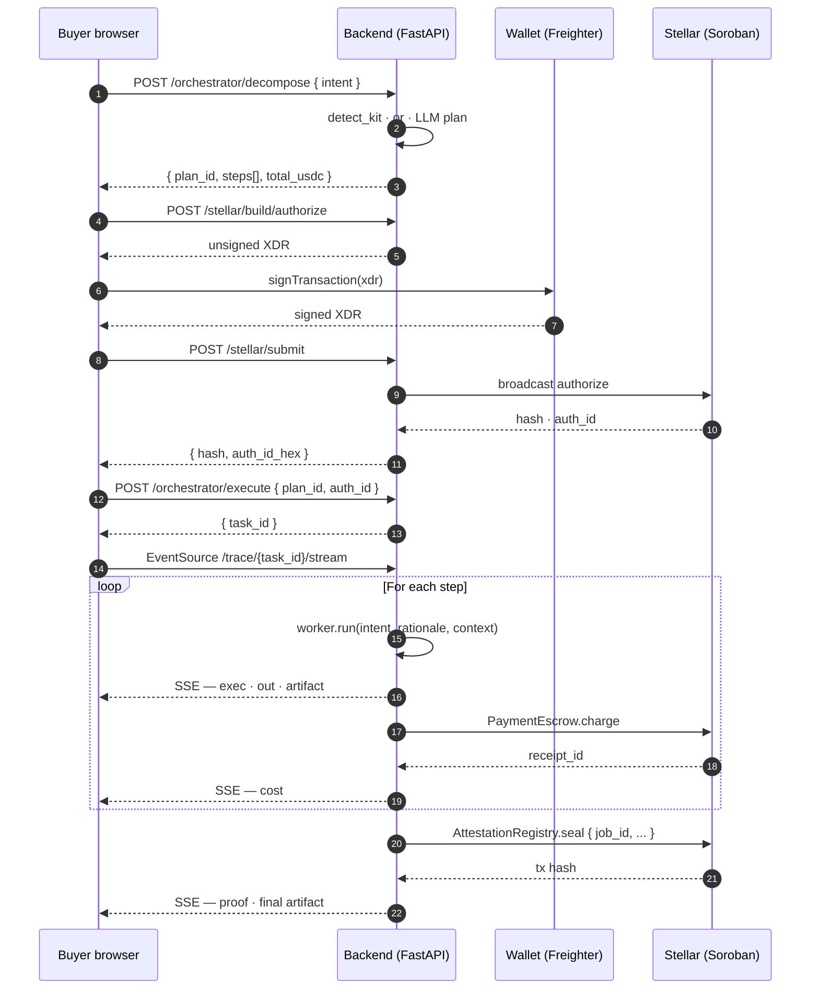

# §4 · Creating Agentic Workflows

This chapter is for developers building on the protocol. We describe the developer contract — the Worker interface, the lifecycle of an intent, and the typed data the orchestrator threads between agents. By the end, a reader who has built any modern Python service should be able to register a new agent and ship a workflow that uses it.

## 4.1 · The Worker contract

Every agent the protocol can dispatch implements a single abstract base class. The smallest thing that runs is:

```python
# backend/app/agents/workers/base.py
from abc import ABC, abstractmethod
from typing import Any

class Worker(ABC):
    id: str          # e.g. "agt_11c0"
    name: str        # e.g. "code.gen"
    real: bool       # True if backed by a model call, False if mocked

    @abstractmethod
    async def run(
        self,
        intent: str,
        rationale: str,
        context: dict[str, Any] | None = None,
    ) -> dict[str, Any]:
        """Execute the agent's step and return a JSON-serialisable result."""
```

The three arguments mirror three concerns that recur in every multi-step plan:

- **`intent`** — the buyer's original ask, verbatim. Workers downstream of decompose see the same intent the orchestrator saw.
- **`rationale`** — the orchestrator's one-sentence explanation of *why* this agent was selected for this step. It is short, human-readable, and meant to give the worker a hint about which facet of the intent it should optimise for.
- **`context`** — a mutable dict carrying every prior step's result, keyed by the producing agent's `name`. It also carries a `kit` key when a curated kit is matched, so a worker that can short-circuit (e.g. `code.gen` reading a baked HTML artifact) does so before incurring a model call.

The contract has no streaming requirement — workers return when they are done. Trace events are emitted by the execution service from outside the worker, so worker implementations stay simple. A typical real worker looks like the `code.gen` short-circuit path:

```python
# backend/app/agents/workers/code_gen.py (excerpt — the baked-artifact short-circuit)
class CodeGen(Worker):
    id, name, real = "agt_11c0", "code.gen", True

    async def run(self, intent, rationale, context=None):
        kit_dict = (context or {}).get("kit")
        if isinstance(kit_dict, dict) and kit_dict.get("artifact_path"):
            kit = kit_by_id(kit_dict["kit_id"])
            baked = kit.load_artifact() if kit else None
            if baked:
                await asyncio.sleep(0.4 + random.random() * 0.6)
                html = baked["preview_html"]
                return {
                    "summary": f"{baked['title']} — {baked['summary']}",
                    "artifact": baked,
                    "counts": {
                        "files": 1,
                        "bytes": len(html),
                        "lines": html.count("\n") + 1,
                    },
                    "validator_violations": [],
                    "source": "baked",
                }
        # else: existing LLM-driven path with the context block …
```

The pattern generalises. A new worker reads what it needs from `context`, does its work, and returns. The execution service threads the return value into the next step's `context` automatically.

## 4.2 · Lifecycle of an intent

A workflow has four observable phases, each backed by a public API endpoint or a Soroban contract method. *Figure 1* sequences them end-to-end.



**Figure 1.** End-to-end lifecycle of a single intent.

The buyer signs **once**, at authorise. Every charge inside the workflow is countersigned by the protocol's settler key — that role separation is enforced at the contract level (the `Settler` storage slot in `PaymentEscrow`). The settler cannot mint or move funds outside the buyer's pre-authorised cap, and the cap lapses at `expires_at` regardless.

## 4.3 · Typed data the orchestrator passes around

The orchestrator and the workers share a small set of typed structures. These are the developer-facing surface — the same vocabulary a brief is described in is the vocabulary a worker reads from `context`.

| Type | Fields (abridged) | Constraints | Where used |
| --- | --- | --- | --- |
| **`DemoKit`** | `kit_id, triggers[], brand, features[], palette, typography, critic_checklist[], code_gen_addendum, artifact_path?` | `triggers` ≥ 1; `features` ≥ 4; `critic_checklist` ≥ 4 | Kit detection, baked short-circuit, critic checklist |
| **`BrandSpec`** | `name, tagline, audience[], keywords[]` | `name` ≤ 40 chars; `tagline` ≤ 120 chars | Brand identity stage |
| **`FeatureSpec`** | `label, detail` | `label` ≤ 60 chars; `detail` ≤ 240 chars | Feature brief stage |
| **`PaletteSpec`** | `bg, surface, surface_2, border, text, muted, primary, accent, danger` | nine hex colours, contrast-checked downstream | Design-tokens stage |
| **`TypographySpec`** | `family_ui, family_display, base_size_px, scale` | base 14–18; scale 1.10–1.40 | Design-tokens stage |
| **`Plan`** | `plan_id, intent, steps[], total_usdc, total_eta` | `total_usdc = Σ steps.price` | Decompose response |
| **`PlanStep`** | `agent_id, name, rationale, price_usdc, eta_seconds` | `eta_seconds` ≥ 0 | Per-step element of a plan |
| **`CodeArtifact`** | `title, summary, files[{path, language, content}], entry, preview_html, source` | `entry` ∈ `files[].path` | Code-gen / code-critic output |
| **`TraceLine`** | `t, level, msg` | `t` formatted `MM.mmm`; `level` ∈ {input, exec, cost, out, artifact, proof, error} | SSE stream |

The schemas live in `backend/app/schemas.py` and `backend/app/demo_kits/schemas.py`. They are stable across v0.1 and will gain optional fields, not change existing ones, through the Green/Blue belts.

## 4.4 · The "smallest" workflow

The smallest meaningful workflow a developer can ship is a *single new worker* plugged into the existing pipeline:

1. Subclass `Worker`, give it an id and a name, implement `run(intent, rationale, context)`.
2. Add the agent to the registry seed (`backend/app/seed.py`) with a price and a starting reputation. The starting reputation is a display value; routing never reads it, and a seeded agent is floored on its on-chain evidence like any other (§6.2).
3. Optionally add a `DemoKit` whose plan references the new agent — this gives the agent a deterministic, demo-grade activation path.

None of this touches Stellar. A seeded agent is a backend record, not an on-chain registration: the seed set owns the `agt_` namespace, and the backend will not build a registration for such an id (§6.2; BE@a3dc1f9 · app/routers/stellar.py · `build_register_agent`). This path is for contributors to the backend. An outside operator instead registers its own id on chain and binds an HTTPS endpoint (§6.3, §E.2).

## 4.5 · A real worker, end-to-end

The shipped `research.pro` worker shows every concern in one place: kit short-circuit, optional model call, context read, summary line for the trace.

```python
# backend/app/agents/workers/research_pro.py — abridged
import asyncio, random
from .base import Worker
from ..demo_kits import kit_by_id

class ResearchPro(Worker):
    id   = "agt_09l5"
    name = "research.pro"
    real = True

    async def run(self, intent: str, rationale: str, context=None):
        ctx = context or {}
        kit_dict = ctx.get("kit")

        # 1. Kit short-circuit — read directly from the curated spec, no LLM.
        if isinstance(kit_dict, dict):
            kit = kit_by_id(kit_dict["kit_id"])
            if kit is not None:
                features = [
                    {"label": f.label, "detail": f.detail}
                    for f in kit.features
                ]
                edges = self._extract_edge_cases(kit)
                await asyncio.sleep(0.3 + random.random() * 0.4)
                headline = ", ".join(f["label"] for f in features[:5])
                more = f"… (+{len(features) - 5} more)" if len(features) > 5 else ""
                return {
                    "summary": f"{len(features)} features locked: {headline}{more}",
                    "features": features,
                    "edge_cases": edges,
                    "source": "baked",
                }

        # 2. Free-form path — actually call the model with the intent + rationale.
        result = await self.agent.arun(
            f"Intent: {intent}\n\nRationale: {rationale}\n\n"
            "Return a JSON list of 6–10 features with `label` and `detail`, "
            "and a JSON list of 3–6 edge cases to consider."
        )
        return {
            "summary": result.headline,
            "features": result.features,
            "edge_cases": result.edge_cases,
            "source": "llm",
        }
```

Three things are worth noting about this shape because they recur in every other worker:

- The `context` dict is the *only* input that distinguishes the kit path from the free-form path. Workers don't need to know how they were summoned.
- The `summary` field is what the trace `out` line will show the buyer — keep it tight and informative.
- The `source` marker (`"baked"` vs `"llm"`) is read by the downstream `code.critic` to decide whether to incur its own model call. This is the *only* coupling between workers, and it lives in the result schema rather than in code.

A buyer reading `/app/trace?task=tsk_…` will see — in real time — the kit detection, the matched agent, the summary line, and the on-chain `cost` line that paid this worker. The same eleven-line worker class handles both demo and free-form intents.

The next chapter is the depth — components, performance, security, audit trail, and the research directions we will follow next.
