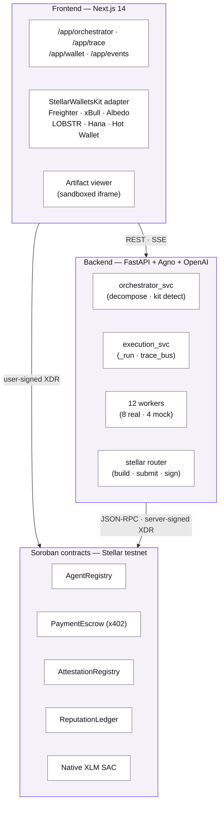
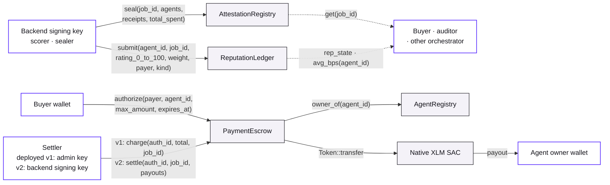
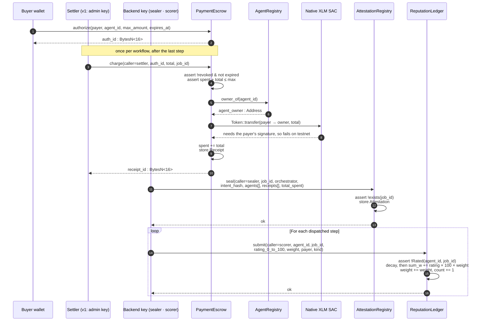

# §5 · Technical Details

This is the longest chapter in the document. It walks through how an intent becomes a paid, sealed workflow — service by service, contract by contract. Where measurements exist, we cite them; where research is open, we say so.

## 5.1 · Intent decomposition

The orchestrator service exposes one endpoint:

```
POST /api/orchestrator/decompose
body: { intent: string }
→    { plan_id, intent, steps: PlanStep[], total_usdc, total_eta }
```

The handler is in `backend/app/services/orchestrator_svc.py`. It does two things:

1. **Detect a curated kit.** `detect_kit(intent)` scans the intent against each kit's `triggers[]` (case-insensitive substring match). On a hit, it returns the kit object directly.
2. **Build a plan.** If a kit matched, `_build_kit_plan(intent, kit)` returns a deterministic six-step plan stitched from `_KIT_PIPELINE` (the six agent identifiers in order) and `_KIT_ETAS` (the per-step second budget). If no kit matched, the orchestrator agent (a model call with the agent registry serialised into the system prompt) returns the plan.

Two design choices in the kit path matter for the user experience:

- **The plan is built with a randomised 1.4–2.4 s pace.** A deterministic plan would otherwise return in microseconds — faster than the buyer's UI can render the loading state. We `await asyncio.sleep(1.4 + random.random() * 1.0)` so the decompose call surfaces with the cadence of a real planning step, the network panel shows a coherent waterfall, and downstream subscribers see the same timing curve they'd see for a free-form intent. The pacing budget is documented in §5.4 and shared with the free-form path's natural model-call latency.
- **The pipeline is identical across kits.** Every kit uses the same six agents — `research.pro`, `seo.brief`, `design.figma`, `code.gen`, `code.critic`, `deploy.v0` — in the same order. Differences live in the kit data (`BrandSpec`, `PaletteSpec`, `critic_checklist`) that is threaded through `context`, not in the plan structure. This keeps the demo readable.

Kit detection itself is a deliberately small function — case-insensitive substring match over a list of triggers, first hit wins, ordered to put more specific tokens before less specific:

```python
# backend/app/demo_kits/registry.py — abridged
def detect_kit(intent: str) -> DemoKit | None:
    lower = intent.lower()
    for kit in ALL_KITS:
        for trigger in kit.triggers:
            if trigger.lower() in lower:
                return kit
    return None
```

For the free-form path, the orchestrator is a single Agno-wrapped chat agent whose system prompt is built from the live agent registry — every routable agent's id, name, skills, price, and reputation is injected before the user's intent. Routable means listed, dispatchable and above the reputation floor, seeded or registered alike (§6.3, §6.7), and the reputation shown is the prior-smoothed on-chain score on a 0–5 display scale, never a seeded or self-declared value (BE@a3dc1f9 · app/services/orchestrator_svc.py · `_routable_registry`, `_smoothed_score`). The agent returns a `Plan` object validated against the Pydantic schema (`Plan{plan_id, intent, steps[], total_usdc, total_eta}`); any malformed return is rejected and re-rolled up to three times before the endpoint returns a 5xx. The validation surface is small but strict — invalid agent ids, negative prices, and zero-step plans are all rejected at parse time.

Measured decompose latency over the four shipped kits (FastAPI `TestClient`, single process, warm cache):

| Intent | Steps | Decompose latency |
| --- | :---: | :---: |
| `tetris game in html` | 6 | 2,267 ms |
| `calculator web app` | 6 | 2,137 ms |
| `snake game in html` | 6 | 2,275 ms |
| `pomodoro timer with sound` | 6 | 1,927 ms |

Free-form intents take whatever the model takes — typically 1–3 s for a small reasoning model planning six steps.

## 5.2 · Worker execution model and context plumbing

The execution service exposes:

```
POST /api/orchestrator/execute
body: { plan_id, auth_id_hex?, payer? }
→    { task_id }
```

The handler spawns `asyncio.create_task(_run(plan, task_id, auth_id_hex, payer))` and returns the task id immediately. The frontend opens an `EventSource` to `/api/trace/{task_id}/stream` and watches the workflow unfold.

Inside `_run()`, the loop is (abridged from BE@a3dc1f9 · app/services/execution_svc.py · `_run`; the real function also resolves external endpoints, tracks failures and records the settlement):

```python
async def _run(plan: Plan, task_id: str, auth_id_hex: str | None, payer: str | None):
    start = time.monotonic()
    context: dict[str, Any] = {"intent": plan.intent}
    if (kit := detect_kit(plan.intent)) is not None:
        context["kit"] = kit.model_dump()  # threaded into every worker

    await _emit(task_id, start, "input", f"intent received → {plan.intent!r}")

    delivered: dict[int, Any] = {}
    spent = 0.0
    for step_index, step in enumerate(plan.steps):
        await _emit(task_id, start, "exec",
                    f"match agent: {step.name} ({step.agent_id}) — {step.rationale}")
        worker = get_worker(step.agent_id)
        if worker is None:
            await _emit(task_id, start, "error",
                        f"unknown agent {step.agent_id}")
            continue                      # the step fails; the run goes on

        try:
            result = await asyncio.wait_for(
                worker.run(plan.intent, step.rationale, context=context),
                timeout=STEP_TIMEOUT_SECONDS,   # 120 s
            )
        except asyncio.TimeoutError:
            await _emit(task_id, start, "error", f"{worker.name} timed out")
            continue

        # Nothing is paid inside the loop: a delivered step is only noted.
        delivered[step_index] = result
        spent += step.est_price_usdc

        # Emit summary + (optional) artifact.
        await _emit(task_id, start, "out",
                    result.get("summary", "(no summary)"))
        if (artifact := result.get("artifact")):
            await _emit(task_id, start, "artifact",
                        artifact_summary(artifact))
            state.artifacts[task_id] = artifact

        context[step.name] = result  # plumb forward

    # Settle once, at the end, for the delivered steps; seal after it confirms.
    job_id = None
    if auth_id_hex and payer and delivered:
        if await _escrow_version() >= 2:
            # v2: one `settle` pays each delivered step's owner from custody
            # and returns the rest to the buyer, then the seal.
            settle_tx, proof_tx, job_id = await _settle_v2(
                task_id, start, plan, payer=payer, auth_id_hex=auth_id_hex,
                delivered_steps=frozenset(delivered))
        else:
            # v1 (deployed): one `charge` for the workflow's total, then the seal.
            charge_tx, proof_tx, job_id = await _settle_onchain(
                task_id, start, plan, payer=payer, auth_id_hex=auth_id_hex,
                total_usdc=spent)
    # One rating per dispatched step, whether or not the money moved.
    if auth_id_hex and payer:
        await _submit_ratings(task_id, start, plan, delivered, payer=payer,
                              job_id=job_id or unsettled_job_id(task_id))
```

Three properties of this loop are worth highlighting.

**Context is monotonic.** Every result is keyed by the worker's `name` (`code.gen`, `code.critic`, `seo.brief`, …) so later steps can read prior outputs by name. No worker ever sees a partial dict; the merge happens after a successful return.

**Timeouts are enforced.** A worker has 120 seconds to return. If it does not, the wrapper emits an `error` line and the run moves on to the next step; the step that timed out is not billed. We never attempt to "kill" a worker; we just stop waiting.

**Settlement happens once, after the loop.** Nothing is paid per step. At the end of the run the backend submits one settlement for the delivered steps only: one `settle` under escrow v2, one `charge` for the workflow's total on the deployed v1, which cannot complete on testnet (§6.9). A failed step is never billed, so a buyer pays for value that arrived, never for value that didn't (BE@a3dc1f9 · app/services/execution_svc.py · `_run`, `_settle_v2`, `_settle_onchain`).

The `code.critic` worker uses a parallel short-circuit: when the prior step's result carries `source: "baked"`, the critic runs the structural validator (`code_validator.validate_html`), reports the kit's `critic_checklist` as pre-satisfied, sleeps for a believable 0.4–1.0 s, and returns. No model call is incurred.

*Figure 4* shows how prior step outputs accumulate into the shared `context` dict that each downstream worker reads.

```mermaid
flowchart LR
    I([Intent]) --> C0[("context<br/>{ kit, intent }")]
    C0 --> W1["research.pro"]
    W1 --> C1[("context<br/>+ research.pro")]
    C1 --> W2["seo.brief"]
    W2 --> C2[("context<br/>+ seo.brief")]
    C2 --> W3["design.figma"]
    W3 --> C3[("context<br/>+ design.figma")]
    C3 --> W4["code.gen"]
    W4 --> C4[("context<br/>+ code.gen")]
    C4 --> W5["code.critic"]
    W5 --> C5[("context<br/>+ code.critic")]
    C5 --> W6["deploy.v0"]
    W6 --> OUT([Sealed artifact + on-chain proof])

    classDef worker fill:#FFFFFF,stroke:#5A2EFF,stroke-width:1.2px,color:#14131A
    classDef state fill:#F4F2F8,stroke:#7C7A8B,stroke-width:1px,color:#4A4757,font-style:italic
    class W1,W2,W3,W4,W5,W6 worker
    class C0,C1,C2,C3,C4,C5 state
```



**Figure 4.** Worker context plumbing — `_run()` keys every result by the worker's `name` so later steps can read prior outputs directly (e.g., `code.gen` reads the `seo.brief` brand block and the `design.figma` palette from its own `context`).

## 5.3 · Components

The protocol's runtime is three layers, glued by an SSE channel and four Soroban contracts. *Figure 2* shows the layering; *Figure 3* shows the contract topology.



**Figure 2.** Three-layer system architecture.

The **frontend** is a Next.js 14 App Router application with eight protected routes under `/app` (`agents`, `orchestrator`, `trace`, `wallet`, `send`, `events`, `flow`, plus the dashboard). It uses StellarWalletsKit to talk to six wallet adapters, opens Server-Sent Event channels for trace streams, polls Soroban RPC for event indices, and renders runnable HTML artifacts in a sandboxed iframe. The shipped trace replay (`/app/trace` with no task parameter) advances using the real timestamps embedded in the trace data — short gaps feel instant, the 2.6 s `code.gen` pause feels like generation, total wall-clock is about 6.4 s.

The **backend** is a FastAPI service. The orchestrator service decomposes intents; the execution service runs plans; the trace bus fans SSE events out to subscribers, replaying history for late joiners. Twelve workers are seeded, eight of them backed by real model calls. The Stellar router builds unsigned XDR for the user to sign, broadcasts user-signed XDR, and — when the protocol's signing key is configured — signs `charge` and `seal` XDR on the backend's behalf.

The **contracts** are four lean Rust Soroban modules.

| Contract | Address (testnet) | WASM | Role |
| --- | --- | :---: | --- |
| `AgentRegistry` | `CAPHXWU53UZUZJGV7IAE57NNMH3YYB5MTWO6YA53KKMXSFVLOITBJ3GQ` | 7.2 KB | Identity, skills, price catalog; resolves agent owner for payout |
| `PaymentEscrow` | `CBJPTMAPMGODGZCZ2IMEQSRUX3WGUXNMKDTNN2KMJ3NFGYZ5OJ5525PI` | 9.8 KB | x402 authorize → charge → receipt flow; calls registry + SAC |
| `AttestationRegistry` | `CBYUZKOET43UXTBXZUJIBBJW5ODGD2J2AZVVXCR3QONGOCAHOXQQHEGK` | 5.1 KB | Write-once workflow receipt under a job id |
| `ReputationLedger` | `CDCSOBEVZUPQZV5GV4D6KYHZCLNGW2KXY74RUHSZ3EZUXF34DPW422ZT` | 5.1 KB | Decayed, value-weighted rating evidence per agent, 0–10,000 bps, with replay guard |
| Native XLM SAC | `CDLZFC3SYJYDZT7K67VZ75HPJVIEUVNIXF47ZG2FB2RMQQVU2HHGCYSC` | n/a | Settlement asset |

The contracts share a small types crate (`contract/shared`) exporting `Agent`, `Authorization`, `Receipt` and `Attestation`; the ledger's `RepState` lives in the ledger itself (SC@dd2d642 · contract/shared/src/lib.rs; contract/reputation-ledger/src/lib.rs · `RepState`). Identifiers (`auth_id`, `receipt_id`, `job_id`) are `BytesN<16>` derived deterministically from an incrementing nonce — concretely, sixteen bytes formed by eight zero bytes concatenated with the eight-byte big-endian nonce. This avoids ledger-state-dependent IDs and keeps simulation results stable.



**Figure 3.** Soroban contract topology — `PaymentEscrow` resolves agent ownership through `AgentRegistry` and routes settlement through the native XLM SAC; `AttestationRegistry` and `ReputationLedger` are write paths for the sealer and the scorer and public read paths for everyone else. On testnet the sealer and the scorer are the backend's signing key, `GDB4N2…CDHP`, and the deployed escrow's settler is the admin key, `GA7AI5…5OQV`; the backend key becomes the settler once escrow v2 is deployed (§6.1).

The on-chain x402 flow is four steps. A buyer calls `authorize(payer, agent_id, max_amount, expires_at)` once and receives an `auth_id`. The settler calls `charge(caller, auth_id, amount, job_id)`, which validates the authorisation, looks up the agent owner via `AgentRegistry.owner_of(agent_id)`, and transfers USDC from the buyer to the owner via the asset's `Token::transfer`. On the deployed escrow the settler is the admin key, not the backend's, and that transfer cannot complete, because it needs the buyer's signature, which the charge transaction does not carry (§6.1, §6.9; SC@88aa554 · contract/payment-escrow/src/lib.rs · `PaymentEscrow::charge`). The backend submits one `charge` for the workflow's total (BE@a3dc1f9 · app/services/execution_svc.py · `_settle_onchain`). The sealer calls `seal(caller, job_id, orchestrator, intent_hash, agents, receipts, total_spent)` on `AttestationRegistry` once at the end — write-once, second seal of the same `job_id` returns `AlreadyExists`. The scorer calls `submit(caller, agent_id, job_id, rating_0_to_100, weight, payer, kind)` on `ReputationLedger`, with a `Rated(agent_id, job_id)` persistent-storage key guarding against replay. The sealer and the scorer are the backend's signing key on testnet (§6.1).

### 5.3.1 · Contract APIs — verbatim

The four contracts share a small types crate exporting `Agent`, `Authorization`, `Receipt` and `Attestation`. Below, every public entry point is listed with its exact signature from `contract/*/src/lib.rs`.

**`AgentRegistry`** — agent identity, skills, price catalog. Storage keyed by `Agent(Symbol)`.

| Function | Signature | Auth | Purpose |
| --- | --- | --- | --- |
| `__constructor` | `(env, admin: Address)` | n/a | One-shot init at deploy |
| `register` | `(env, owner, id, name, skills, price) → Result<(), Error>` | `owner.require_auth()` | Add a new agent; errs `AlreadyExists` on collision |
| `update_price` | `(env, id, new_price) → Result<(), Error>` | owner of `id` | Adjust per-step price |
| `set_active` | `(env, id, active) → Result<(), Error>` | owner of `id` | Toggle eligibility |
| `get` | `(env, id) → Result<Agent, Error>` | public | Full agent record |
| `owner_of` | `(env, id) → Result<Address, Error>` | public | Resolve payout target (called by `PaymentEscrow.charge`) |
| `list_ids` | `(env) → Vec<Symbol>` | public | Registry enumeration |
| `admin` | `(env) → Address` | public | Current admin address |

**`PaymentEscrow`** — x402-style authorise → charge → revoke. Storage keyed by `Auth(BytesN<16>)` and `Receipt(BytesN<16>)`.

| Function | Signature | Auth | Purpose |
| --- | --- | --- | --- |
| `__constructor` | `(env, admin, usdc, registry, settler)` | n/a | Init with USDC SAC + AgentRegistry + settler key |
| `authorize` | `(env, payer, agent_id, max_amount, expires_at) → Result<BytesN<16>, Error>` | `payer.require_auth()` | Step 1 of x402; returns a fresh `auth_id` |
| `charge` | `(env, caller, auth_id, amount, job_id) → Result<BytesN<16>, Error>` | settler only | Step 2; debits authorisation, calls `registry.owner_of`, transfers via SAC, returns `receipt_id` |
| `revoke` | `(env, payer, auth_id) → Result<(), Error>` | `payer.require_auth()` | Cancel an unused authorisation |
| `authorization` | `(env, auth_id) → Result<Authorization, Error>` | public | Read the authorisation record |
| `receipt` | `(env, receipt_id) → Result<Receipt, Error>` | public | Read a settled receipt |
| `settler` | `(env) → Address` | public | Current settler address |

**`AttestationRegistry`** — write-once workflow seal. Storage keyed by `Job(BytesN<16>)`.

| Function | Signature | Auth | Purpose |
| --- | --- | --- | --- |
| `__constructor` | `(env, admin, sealer)` | n/a | Init |
| `seal` | `(env, caller, job_id, orchestrator, intent_hash, agents, receipts, total_spent) → Result<(), Error>` | sealer only | Step 3; errs `AlreadyExists` on re-seal |
| `get` | `(env, job_id) → Result<Attestation, Error>` | public | Read the sealed attestation |
| `exists` | `(env, job_id) → bool` | public | Cheap probe |
| `set_sealer` | `(env, new_sealer) → Result<(), Error>` | admin only | Rotate the sealer key |

**`ReputationLedger`** — decayed, value-weighted rating evidence per agent, on a 0–10,000 basis-point scale. Storage keyed by `Rep(Symbol)` for the aggregate and `Rated(Symbol, BytesN<16>)` (persistent tier) for the replay guard (SC@dd2d642 · contract/reputation-ledger/src/lib.rs · `ReputationLedger`, `DataKey`).

| Function | Signature | Auth | Purpose |
| --- | --- | --- | --- |
| `__constructor` | `(env, admin, scorer)` | n/a | Init |
| `submit` | `(env, caller, agent_id, job_id, rating_0_to_100, weight, payer, kind) → Result<(), Error>` | scorer only | Step 4; stores the rating as `rating_0_to_100 × 100` bps, weighted by the job's value; errs `Replay` on `(agent_id, job_id)` duplicate, errs `OutOfRange` if rating > 100 or the weight is outside 0 < weight ≤ 100 USDC |
| `rep_state` | `(env, agent_id) → RepState` | public | Raw evidence `{sum_w, weight, count, disputed, last_epoch}`, decayed to now |
| `avg_bps` | `(env, agent_id) → u32` | public | Decayed, weighted mean in basis points, clamped to 0..10,000; 0 if no ratings yet |
| `rep_bps` | `(env, agent_id, prior_bps, prior_weight) → u32` | public | The mean smoothed by a caller-supplied prior, clamped to 0..10,000 |
| `dispute_rate_bps` | `(env, agent_id) → u32` | public | Lifetime `disputed × 10,000 / count` |
| `payer_weight` | `(env, agent_id, payer) → i128` | public | Cumulative weight one payer has contributed to the agent |
| `set_scorer` | `(env, new_scorer) → Result<(), Error>` | admin only | Rotate the scorer key |

### 5.3.2 · Error codes — shared

Every error from the protocol's contracts is enumerated in the shared `codes` module so a single backend mapper can translate them into human messages.

| Code | Symbol | Returned by |
| :---: | --- | --- |
| 1 | `Unauthorized` | All contracts — missing `require_auth` or wrong caller |
| 2 | `NotFound` | All contracts — unknown id |
| 3 | `AlreadyExists` | `AgentRegistry.register`, `AttestationRegistry.seal` |
| 4 | `Expired` | `PaymentEscrow.charge` — past `expires_at` |
| 5 | `Insufficient` | `PaymentEscrow.charge` — `spent + amount > max_amount` |
| 6 | `Revoked` | `PaymentEscrow.charge` — buyer revoked |
| 7 | `Replay` | `ReputationLedger.submit` — duplicate `(agent_id, job_id)` |
| 8 | `Inactive` | `AgentRegistry.get`/lookup — agent toggled off |
| 100 | `OutOfRange` | `ReputationLedger.submit` — rating > 100, or weight outside 0 < weight ≤ 100 USDC |
| 101 | `BadAmount` | `PaymentEscrow.charge` — amount ≤ 0 |

### 5.3.3 · The x402 flow as a sequence



**Figure 5.** The x402 flow on the deployed v1 contracts as the backend drives it: one `charge` for the workflow's total, the seal once it confirms, and one rating per dispatched step (BE@a3dc1f9 · app/services/execution_svc.py · `_settle_onchain`, `_submit_ratings`; SC@dd2d642 · contract/reputation-ledger/src/lib.rs · `ReputationLedger::submit`). On testnet the `Token::transfer` step fails, because the buyer's signature is not in the charge transaction, so no charge has completed and the seal is not reached; the ratings are written regardless. Escrow v2, merged but not deployed, takes custody at `authorize` and replaces the `charge` with one `settle` that pays each delivered step's owner and returns the rest (§6.8, §6.9).

The contracts are non-upgradable. Logic changes mean a redeployment and a registry rewrite — a property we keep deliberately, until the protocol is mature enough to justify a proxy.

## 5.4 · Performance

End-to-end timings, measured on the live deployment with a kit intent:

| Phase | Demo kit | Free-form intent |
| --- | :---: | :---: |
| Decompose | 1,927 – 2,275 ms | 1–3 s (model dependent) |
| Per-step execution (avg) | 0.4 – 0.6 s | 1–6 s (model dependent) |
| End-to-end, intent → sealed | ≈ 6.4 s | 15–30 s |

The 6.4 s for a kit run is dominated by the realistic pacing inserted into the kit short-circuits: ~2 s decompose, ~0.5 s per pre-code step, ~0.6 s for the baked `code.gen`, ~0.6 s for the critic, ~0.4 s for the seal. Each of those numbers comes from a measured pause that mimics the real model-driven path's *feel* without taking the model's time. The shipped trace replay at `/app/trace` uses the same timing budget.

Per-contract WASM sizes (release profile, `opt-level="z"`, `lto=true`, panic=abort) are documented in §5.3. The largest, `PaymentEscrow`, is 9.8 KB; the simplest, `AttestationRegistry`, is 5.1 KB. Storage growth per workflow is bounded: one `Receipt` per step, one `Attestation` per workflow, one `Rated` marker per rating in persistent storage, which does not lapse.

## 5.5 · Security

The shipped surface area is small enough to reason about. We list the threats, the mitigations, and — explicitly — what we do *not* defend against.

**Buyer-side custody.** The buyer's private key never leaves their wallet. The frontend builds unsigned XDR; the wallet signs it; the backend only ever sees signed XDR for buyer-initiated calls. The classification of wallet errors (`wallet_not_found`, `user_rejected`, `insufficient_balance`, `unknown`) lives in `lib/wallet-errors.ts`.

**Settler-role separation.** The `Settler` storage slot in `PaymentEscrow` is the only address allowed to call `charge` (SC@88aa554 · contract/payment-escrow/src/lib.rs · `PaymentEscrow::charge`). On the deployed escrow that settler is the admin key, `GA7AI5…5OQV`. The backend's own signing key, `GDB4N2…CDHP`, is a different key: it writes ratings (scorer), seals attestations (sealer) and pays dispute credits, and it becomes the escrow's settler only once escrow v2 is deployed (§6.1; BE@a3dc1f9 · app/config.py · `stellar_signing_key`). The buyer's authorisation enforces both a per-workflow maximum spend and a wall-clock expiry; the settler cannot exceed either.

**Authorisation lapse.** Every `Authorization` carries `expires_at`. `PaymentEscrow.charge` rejects charges past the expiry with `Error::Expired`. A workflow that crashes leaves the unspent authorisation to lapse naturally; the buyer never has to "cancel" anything.

**Write-once attestation.** `AttestationRegistry.seal` returns `Error::AlreadyExists` on a second seal of the same `job_id`. A workflow's receipt is the first one written, ever, period.

**Rating replay.** `ReputationLedger.submit` writes a `Rated(agent_id, job_id)` marker in persistent storage. A second rating for the same `(agent_id, job_id)` pair is rejected with `Error::Replay`, however much later it comes; the marker does not lapse (SC@dd2d642 · contract/reputation-ledger/src/lib.rs · `ReputationLedger::submit`, `DataKey::Rated`).

**Worker timeouts.** Every worker is wrapped in `asyncio.wait_for(..., timeout=120)`. A hung worker's step fails with an `error` line and the run moves on to the next step; the failed step is left out of the one settlement at the end, so it is never billed (BE@a3dc1f9 · app/services/execution_svc.py · `_run`, `STEP_TIMEOUT_SECONDS`).

**What we do not defend against.** We do not currently verify *what* an agent did, beyond the structural validator on the resulting artifact. A malicious worker that returns plausible-looking garbage *will* be paid, and reputation will only catch it on the next workflow. We do not encrypt the intent — a buyer who needs confidentiality should not, today, use the protocol for sensitive inputs. We discuss the research direction for both in §5.7.

### 5.5.1 · Threat model

The full enumeration. Each row gives a concrete threat, the vector that would realise it, the mitigation in v0.1, and the residual risk that remains.

| Threat | Vector | Mitigation | Residual risk |
| --- | --- | --- | --- |
| Buyer key compromise | Stolen seed phrase, phishing, malicious extension | Freighter (or any StellarWalletsKit-supported wallet) holds the key; the protocol never sees it | Wallet-side — protocol cannot prevent |
| Settler key compromise | Theft of the settler key: on testnet the admin key, `GA7AI5…5OQV`; once escrow v2 is deployed, the backend's signing key on its host (§6.1) | Settler is bound by every buyer's `max_amount` and `expires_at`. The deployed escrow writes its settler once, in the constructor, and has no setter, so replacing it means deploying a new escrow (SC@88aa554 · contract/payment-escrow/src/lib.rs · `PaymentEscrow::__constructor`); escrow v2, merged but not deployed, adds an admin-only `set_settler` (SC@dd2d642 · contract/payment-escrow/src/lib.rs · `PaymentEscrow::set_settler`). The admin can rotate the sealer and the scorer via `set_sealer` / `set_scorer` | A compromised settler can drain authorised envelopes that have not yet expired. Mitigation: keep `max_amount` tight per workflow and `expires_at` short |
| Hung worker | LLM stall, network partition, dependency failure | `asyncio.wait_for(120 s)` per step; the failed step emits `error`, the run moves on, and the step is left out of the settlement | Buyer waits up to 120 s for the failure to surface |
| Charge replay | Settler submits the same `charge` twice | Each `charge` produces a fresh `receipt_id` (deterministic nonce) and decrements the same `Authorization.spent`. Double-charging exhausts the cap legitimately | Settler cannot extract "double" funds, only burn the buyer's cap. Detected by `Authorization.spent` reaching `max_amount` faster than expected |
| Rating replay | Scorer submits a rating for the same `(agent_id, job_id)` twice | `Rated(agent_id, job_id)` marker in persistent storage; second `submit` errs `Replay` | None at the contract: the marker does not lapse. A scorer can still rate the same agent under a fresh `job_id`, which is why only the scorer can rate |
| Workflow tampering | Modified worker output | Sealed `Attestation` records the orchestrator, `intent_hash`, agent list, receipts, and total spent — immutably | Off-chain artifact mutability — buyer must hash-verify the returned artifact against `intent_hash`/job metadata |
| Front-running of `authorize` | Public mempool observation of unsigned XDR | Nothing extractable — `authorize` is a function call, not a swap or auction. No price impact, no slippage | Negligible |
| Double-spend within envelope | Two charges drawing the same lamport from the same authorisation | `Authorization.spent` is checked-and-incremented atomically in `charge`; transaction failure rolls back | Contract-level: none |
| Sealed attestation tampering | Edit the `Attestation` after seal | Storage write happens once; second seal of the same `job_id` errs `AlreadyExists`. Contract is non-upgradable | Contract-level: none |
| DoS via storage flood | Mass `authorize` calls | Every `authorize` requires `payer.require_auth()`, so each costs a Stellar network fee paid by the attacker | Economic — Stellar's per-tx fee gates the attack |
| Untrusted agent output | Worker returns plausible-looking garbage | Code validator runs structural checks; kit `critic_checklist` covers the kit's stated promises; rating signal feeds future routing | High — semantic correctness is not verified |
| Confidentiality leak | Intent + outputs travel in plaintext between buyer, orchestrator, workers, model provider | None today — explicit limitation called out in §5.7 and §10 | High — buyers must not send confidential material |
| Orchestrator equivocation | House orchestrator produces a different plan than its public agent registry would imply | Plans are deterministic for kit intents and validated against the registry for free-form intents; planner returns are stored under `plan_id` and visible on `GET /api/tasks/{task_id}` | Trust on first plan — a malicious orchestrator could route to its own agent. Mitigation in Purple belt: multiple competing orchestrators |

A residual risk of "high" or "wallet-side" is not a defect to apologise for — it is a property of the protocol's threat model that callers must understand. The point of listing it is that the surface is small enough to enumerate.

## 5.6 · Compliance and audit trail

Every workflow produces a complete on- and off-chain receipt set without any additional work.

The off-chain side is the SSE trace. Each `TraceLine` has the shape:

```python
class TraceLine(BaseModel):
    t: str          # elapsed time, "MM.mmm"
    level: Literal["input", "exec", "cost", "out", "artifact", "proof", "error"]
    msg: str
```

The bus buffers every line so any subscriber — a watcher, an investigator, a reconciler — can replay the workflow from the start. The intent itself appears in the first `input` line; the payment appears as one `cost` line for the run's settlement, with its transaction hash (on testnet an `error` line, since the deployed escrow cannot complete a charge; §B.3); the final seal appears as a `proof` line.

The on-chain side is the four contracts together. For any sealed workflow you can pull:

- the buyer's `Authorization` (payer, agent target, max, expires_at, spent) from `PaymentEscrow.authorization(auth_id)`;
- every `Receipt` (auth_id, agent_id, amount, job_id, settled_at) from `PaymentEscrow.receipt(receipt_id)`;
- the `Attestation` (orchestrator, intent_hash, agents, receipts, total_spent, sealed_at) from `AttestationRegistry.get(job_id)`;
- per-agent `RepState` and `avg_bps` from `ReputationLedger.rep_state(agent_id)` and `avg_bps(agent_id)`.

The events emitted by each contract (`regd`, `authd`, `charged`, `sealed`, `rated`) are indexed by Soroban RPC, so any external observer can subscribe and replay.

The combination — typed trace plus immutable receipts — is the audit trail. A regulator who asks "show me the bill of materials for this output" gets a single `job_id` that resolves to the orchestrator, the intent hash, every paying step, every paid agent, and the total in USDC. No reconciliation required.

### 5.6.1 · A worked example

A complete sealed `Attestation` returned by `GET /api/stellar/attestation/{job_id_hex}` for the calculator workflow, with one decoded receipt for context. All hex IDs are deterministic from the nonce-derived `BytesN<16>` scheme.

```json
{
  "job_id": "0x0000000000000000000000000000002a",
  "orchestrator": "GA7AI5TAJEZA27I666DSJC4MUJYBEWUYNNZWPU7R2ONA7IZQVO6R5OQV",
  "intent_hash": "0x7c8a4f9e91fa6a8a37dc4cbb4f7a9c3c2d3f8e4d6a91b32afef1d6e5b8a72b1f",
  "agents": [
    "agt_09l5", "agt_05x7", "agt_02k2",
    "agt_11c0", "agt_12r0", "agt_08j2"
  ],
  "receipts": [
    "0x00000000000000000000000000000a01",
    "0x00000000000000000000000000000a02",
    "0x00000000000000000000000000000a03",
    "0x00000000000000000000000000000a04",
    "0x00000000000000000000000000000a05",
    "0x00000000000000000000000000000a06"
  ],
  "total_spent": "168000",
  "sealed_at": 49217481
}
```

`total_spent` is in **stroops of USDC** (7-decimal Stellar convention), so `168000` is 0.168 USDC — exactly the sum of the six per-step prices listed in §7.1. One of the receipts decoded from `PaymentEscrow.receipt(receipt_id)`:

```json
{
  "auth_id":   "0x000000000000000000000000000000c4",
  "agent_id":  "agt_11c0",
  "amount":    "54000",
  "job_id":    "0x0000000000000000000000000000002a",
  "settled_at": 49217473
}
```

The receipt is keyed back to the same `job_id` carried by the `Attestation`, so a verifier can walk from the attestation to every contributing payment without out-of-band correlation. The trace stream emits a parallel SSE line at each on-chain event, so a buyer's browser sees the same data the chain does:

```
00.000  input    intent received → 'calculator web app'
00.018  exec     kit detected: calculator → AURORA·CALC (8 features locked)
00.024  exec     orchestrator: decompose → [agt_09l5, agt_05x7, agt_02k2, agt_11c0, agt_12r0, agt_08j2]
00.110  exec     match agent: research.pro (agt_09l5) — extract feature brief + edge cases
00.214  cost     x402 payment → agt_09l5 :: 0.024 USDC (tx 47a13c…b91d)
00.602  out      research.pro: 8 features locked: tokenizer, RPN evaluator, memory bank, …
00.640  exec     match agent: seo.brief (agt_05x7) — produce brand identity
00.812  cost     x402 payment → agt_05x7 :: 0.009 USDC (tx 8b2f01…2c14)
01.110  out      seo.brief: name: "AURORA·CALC" · tone: studio-precise · audience: engineers, students
…
06.405  out      deploy.v0: sealed AURORA·CALC · 1 file · 988 lines · 70.5 KB · preview ready
06.418  proof    workflow sealed — 6 agents · 0.168 USDC · tx 0x7fa2c41b…b91d12e4
```

This is the *same* string-for-string content a watcher subscribed to `/api/trace/{task_id}/stream` would replay from history and continue receiving live.

## 5.7 · Future improvements

This section catalogues the research and engineering directions we will follow next. None of them is shipped in v0.1; each is described as a design.

### 5.7.1 · Throughput

The current pipeline runs strictly sequentially. Many useful plans have parallelisable steps — research, brand, and design tokens can run concurrently; only the code-gen step truly depends on all three. We will add a planner-emitted dependency graph (a small DAG instead of a list of steps) and an executor that runs leaves in parallel under the same authorisation envelope. Charges remain per-step; the total spend cap remains enforced on chain. We expect end-to-end times for kit workflows to drop into the three-second range without changing the buyer's experience.

Beyond parallelism, the orchestrator's plan-building call itself is a candidate for a smaller, cheaper model fine-tuned on the agent registry. The orchestrator is not creative; it is a router. A 200-million-parameter router would settle the decompose latency at well under one second for free-form intents.

### 5.7.2 · Confidential workflows (research)

A significant class of workloads requires that the buyer's intent never appear in plaintext to the agents — legal drafting against confidential briefs, financial analysis against a client portfolio, medical-record summarisation. The protocol does not solve this in v1, and we are honest about the boundary (§5.5, §10).

The research direction we will pursue is *computation over encrypted intent payloads*. A buyer's intent would be encrypted client-side under a key whose decryption is controlled by an on-chain access-control list. Agents capable of operating over encrypted inputs would execute against the ciphertext and return ciphertext outputs. The attestation registry would record the receipt of a confidential workflow without revealing the intent or the result; a subsequent selective-disclosure step, gated by the same access-control list, would let the buyer (or a designated auditor) read the workflow's output.

The honest constraints are well known. Practical encrypted-computation primitives today have substantial per-operation overhead and a narrow circuit grammar. Not every agent class will run confidentially in the near term — model inference under encryption is still a research frontier. We expect the first shipped confidential agent to be a *deterministic* one (a structural validator, a hash, a small numeric aggregation) rather than a model-driven one, and we expect the path from there to confidential model inference to follow improvements in the underlying primitive. The protocol design — the ACL gating, the attestation record, the per-step charge — is independent of which primitive ships first.

### 5.7.3 · Multi-chain settlement

Stellar is our settlement chain in v1 because the per-transaction fee is denominated in fractions of a cent and finality is sub-second. Buyers and agents already on other ecosystems would prefer to settle where their treasury sits. We will add a settlement-layer abstraction that lets an orchestrator denominate a plan in USDC and execute the charges on Stellar, an EVM L2, or a Solana program, with the same authorisation envelope semantics. The buyer-visible contract — sign once, get a receipt — does not change.

### 5.7.4 · Permissionless agent operators

This shipped in the **Blue** belt and is live on testnet (§6.3, §6.7). Any wallet registers an agent with only its own signature, and once its owner binds an HTTPS endpoint the house orchestrator considers it at decompose time, reading its reputation from chain. The gate is not an `avg_bps` threshold: it is a floor of 5,500 bps on the lower bound of a prior-smoothed score, on the ledger's 0–10,000 scale, with no minimum job count (BE@a3dc1f9 · app/config.py · `reputation_floor_bps`; app/services/reputation_svc.py · `passes_floor`). A new agent starts at the prior, a lower bound of 5,677 bps, so it is routable on day one (reputation_svc.py · `cold_start_margin`). Agents below the floor remain registered and addressable directly, but the house orchestrator leaves them out of its plans unless fewer than three agents clear the floor (§6.7).

The dispute window shipped with the Blue belt too, with a partial credit paid from the platform's own key rather than drawn from a deposit; the refund path is off by default, and on testnet no window opens until escrow v2 is deployed (§6.8). Slashing for non-delivery, from a small staked deposit, remains the **Brown** belt item that makes the marketplace self-policing.

---

The next chapter discusses who runs the protocol and how the registry is governed.
